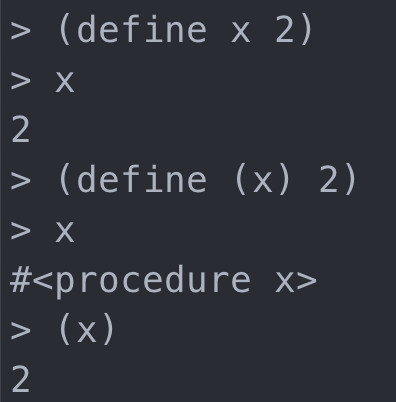
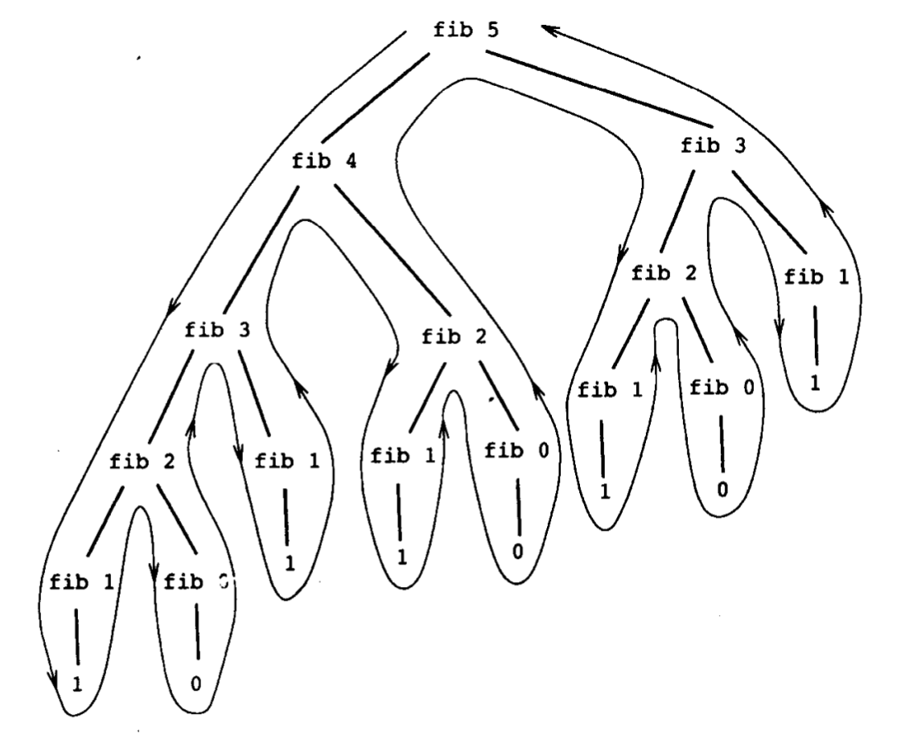

# 构造计算过程抽象

计算过程的 Lisp 描述（称为过程）本身又可以作为 Lisp 的数据来表示和操作

## 程序设计的基本元素

将简单的认识组合成更复杂认识的方法方面，每一种强有力的语言都提供三种机制：

* 基本表达形式：用于表达语言所关心的最简单的个体

* 组合的方法：从简单的元素构造出复杂的元素

* 抽象的方法：为复杂的元素命名，并将它们当作单元去操作

### 表达式

前缀表达式：

```scheme
(+ (* 3
      (+ (* 2 4)
        (+ 3 5)))
  (+ (- 10 7)
    6))
```

完全适用于可能带有任意个实参的过程

### 命名和环境

```scheme
(define pi 3.1415926)
```

一个 Lisp 程序通常总是由一大批相对简单的过程组成

可以将值与符号关联，而后又提取出这些值，这意味着解释器必须维护某种存储能力，以便保持名字 - 值的对应关系，这种储存被称为环境

### 组合式的求值

1. 求值该组合式的各个子表达式

2. 将作为最左子表达式（运算符）的值的那个过程应用与实际参数（其它子表达式的值）

```scheme
(* (+ 2 (* 4 6))
  (+ 3 5 7))
```

* 数的值就是它们表示的数值

* 内部运算符的值就是能完成相应操作的机器指令序列

* 其他名字的值就是在环境中关联这一值的那个对象

```scheme
(define x 3) ; 表示符号 x 关联另一个值 3

(define (x) 3) ; 表示过程 x
```



### 复合过程

定义过程

```scheme
(define (<name> <formal parameters>) <body>)
```

### 过程应用的代换模型

正则序求值：

完全展开而后归约

```scheme
(define (square x) (* x x))

(+ (square 3) (square 2))
; => (+ (* 3 3) (* 2 2)) 完全展开
; => (+ 9 4) => 11 归约（reduce）求值
```

应用序求值：

先求值参数而后应用

```scheme
(define (square x) (* x x))

(+ (square 3) (square 2))
; => (+ (square 3) (* 2 2))
; => (+ (square 3) 4)
; => (+ (* 3 3) 4)
; => (+ 9 4) => 11
```

Lisp 采用应用序求值，避免一些重复求值，提高效率

> thunk、求值策略（传值调用 call by value、传名调用 call by name）

### 条件表达式和谓词

```scheme
; (cond (<p1> <e1>)
;   (<p2> <e2>)
;   (<p3> <e3>))

(define (abs x)
  (cond ((> x 0) x)
    ((= x 0) 0)
    ((< x 0) (- x))))
```

\<p\>：谓词，返回 #t 或 #f，风格上一般在谓词后面加 `?` 表示

> 当解释器检查谓词的值时，#f 解释为假，其余的都解释为真，在逻辑上 #t 是不需要的，只是为了方便

```scheme
(define (abs x)
  (cond ((< x 0) (- x))
    (else x)))

; (if <predicate> <consequent> <alternative>)
(define (abs x)
  (if (< x 0)
    (- x)
    x))
```

逻辑运算符：

```scheme
(and <e1> <e2>)
(or <e1> <e2>)
(not <e>)
```

### 过程作为黑箱抽象

牛顿法求平方根

```scheme
(define (sqrt x)
  (define (average a b)
    (/ (+ a b)
      2))
  (define (square x)
    (* x x))
  (define (improve guess)
    (average guess (/ x guess)))
  (define (good-enough? guess)
    (< (abs (- (square guess) x))
      .001))
  (define (try guess)
    (if (good-enough? guess)
      guess
      (try (improve guess))))
  (try 1))

; sqrt
; └── try
;     ├── good-enough?
;     │   ├── square
;     │   └── abs
;     └── improve
;         └── average

(display (sqrt 5))
```

## 过程与它们所产生的计算

### 线性的递归和迭代

递归计算过程：由一个推迟执行的运算链条所刻画，链条用于保存需要的信息量，这个链条越长，其中“隐含”保存的信息就越多

由于这个链条长度随 n 值线性增长（正比与 n）所以也叫线性递归

```scheme
(define (factorial n)
  (if (= n 1)
    1
    (* n (factorial (- n 1)))))

; (factorial 5)                          /|\ time: O(n)
; (* 5 (factorial 4))                     |
; (* 5 (* 4 (factorial 3)))               |
; (* 5 (* 4 (* 3 (factorial 2))))         |
; (* 5 (* 4 (* 3 (* 2 (factorial 1)))))   |
; (* 5 (* 4 (* 3 (* 2 1))))               |
; (* 5 (* 4 (* 3 2)))                     |
; (* 5 (* 4 6))                           |
; (* 5 24)                                |
; 120
; -------------------------------------> space: O(n)
```

迭代计算过程：其状态可以用固定数目的状态变量描述的计算过程

由于计算步骤随 n 线性增长（正比于 n）所以也称线性迭代

```scheme
(define (factorial n)
  (define (fact-iter product counter)
    (if (> counter n)
      product
      (fact-iter
        (* product counter)
        (+ counter 1))))
  (fact-iter 1 1))

; (factorial 5)     /|\ time: O(n)
; (fact-iter 1 1)    |
; (fact-iter 1 2)    |
; (fact-iter 2 3)    |
; (fact-iter 6 4)    |
; (fact-iter 24 5)   |
; (fact-iter 120 6)  |
; 120
; -------------------> space: O(1)
```

尾递归：用递归过程描述的在常量空间中执行的迭代计算过程

### 树形递归

斐波那契数列

```scheme
(define (fib n)
  (cond ((= n 0) 0)
    ((= n 1) 1)
    (else (+ (fib (- n 1)) (fib (- n 2))))))
```



space: O(n)
time: O(fib(n))

```scheme
; a => a + b
; b => a

(define (fib n)
  (define (fib-iter a b count)
    (if (= count 0)
      b
      (fib-iter (+ a b) a (- count 1))))
  (fib-iter 1 0 n))

; (fib 5)
; (fib-iter 1 0 5)
; (fib-iter 1 1 4)
; (fib-iter 2 1 3)
; (fib-iter 3 2 2)
; (fib-iter 5 3 1)
; (fib-iter 8 5 0)
; 5
```

### 增长的阶

O(n) O(n ^ 2) O(log2 n)

其中的 n、n^2、log2 n 就是阶

## 用高阶过程做抽象

### 过程作为参数

$$\sum-{n=a}^bf(n)=f(a)+...+f(b)$$

```scheme
(define (sum-int a b)
  (if (> a b)
    0
    (+ a (sum-int (+ 1 a) b))))

(define (sum-cubes a b)
  (if (> a b)
    0
    (+ (cube a) (sum-cubes (+ 1 a) b))))

(define (pi-sum a b)
  (if (> a b)
    0
    (+ (/ 1.0 (* a (+ a 2))) (pi-sum (+ a 4) b))))
```

抽象过程，并使用 lambda：`(lambda (<formal-parameters>) <body>)`

```scheme
(define (sum term a next b)
  (if (> a b)
    0
    (+ (term a) (sum term (next a) next b))))

(define (sum-int a b)
  (define (identity x) x)
  (define (inc x) (+ 1 x))
  (sum identity a inc b))

(define (sum-cubes a b)
  (sum (lambda (x) (* x x x)) a (lambda (x) (+ 1 x)) b))

(define (pi-sum a b)
  (sum (lambda (x) (/ 1.0 (* x (+ 2 x))))
    a
    (lambda (x) (+ 4 x))
    b))
```

`(define (inc x) (+ 1 x))` == `(define inc (lambda (x) (+ 1 x)))`

### 局部变量

$$f(x,y)=x(1+xy)^2+y(1-y)+(1+xy)(1-y)$$

$$a=(1+xy)$$

$$b=(1-y)$$

$$f(x,y)=a^2x+by+ab$$

```scheme
(define (f x y)
  (define (f-helper a b)
    (+ (* x (* a a))
       (* b y)
       (* a b)))
  (f-helper (+ 1 (* x y))
            (- 1 y)))
```

```scheme
(define (f x y)
  ((lambda (a b)
    (+ (* x (* a a))
       (* b y)
       (* a b)))
    (+ 1 (* x y))
    (- 1 y)))
```

let:

```scheme
; (let ((<var1> <exp1>)
;       (<var2> <exp2>)
;       ...
;       (<varn> <expn>))
;   <body>)
; ==
; ((lambda (<var1> <var2> ... <varn>)
;   <body>)
;   <exp1>
;   <exp2>
;   ...
;   <expn>)

(define (f x y)
  (let ((a (+ 1 (* x y)))
        (b (- 1 y)))
    (+ (* x (* a a))
       (* y b)
       (* a b))))
```

```scheme
(define (f x y)
  (define a (+ 1 (* x y)))
  (define b (- 1 y))
  (+ (* x (* a a))
       (* y b)
       (* a b)))
```

一般 `let` 用于定义值，`define` 用于定义过程

### 过程作为一般性方法

不动点：$f(x) = x$

通过某个初始值猜测，之后反复应用$f(x)、f(f(x))、f(f(f(x)))$

```scheme
(define (fixed-point f first-guess)
  (define (close-enough? v1 v2)
    (< (abs (- v1 v2)) 0.00001))
  (define (try guess)
    (let (next (f guess))
      (if (close-enough? guess next)
        next
        (try next))))
  (try first-guess))
```

### 过程作为返回值

求导：$df(x)=\frac{f(x+dx)-f(x)}{dx}$

```scheme
(define (deriv f)
  (let ((dx 0.00001))
    (lambda (x)
      (/ (- (f (+ x dx)) (f x)) dx))))

(define (cube x) (* x x x))

((deriv cube) 5)
```
