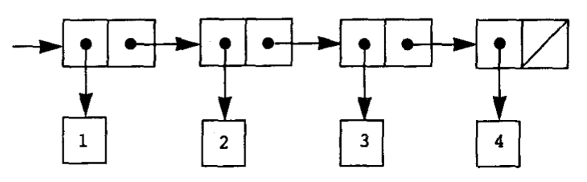
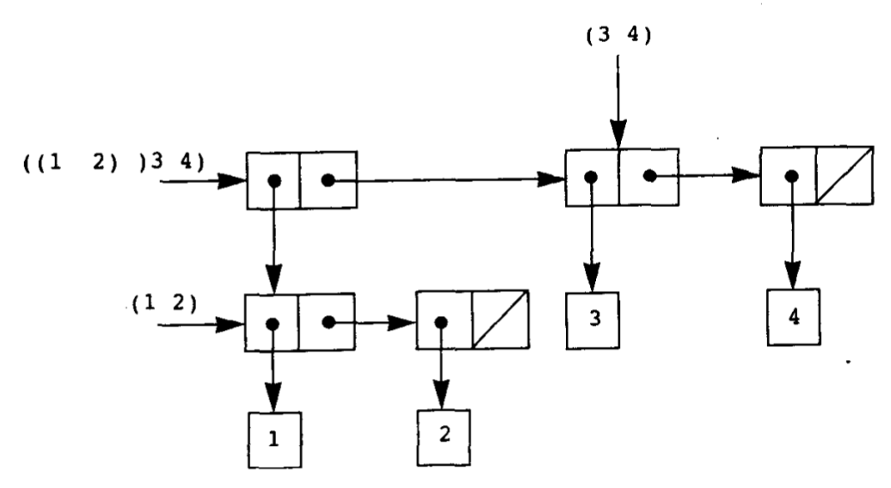
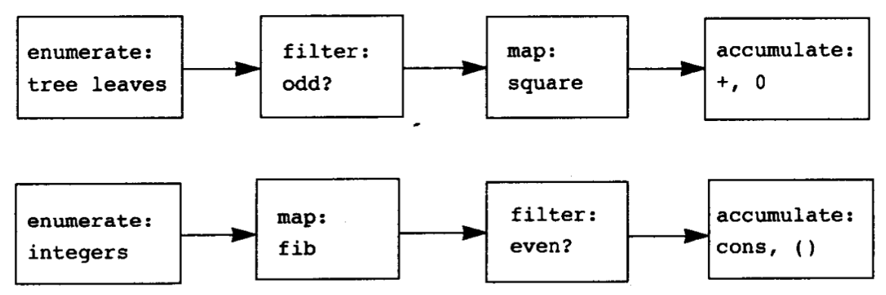

# 构造数据抽象

复合数据、抽象屏障、模糊“过程”和“数据”的划分、符号表达式（扩大语言的表述能力）、通用型操作

## 数据抽象导引

### 抽象屏障

```scheme
(define (make-vector x y) (cons x y)) ; (define make-vector cons)
(define (getx x) (car x)) ; (define getx car)
(define (gety x) (cdr x)) ; (define gety cdr)
```

```scheme
(define make-line cons)

(define start car)
(define (startx line)
  (getx (start line)))
(define (starty line)
  (gety (start line)))

(define end cdr)
(define (endx line)
  (getx (end line)))
(define (endy line)
  (gety (end line)))

(define (length line)
  (sqrt (add (sub endx startx) (sub endy starty))))
```

```bash
-----( 图形程序 )-----
图形、对图形的操作
-----( 线 )------
make-line end start endx startx...
-----( 向量 )------
make-vector getx gety...
-----( 有序对 )-----
cons car cdr...
```

### 数据意味着什么

有序对的创建：

```scheme
(define (cons x y)
  (lambda (pick)
    (cond ((= pick 0) x)
          ((= pick 1) y)
          (else (error "Argument not 0 or 1 -- cons" pick)))))

(define (car pair) (pair 0))
(define (cdr pair) (pair 1))
```

cons 返回一个过程，car cdr 对过程进行了操作，有序对的数据结构其实是一种过程，模糊“过程”和“数据”的划分

## 层次性数据和闭包性质

闭包：通过某种数据对象的操作，组合起来得到的数据对象还可以通过同样的操作进行组合

> 闭包另一种含义：一种为表示带有自由变量的过程而用的实现技术

### 序列的表示

```scheme
(list 1 2 3 4)

; 语法糖
; (cons 1
;   (cons 2
;     (cons 3
;       (cons 4 nil))))
```

> nil 空表，是拉丁文“nihil”的缩写，表示“什么也没有”



list 是一个过程，返回 `(1 2 3 4)` 表

```scheme
(define ls (list 1 2 3 4))
(car ls) ; 1
(cdr ls) ; (2 3 4)
```

对表的操作：

```scheme
; 根据下标返回元素
(define (list-ref ls n)
  (if (= n 0)
    (car ls)
    (list-ref (cdr ls) (- n 1))))

; 返回表的长度
(define (length ls)
  (if (null? ls)
    0
    (+ 1 (length (cdr ls)))))

(define (length ls)
  (define (iter ls count)
    (if (null? ls)
      count
      (iter (cdr ls) (+ count 1))))
  (iter ls 0))
```

对表的映射：

```scheme
(define (map proc ls)
  (if (null? ls)
    (list) ; nil
    (cons (proc (car ls))
          (map proc (cdr ls)))))
```

> Scheme 标准提供了一个 map，更具有一般性，以一个取 n 个参数的过程和 n 个表为参数，将过程应用于所有表的第一个元素，之后应用于所有表的第二个参数…… 最后返回所有结果的表
>
> ```scheme
> (map + (list 1 2 3) (list 40 50 60) (list 700 800 900)) ; (741 852 963)
> ```

### 层次性结构

```scheme
(cons (list 1 2) (list 3 4))
```



```scheme
(define (count-leaves x)
  (cond ((null? x) 0)
        ((not (pair? x)) 1)
        (else (+ (count-leaves (car x))
                 (count-leaves (cdr x))))))

(define (scale-tree tree factor)
  (map (lambda (tree)
         (if (pair? tree)
             (scale-tree tree factor)
             (* tree factor)))
       tree))
```

### 序列作为一种约定的界面

```scheme
(define (sum-odd-squares tree)
  (cond ((null? tree) 0)
        ((not (pair? tree))
          (if (odd? tree) (square tree) 0))
        (else (+ (sum-odd-squares (car tree))
                 (sum-odd-squares (cdr tree))))))

(define (evens-fibs n)
  (define (next k)
    (if (> k n)
        (list)
        (let ((f (fib k)))
          (if (even? f)
              (cons f (next + k 1))
              (next (+ k 1))))))
  (next 0))
```

第一个过程：

1. 枚举一棵树的树叶

2. 过滤选出奇数

3. 求平方

4. 累加

第二个过程：

1. 枚举 0-n 的整数

2. 对每个整数计算 fib 数列

3. 过滤选出偶数

4. 用 cons 累积结果



只写出第一个过程的操作：

```scheme
(define (enum-tree tree)
  (cond ((null? tree) (list))
        ((not (pair? tree)) (list tree))
        (else (append (enum-tree (car tree))
                      (enum-tree (cdr tree))))))

(define (sum-odd-tree tree)
  (accumulate +
              0
              (map square
                   (filter odd?
                           (enum-tree tree)))))
```
