# 程序设计 = 数据结构 + 算法

* 数据：是描述客观事物的符号，是计算机中可以操作的对象，是能被计算机识别，并输入给计算机处理的符号集合。数据不仅仅包括整型、实型等数值类型，还包括字符及声音、图像、视频等非数值类型。

* 数据元素：是组成数据的、有一定意义的基本单位，在计算机中通常作为整体处理。也被称为记录。

* 数据项：一个数据元素可以由若干个数据项组成。数据项是数据不可分割的最小单位

* 数据对象：是性质相同的数据元素的集合，是数据的子集。

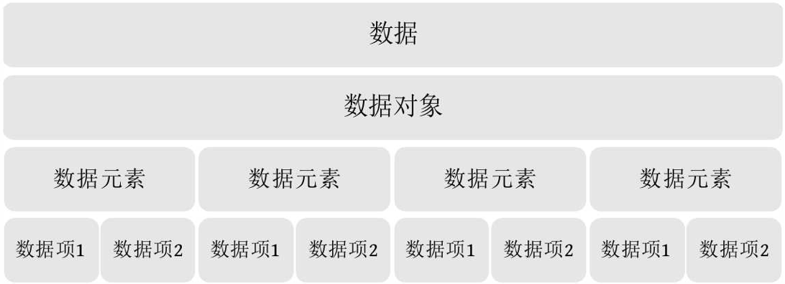

* 数据结构：是相互之间存在一种或多种特定关系的数据元素的集合。

    * 逻辑结构：是指数据对象中数据元素之间的相互关系

        * 集合结构

        * 线性结构

        * 树形结构

        * 图形结构

    * 物理结构：数据的逻辑结构在计算机中的存储形式

        * 顺序存储

        * 链式存储

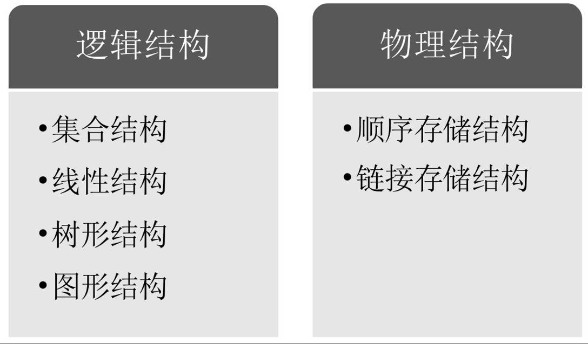

* 数据类型：是指一组性质相同的值的集合及定义在此集合上的一些操作的总称

* 抽象数据类型（Abstract Data Type，ADT）：是指一个数学模型及定义在该模型上的一组操作

* 算法：算法是解决特定问题求解步骤的描述，在计算机中表现为指令的有限序列，并且每条指令表示一个或多个操作

    * 输入输出：入参返回

    * 有穷性：会结束

    * 确定性：每个步骤被精确定义而无歧义

    * 可行性：

* 算法设计要求：正确性、可读性、健壮性、高效率、低存储量

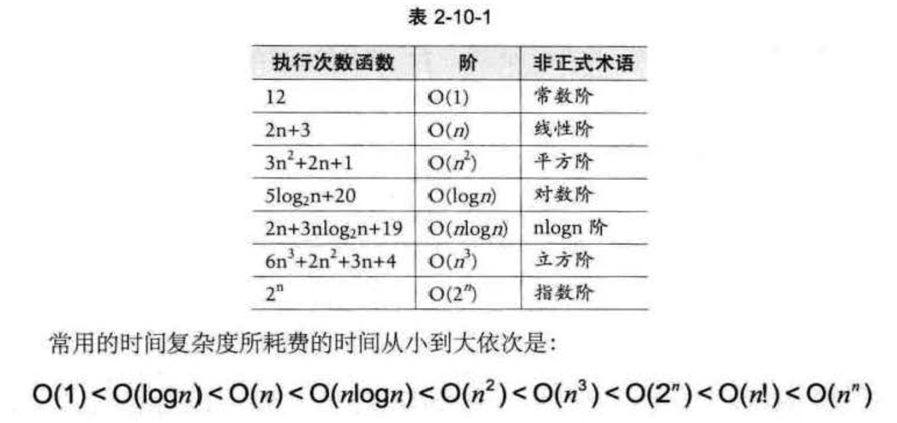

# 线性表

零个或多个数据元素的有限序列

## 顺序存储

* 优点：

    * 无需储存元素之间的逻辑关系（指针）

    * 可快速存取表中任意位置元素

* 缺点：

    * 插入删除需大量移动元素

    * 难以确定储存空间容量

    * 储存空间碎片

## 链式存储

存储下一个元素的位置（储存元素之间的逻辑关系）

`[_, *next] -> [a1, *next] -> [a2, *next] -> [a3, null]`

* 头节点：可有可无，方便操作统一而设立

* 头指针：必须存在，指向链表中第一个节点，有头节点则是头节点

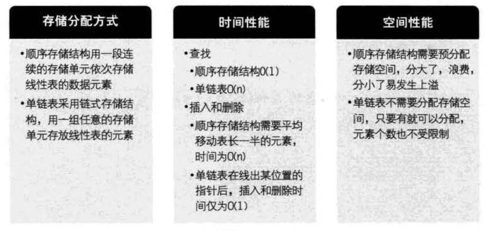

### 静态链表

用数组描述的链表

一个数组元素存 `{data, cur}`

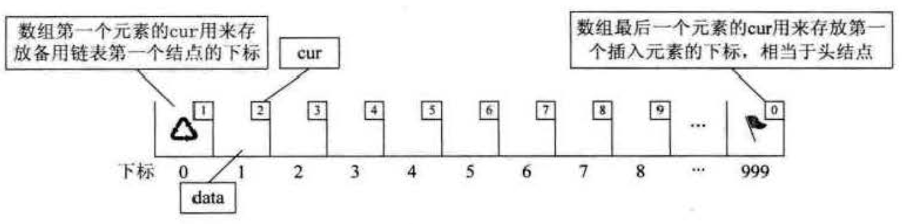

```cpp
template <class T>
class StaticLinkList {
public:
  StaticLinkList() {
    for (int i = 0; i < MAXSIZE - 1; i++) {
      arr[i].cur = i + 1;
    }
    arr[MAXSIZE] = 0;
  }

  int molloc() {
    int i = arr[0].cur
    arr[0].cur = arr[i].cur
    return i
  }

  void free(i) {
    arr[i].cur = arr[0].cur
    arr[0].cur = i
  }

private:
  T arr[100];
}
```

静态链表其实是为了给没有指针的高级语言设计的一种实现单链表能力的方法

### 动态（类似 go 的 slice）

超出时再扩展

### 循环链表

从当中一个结点出发，访问到链表的全部结点

### 双向链表

克服单向性

# 栈

先进后出

## 两栈共享

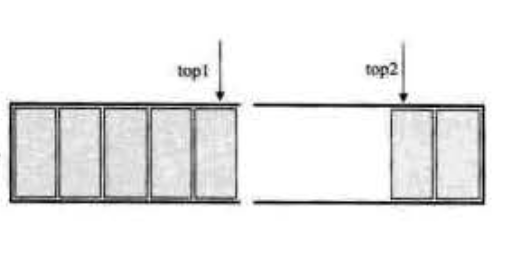

`top1 !== top2` 则不满

## 链栈

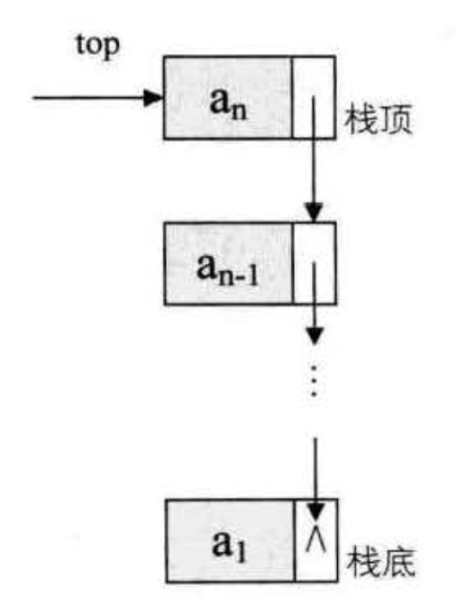

注意单向链表的单向性

## 最小栈

实现一个栈，带有出栈（pop），入栈（push），取最小元素（getMin）三个方法。并且这三个方法的时间复杂度都是 O(1)

1. 多用一个辅助栈，借用一个辅助栈 min_stack，用于存获取 stack 中最小值：

    * push：push 时，如果小于等于 min_stack 栈顶值，则一起 push 到 min_stack，即更新了栈顶最小值

    * pop：判断 pop 出去的元素值是否是 min_stack 栈顶元素值（即最小值），如果是则将 min_stack 栈顶元素一起 pop，这样可以保证 min_stack 栈顶元素始终是 stack 中的最小值

    * getMin：返回 min_stack 栈顶即可

    * t: O(1) s: O(N)

2. 多一个 min，在 push 时对比，比他小则更新并把原来的 min 存起来，在 pop 时对比，比他大则更新并把原来的 min 放出来

    * push：如果小于 min，则把 oldmin 在 min 之前入栈，再更新 min（入栈两个元素 [oldmin, min]）

    * pop：[..., oldmin, min] min 如果 pop 值等于 min，则出两个 [oldmin, min] 并更新 min = oldmin

3. 链表存 [value, min, next]

# 队列

先进先出

## 循环队列

解决“单向移动性”，充分利用数组空间

如果 front === rear 为满，则 front === rear 也为空，怎么区分？

1. 加个 flag，记录上一次操作是增是减，增则为满，减则为空

2. 留一个空间放 front 或 rear，`(rear + 1) % QueueSize === front` 为满

## 链队列

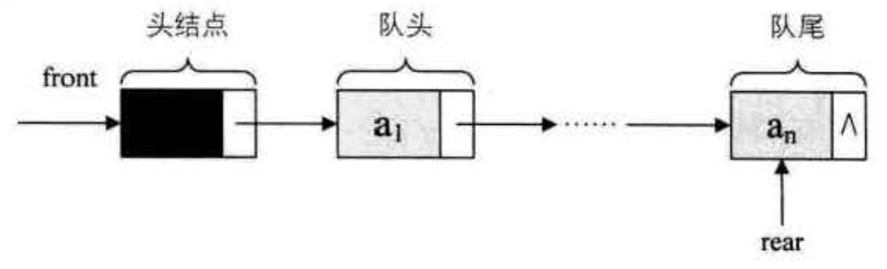

注意单向链表的单向性

## 最小队列

实现一个队列，带有出队（deQueue），入队（enQueue），取最小元素（getMin）三个方法。要保证这三个方法的时间复杂度都尽可能小

实现类似最小栈

# 串

// TODO

# 树

度：结点拥有的子树数称为结点的度（De-gree）

* 叶节点：度为 0

* 分枝节点

树的度：树内各结点的度的最大值

双亲表示法

孩子表示法

孩子兄弟表示法：`[data, *child, *rightSib]` -> 复杂的树变为二叉树

## 二叉树

满二叉树：所有分枝结点都有左子树和右子树，所有叶子都在同一层

完全二叉树：不满的，各个节点的位置与满二叉树相同

### 性质

* 第 i 层上最多有 2 ^ (i - 1) 个节点

* 深度为 k 的二叉树至多有 2 ^ k - 1 个结点

* 叶节点数 n0，度为 2 的节点数 n2，n0 = n2 + 1

    n0 + n1 + n2 = n0 * 0 + n1 * 1 + n2 * 2 + 1 = n1 + n2 * 2 + 1

    n0 = n2 + 1

* 具有 n 个结点的完全二叉树深度为 logn / 1 + 1

    logn / 1：去掉最底部一层得到的满二叉树的层数

* 完全二叉树的结点的编号为 i，则其左孩子（如果有）编号为 2i，右孩子（如果有）编号为 2i + 1

### 存储结构

* 顺序结构

    由于二叉树的严格定义（优越性），顺序结构也可以存（性质 5）

* 二叉链表

    `[data, *lchild, *rchild]`

### 遍历

* 前序

* 中序

* 后序

* 层序

已知中序和前序或后序，都可以推导出唯一一颗二叉树

二叉树的建立也是一次遍历

时间复杂度：O(n) 空间复杂度：O(h)（递归几层）

## 线索二叉树

利用二叉树的空指针域，记录前驱和后继，节省遍历的时间和空间

由于不能区分左右节点存的是子节点还是线索信息，所以引入布尔值 ltag 和 rtag 记录 `[*lchild, ltag, data, rtag, *rchild]`，区分 child 是子节点还是线索信息

线索化：以某种次序遍历使其成为线索二叉树的过程

中序的线索化：

```cpp
BiThrTree pre; // 保存 pre

void inThreading(BiThrTree p) {
  if (p) {
    inThreading(p->lchild);

    if (!p->lchild) { // p 无左孩子
      p->ltag = false;
      p->lchild = pre;
    }

    if (!pre->rchild) { // pre 无右孩子
      pre->rtag = false;
      pre->rchild = p;
    }

    pre = p; // 更新 pre

    inThreading(p->rchild);
  }
}
```

## 树、二叉树、森林之间的转换

相应逆操作省略

### 树转 => 二叉树

1. 加线

2. 去线

3. 层次调整

### 森林 => 二叉树

1. 树 => 二叉树

2. 后一颗二叉树的原根节点作为前一颗二叉树的原根节点的右孩子

## 哈夫曼树（最优二叉树）

压缩编码方式——哈夫曼编码

路径长度：两节点之间分枝数之和

树的路径长度：每个节点到根节点的路径长度之和

**带权路径长度最小的二叉树（最优二叉树）**

> 建立最优二叉树：对最小的两个结点求和，作为其父节点的值，递归直至得到根节点

得到最优二叉树后进行编码，比如左为 1 右为 0（哈夫曼编码）

## 并查集

一堆集合，每个集合没有交集

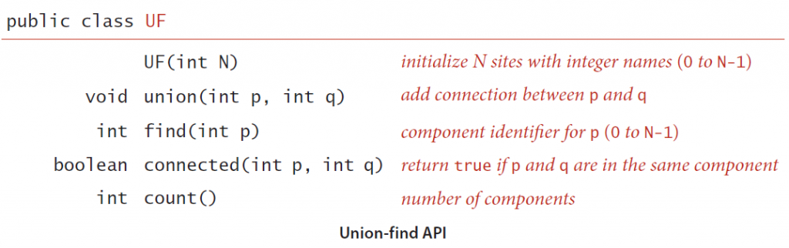


```cpp
class UF {
public:
  int find(int x) {
    return x == parent[x] ? x : find(parent[x])
  }

  void unionSet(int p, int q) {
    int pRoot = fint(p);
    int qRoot = find(q);

    if (pRoot != qRoot) {
      parent[pRoot] = qRoot;
    }
  }
  ...

private:
  int parent[CAP];
  ...
}
```

# 图

G(V, E)

V(Vertex)：点的集合

E(Edge)：边的集合

无向图：G(V, E); V = {A, B, C, D}; E = {(A, B), (B, C), (C, D), (D, A), (A, C)};

有向图：G(V, E); V = {A, B, C, D}; E = {<A, D>, <B, A>, <C, A>, <B, C>}

简单图：不存在顶点到其自身的边，切同一条边不重复出现

无向完全图：任意两顶点都有边

有向完全图：任意两顶点都有方向相反的两条边

度、出度、入度

连通：两顶点存在路径

连通图：任意两顶点都连通

强连通图：有向连通图

连通分量：极大连通（能连通的都算上）子图

## 存储结构

多重链表由于度有时相差很大（类似树），导致空间浪费

### 邻接矩阵

Vertex 与 Edge 分开存，Vertex 不分主次大小所以用一维数组，Edge 需要表示顶点间关系所以用二维数组

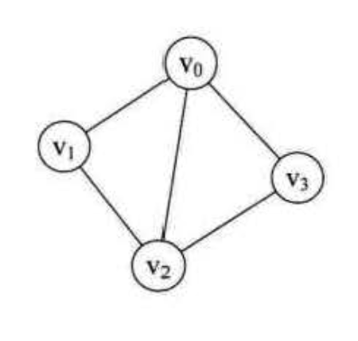

```
Vertex = [v0, v1, v2, v3]

Edge = [
  [0, 1, 1, 1],
  [1, 0, 1, 0],
  [1, 1, 0, 1],
  [1, 0, 1, 0],
]
```

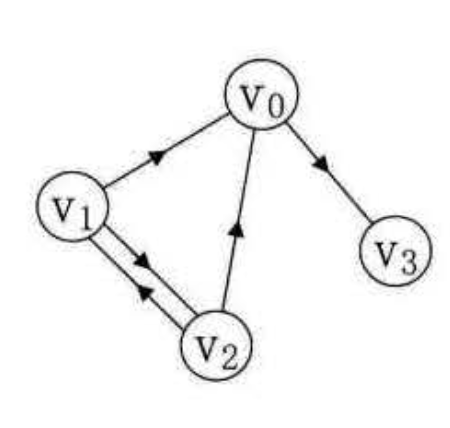

```
Vertex = [v0, v1, v2, v3]

Edge = [
  [0, 0, 0, 1],
  [1, 0, 1, 0],
  [1, 1, 0, 0],
  [0, 0, 0, 0],
]
```

vi, vj 是否连通或存在弧，判断 Edge[i][j] 是否等于 1

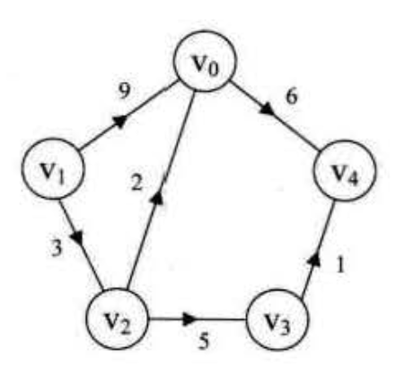

```
Vertex = [v0, v1, v2, v3, v4]

Edge = [
  [ 0 , INF, INF, INF,  6 ],
  [ 9 ,  0 ,  3 , INF, INF],
  [ 2 , INF,  0 ,  5 , INF],
  [INF, INF, INF,  0 ,  1 ],
  [INF, INF, INF, INF,  0 ],
]
```

无向网（无向带权图）类似

```cpp
// 创建无向网
template <typename T>
struct MGraph {
  T vexs[VEXNUM];
  int arc[VEXNUM][VEXNUM];
  int vertexsNum;
  int edgesNum;
}

void createMGraph(MGraph* g) {
  cout << "输入顶点数和边数：" << endl;
  cin >> g->vertexsNum >> g->edgesNum;

  cout << "输入顶点信息" << endl;
  for (int i = 0; i < g->vertexsNum; i++) {
    cin >> g->vexs[i];
  }

  // 初始化边
  for (int i = 0; i < g->vertexsNum; i++) {
    for (int j = 0; j < g->vertexsNum; j++) {
      g->arc[i][j] = INF;
    }
  }

  cout << "输入边信息" << endl;
  for (int n = 0; n < g->edgesNum; n++) {
    cout << "输入 (vi, vj) 的下标 i，下标 j，权 w：" << endl;
    int i, j, w;
    cin >> i >> j >> w;

    g->arc[i][j] = w;
    g->arc[j][i] = w; // 无向图，矩阵对称
  }
}
```

vertexsNum 个顶点，edgesNum 个边，时间复杂度：O(vertexsNum + vertexsNum ^ 2 + edgesNum) == O(n ^ 2)

### 邻接表

邻接矩阵存稀疏图时有极大浪费

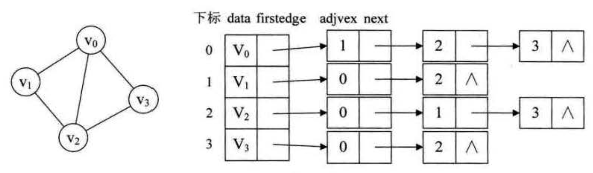

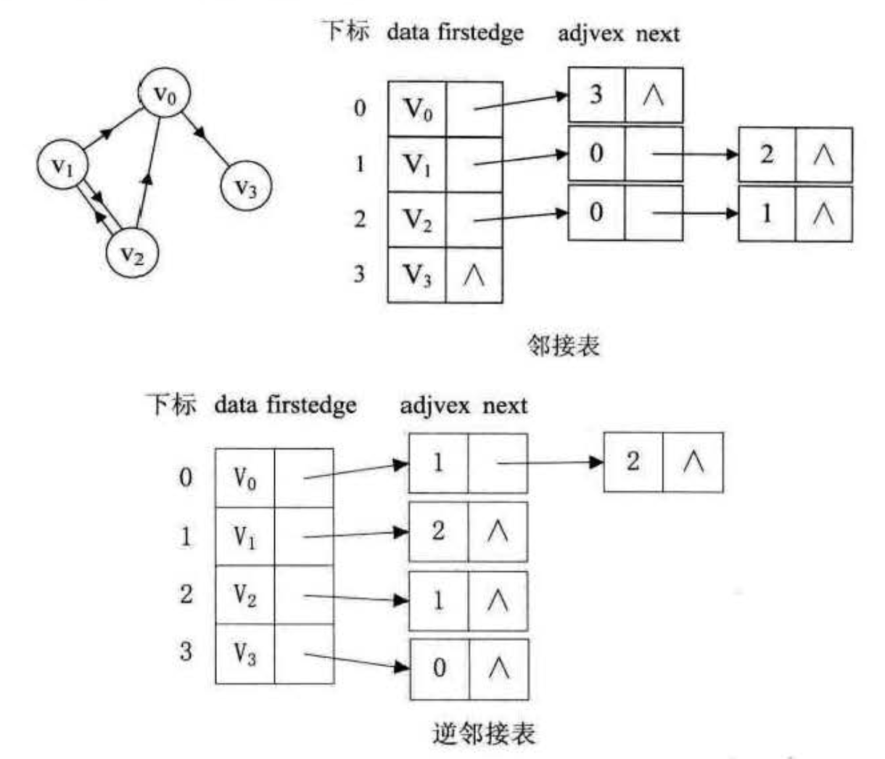

> 对于有向图，邻接表可以轻松获取出度的信息，而入度的信息需要遍历整个邻接表才行；逆邻接表则相反

* 顶点用一维数组存（也可以用链表，不过数组方便读取信息）`[[data, *firstEdge], ...]`

* 由于顶点的邻接点个数不定，所以边用链表存 `[adjvex, *next]`

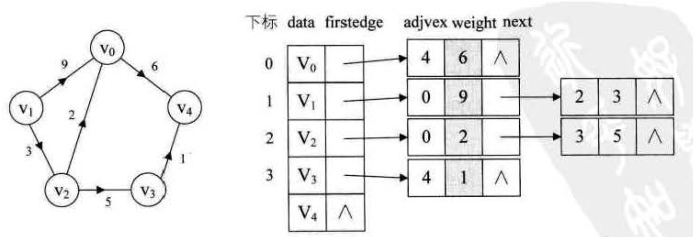

```cpp
// 建立有向网邻接表
struct EdgeNode {
  int adjvex; // 对应下标
  int weight;
  EdgeNode* next;
}

template <typename T>
struct VertexNode {
  T data; // 值
  EdgeNode* firstEdge;
}

template <typename T>
struct ALGraph {
  VertexNode<T> adjList[VEXNUM];
  int VertexsNum;
  int EdgesNum;
}

void createALGraph(ALGraph* g) {
  cout << "输入顶点数和边数：" << endl;
  cin >> g->vertexsNum >> g->edgesNum;

  // 读顶点信息，建立顶点数组，初始化边链表
  for (int i = 0; i < g->vertexsNum; i++) {
    cin >> g->adjList[i].data;
    g->adjList[i].firstEdge = NULL;
  }

  // 建立边链表
  for (int n = 0; n < g->edgesNum; n++) {
    cout << "输入 (vi, vj) 的下标 i，下标 j，权 w："
    int i, j, w;
    cin >> i >> j >> w;

    EdgeNode* e = new EdgeNode;
    // 头插法
    e->adjvex = j; // 弧 (vi, vj) 从 i 指向 j，j 指向（赋值）为 e
    e->next = g->adjList[i].firstEdge; // firstEdge 指向 i
    e->weight = w;
    g->adjList[i].firstEdge = e; // 更新 firstEdge，为下一个插入边
  }
}
```

### 十字链表

解决有向图邻接表入度信息需遍历整个邻接表获取的问题

整合邻接表和逆邻接表

* 顶点的一维数组 `[data, firstIn, firstOut]`

* 边链表 `[tailVex, headVex, *tailLink, *headLink]`

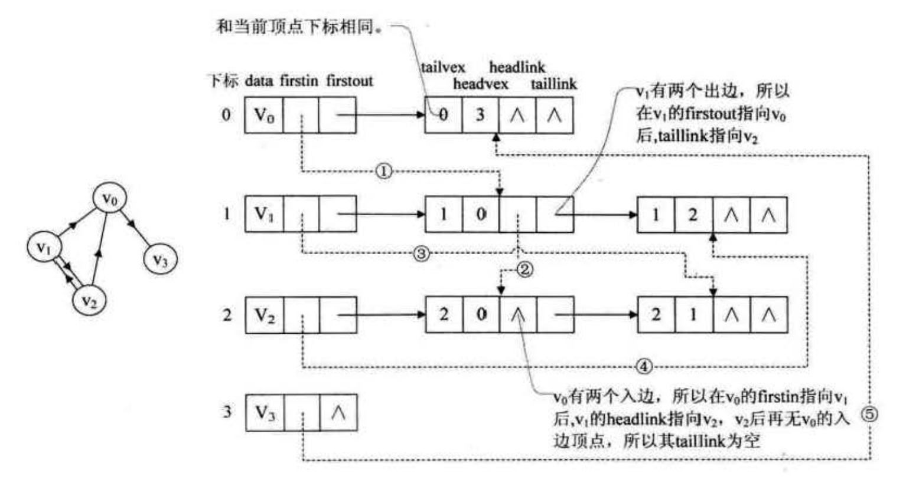

### 邻接多重表

如果无向图的邻接表在操作时注重顶点而不注重边，则邻接表没什么问题

如果注重边，由于无向图是没有方向的，其邻接矩阵是对称的，一个边会有两个边节点表示，这时使用邻接表对于边的操作就不方便

* 边：`[iVex, *iLink, jVex, *jLink]`

将一个边用两个顶点表示，v0 结点有三个边：(v0, v1)、(v3, v0)、(v0, v2)，各个边之间通过 v0 的 link 连接

把顶点的边还原成邻接表看，最后一个指针还是 NULL，添加时只需要构建一个边，最后的指针指向这个边的相应 vex，对应 link 为 NULL

删除则把指向 vex 的指针和 link 合并成一个，然后把边删除就行

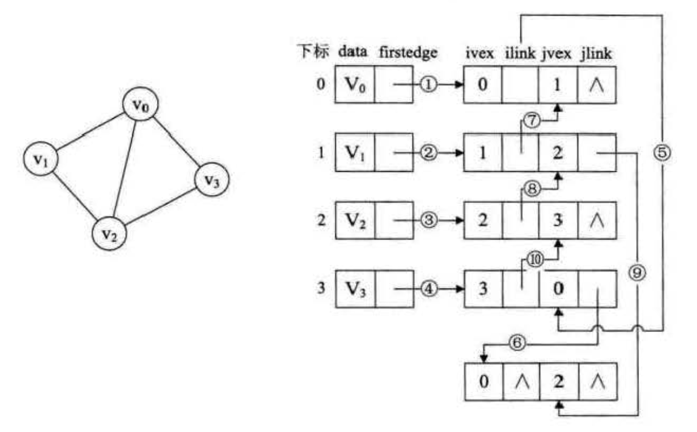

### 边集数组

`[begin, end, weight]`

边集数组关注的是边的集合，要查找一个顶点的度需要遍历整个边集，效率不高，更适合对边进行处理，不适合对顶点操作

## 遍历

使用邻接矩阵

```cpp
template <typename T>
struct MGraph {
  T vexs[VEXNUM];
  int arc[VEXNUM][VEXNUM];
  int vertexsNum;
  int edgesNum;
};

bool visited[VEXNUM];

// Depth-First-Search
void DFS(MGraph g, int i) {
  visited[i] = true;
  cout << g.vexs[i] << endl;

  // 访问邻接矩阵的行中的元素，如果有 i 顶点与 j 顶点间有边且未被访问，则递归遍历
  for (int j = 0; j < g->vertexsNum; j++) {
    if (g.arc[i][j] == 1 && !visited[j]) {
      DFS(g, j);
    }
  }
}

void DFSTraverse(MGraph g) {
  // 初始化 visited
  for (int i = 0; i < g.vertexsNum; i++) {
    visited[i] = false;
  }

  // 对未访问的进行遍历
  for (int i = 0; i < g.vertexsNum; i++) {
    if (!visited[i]) {
      DFS(g, i);
    }
  }
}

// Breadth-First-Search
void BFSTraverse(MGraph g) {
  Queue q;
  for (int i = 0; i < g.vertexsNum; i++) {
    visited[i] = false;
  }

  for (int i = 0; i < g.vertexsNum; i++) {
    if (!visited[i]) {
      // BFS
      visited[i] = true;
      cout << g.vexs[i] << endl; // 先操作或先入队都可以
      q.enQueue(i);

      // 出队，如果顶点 i、j 间有边且顶点 j 未被访问过，则访问并入队
      while (!q.empty()) {
        int i = q.deQueue();
        for (int j = 0; j < g.vertexsNum; j++) {
          if (g.vexs[i][j] == 1 && !visited[j]) {
            visited[j] = true;
            cout << g.vexs[i][j] << endl;
            q.enQueue(j);
          }
        }
      }
    }
  }
}
```

## 最小生成树

连通图：任意两顶点都连通

构造连通图最小代价的生成树

### Prim

以某点为起点，逐渐找到已构建的生成树的顶点上权值最小的边，并将顶点加入生成树，直至所有顶点都加入后得到最小生成树

```cpp
template <typename T>
struct MGraph {
  T vexs[VEXNUM];
  int arc[VEXNUM][VEXNUM];
  int vertexsNum;
  int edgesNum;
};

void prim(MGraph g) {
  int adjvex[VEXNUM];
  int lowcost[VEXNUM];

  for (int i = 0; i < g.vertexsNum; i++) {
    lowcost[i] = g.arc[0][i];
    adjvex[i] = 0;
  }

  for (int i = 1; i < g.vertexsNum; i++) {
    int min = INF;
    int k = 0;

    for (int j = 0; j < g.vertexsNum; j++) {
      if (lowcost[j] != 0 && lowcost[j] < min) {
        min = lowcost[j];
        k = j;
      }
    }

    lowcost[k] = 0;

    for (int j = 0; j < g.vertexsNum; j++) {
      if (lowcost[j] != 0 && g.arc[k][j] < lowcost[j]) {
        lowcost[j] = g.arc[k][j];
        adjvex[j] = k;
      }
    }
  }
}

// 返回最小生成树的顶点数组，对应 vexs 的下标
void prim(MGraph g) {
  int adjvex[VEXNUM]; // 当前的生成树
  int lowcost[VEXNUM]; // 生成树边的权值，下标是顶点，0 则表示该点在当前的生成树中，INF 则表示两点不连通

  int k = 0; // 从 v0 开始
  for (int i = 0; i < g.vertexsNum; i++) {
    // 在原生成树对应 lowcost 的基础上更新 vk 点的对应的 lowcost
    for (int j = 0; j < g.vertexsNum; j++) {
      if (lowcost[j] != 0 && g.arc[k][j] < lowcost[j]) {
        lowcost[j] = g.arc[k][j];
        adjvex[j] = k;
      }
    }

    // 遍历 lowcost 找出权值最小的边，min 记录权值，k 记录该顶点
    int min = INF;
    for (int j = 0; j < g.vertexsNum; j++) {
      if (lowcost[j] != 0 && lowcost[j] < min) {
        min = lowcost[j];
        k = j;
      }
    }

    // 把 vk 放入当前生成树（0 则表示该点在当前的生成树中）
    lowcost[k] = 0;
    // 输出
    cout << "(vi, vj): " << adjvex[k] << k
      << "weight: " << min << endl;
  }
}
```

时间复杂度：O(n ^ 2) // 可优化（算法导论 23.2）

### Kruskal

找最小权值的边来构建，同时避免形成环路

```cpp
// 使用边集数组
struct Edge {
  int begin;
  int end;
  int weight;
}

// 找根
int find(int* parent, int x) {
  while (parent[x] != x) {
    x = parent[x];
  }

  return x;
}

void kruskal(MGraph g) {
  Edge edges[EDGENUM] = matrix2edgesSet(g);
  int parent[EDGENUM];

  // 初始化并查集
  for (int i = 0; i < g.edgesNum; i++) {
    parent[i] = i;
  }

  for (int i = 0; i < g.edgesNum; i++) {
    int n = find(parent, edges[i].begin);
    int m = find(parent, edges[i].end);

    // 是否在同一个集（是否会形成环）
    if (n != m) {
      // 不会则加入集，并操作
      parent[n] = m;

      cout << "(vi, vj): " << edges[i].begin << edges[i].end
        << "weight: " << edges[i].weight << endl;
    }
  }
}
```

遍历 e 条边，每个边进行 find，find 的时间复杂度为 O(loge)（树），所以总时间复杂度：O(eloge)

## 最短路径

两顶点之间边上权值之和最小的路径

### Dijkstra

```cpp
void dijkstra(MGraph g) {
  int distance[], path[], found[];

  for (int i = 0; i < g.vertexsNum; i++) {
    found[i] = 0; // 初始化 found[i]
    distance[i] = g->arc[v0][i]; // 根据 g->arc[原点][i] 初始化 distance[i]
    path[i] = 0; // 初始化 path[i] = 原点
  }
  distance[0] = 0; found[0] = 1; // 处理原点 distance[原点] found[原点]

  for (int i = 1; i < g.vertexsNum; i++) {
    int min = INF; // 声明最小的权
    int k; // 声明最小的权对应的点

    // 找到最小的权的点，并记录最小的权
    for (int j = 0; j < g.vertexsNum; j++) {
      if (!found[j] && distance[j] < min) {
        min = distance[j];
        k = j;
      }
    }
    found[k] = 1; // 已经访问过了

    for (int j = 0; j < g.vertexsNum; j++) {
      // 如果最小的权加之前路径的长度比原来原点到最小权的点的距离小
      // 则更新 distance[最小权的点] 和 path[最小权的点]
      if (!found[j] && min + g.arc[k][j] < distance[j]) {
        distance[j] = min + g.arc[k][j];
        path[j] = k;
      }
    }
  }
}
```

D 到 A

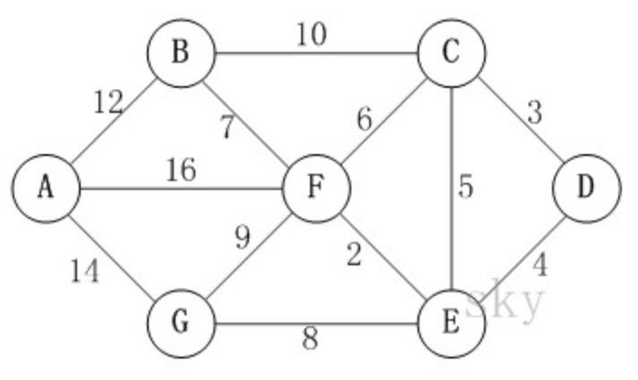

distance { 点: 该点到原点的最短距离 } // 记录各个点到原点的最短距离

path { 点: 最短路径上点的前驱点 } // 记录最短路径

found { 点: 是否已找到原点到该点的最短距离 } // 0: false, 1: true

1. 初始化
    根据 g->arc[D] 初始化 distance，原点距离自己为 0，distance[D] = 0
    path 初始化为全是原点
    found 原点不用找，found[D] = 1，其他为 0
    ```
    distance { D:  0 , C:  3 , E:  4 , F: INF, B: INF, G: INF, A: INF }
    path     { D:  D , C:  D , E:  D , F:  D , B:  D , G:  D , A:  D  }
    found    { D:  1 , C:  0 , E:  0 , F:  0 , B:  0 , G:  0 , A:  0  }
    ```

2. 根据边的权值最小且没有走过找到 C，走到 C，found[C] = 1
    因为 found[D, C] = 1 所以不更新 D, C
    因为 3 + 6 < INF 所以更新 distance[F] = 9; path[F] = C
    因为 3 + 10 < INF 所以更新 distance[B] = 13; path[B] = C
    其他的因为 C 到其距离 >= 原来的距离，所以不更新
    走完 C
    ```
    distance { D:  0 , C:  3 , E:  4 , F:  9 , B: 13 , G: INF, A: INF }
    path     { D:  D , C:  D , E:  D , F:  C , B:  C , G:  D , A:  D  }
    found    { D:  1 , C:  1 , E:  0 , F:  0 , B:  0 , G:  0 , A:  0  }
    ```

3. 根据边的权值最小且没有走过找到 E，走到 E，found[E] = 1
    因为 found[D, C, E] = 1 所以不更新 D, C, E
    因为 4 + 2 < 9 所以更新 distance[F] = 6; path[F] = E
    因为 4 + 8 < INF 所以更新 distance[G] = 12; path[G] = E
    其他的因为 E 到其距离 >= 原来的距离，所以不更新
    走完 E
    ```
    distance { D:  0 , C:  3 , E:  4 , F:  6 , B: 13 , G: 12 , A: INF }
    path     { D:  D , C:  D , E:  D , F:  E , B:  C , G:  E , A:  D  }
    found    { D:  1 , C:  1 , E:  1 , F:  0 , B:  0 , G:  0 , A:  0  }
    ```

4. 根据边的权值最小且没有走过找到 F，走到 F，found[F] = 1
    因为 found[D, C, E, F] = 1 所以不更新 D, C, E, F
    因为 6 + 12 < INF 所以更新 distance[A] = 18; path[A] = F
    其他的因为 F 到其距离 >= 原来的距离，所以不更新
    走完 F
    ```
    distance { D:  0 , C:  3 , E:  4 , F:  6 , B: 13 , G: 12 , A: 18  }
    path     { D:  D , C:  D , E:  D , F:  E , B:  C , G:  E , A:  F  }
    found    { D:  1 , C:  1 , E:  1 , F:  1 , B:  0 , G:  0 , A:  0  }
    ```

5. 根据边的权值最小且没有走过找到 B，走到 B，found[B] = 1
    因为 found[D, C, E, F, B] = 1 所以不更新 D, C, E, F, B
    其他的因为 B 到其距离 >= 原来的距离，所以不更新
    走完 B
    ```
    distance { D:  0 , C:  3 , E:  4 , F:  6 , B: 13 , G: 12 , A: 18  }
    path     { D:  D , C:  D , E:  D , F:  E , B:  C , G:  E , A:  F  }
    found    { D:  1 , C:  1 , E:  1 , F:  1 , B:  1 , G:  0 , A:  0  }
    ```

6. 根据边的权值最小且没有走过找到 A，走到 A，found[A] = 1
    因为 found[D, C, E, F, B, A] = 1 所以不更新 D, C, E, F, B, A
    其他的因为 A 到其距离 >= 原来的距离，所以不更新
    走完 B
    ```
    distance { D:  0 , C:  3 , E:  4 , F:  6 , B: 13 , G: 12 , A: 18  }
    path     { D:  D , C:  D , E:  D , F:  E , B:  C , G:  E , A:  F  }
    found    { D:  1 , C:  1 , E:  1 , F:  1 , B:  1 , G:  0 , A:  0  }
    ```

根据 path[A] = F, path[F] = E, path[E] = D 得最短路径：D -> E -> F -> A

> 权不能是负数

时间复杂度：O(n ^ 2)

### Floyd

