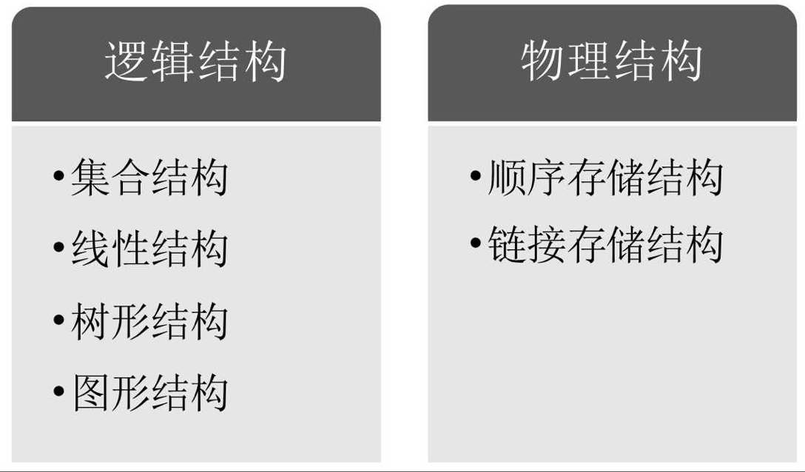

# 程序设计 = 数据结构 + 算法

* 数据：是描述客观事物的符号，是计算机中可以操作的对象，是能被计算机识别，并输入给计算机处理的符号集合。数据不仅仅包括整型、实型等数值类型，还包括字符及声音、图像、视频等非数值类型。

* 数据元素：是组成数据的、有一定意义的基本单位，在计算机中通常作为整体处理。也被称为记录。

* 数据项：一个数据元素可以由若干个数据项组成。数据项是数据不可分割的最小单位

* 数据对象：是性质相同的数据元素的集合，是数据的子集。


* 数据结构：是相互之间存在一种或多种特定关系的数据元素的集合。

    * 逻辑结构：是指数据对象中数据元素之间的相互关系

        * 集合结构

        * 线性结构

        * 树形结构

        * 图形结构

    * 物理结构：数据的逻辑结构在计算机中的存储形式

        * 顺序存储

        * 链式存储



* 数据类型：是指一组性质相同的值的集合及定义在此集合上的一些操作的总称

* 抽象数据类型（Abstract Data Type，ADT）：是指一个数学模型及定义在该模型上的一组操作

* 算法：算法是解决特定问题求解步骤的描述，在计算机中表现为指令的有限序列，并且每条指令表示一个或多个操作

    * 输入输出：入参返回

    * 有穷性：会结束

    * 确定性：每个步骤被精确定义而无歧义

    * 可行性：

* 算法设计要求：正确性、可读性、健壮性、高效率、低存储量


# 线性表

零个或多个数据元素的有限序列

```
ADT List
Data List<T>{a1, a2, a3, ..., an}
Operation
  initList
  isListEmpty
  clearList
  getElem
  locateElem
  listInsert
  listDelete
  listLength
endADT
```

## 顺序存储

* 优点：

    * 无需储存元素之间的逻辑关系（指针）

    * 可快速存取表中任意位置元素

* 缺点：

    * 插入删除需大量移动元素

    * 难以确定储存空间容量

    * 储存空间碎片

## 链式存储

存储下一个元素的位置（储存元素之间的逻辑关系）

`[_, next] -> [a1, next] -> [a2, next] -> [a3, null]`

* 头节点：可有可无，方便操作统一而设立

* 头指针：必须存在，指向链表中第一个节点，有头节点则是头节点


### 静态链表

用数组描述的链表

一个数组元素存 `{data, cur}`


```cpp
template <class T>
class StaticLinkList {
public:
  StaticLinkList() {
    for (int i = 0; i < MAXSIZE - 1; i++) {
      arr[i].cur = i + 1;
    }
    arr[MAXSIZE] = 0;
  }

  int molloc() {
    int i = arr[0].cur
    arr[0].cur = arr[i].cur
    return i
  }

  void free(i) {
    arr[i].cur = arr[0].cur
    arr[0].cur = i
  }

private:
  T arr[100];
}
```

静态链表其实是为了给没有指针的高级语言设计的一种实现单链表能力的方法

### 动态（类似 go 的 slice）

超出时再扩展

### 循环链表

从当中一个结点出发，访问到链表的全部结点

### 双向链表

克服单向性

# 栈

先进后出

## 两栈共享


`top1 !== top2` 则不满

## 链栈


注意单向链表的单向性

## 最小栈

实现一个栈，带有出栈（pop），入栈（push），取最小元素（getMin）三个方法。并且这三个方法的时间复杂度都是 O(1)

1. 多用一个辅助栈，借用一个辅助栈 min_stack，用于存获取 stack 中最小值：

    * push：push 时，如果小于等于 min_stack 栈顶值，则一起 push 到 min_stack，即更新了栈顶最小值

    * pop：判断 pop 出去的元素值是否是 min_stack 栈顶元素值（即最小值），如果是则将 min_stack 栈顶元素一起 pop，这样可以保证 min_stack 栈顶元素始终是 stack 中的最小值

    * getMin：返回 min_stack 栈顶即可

    * t: O(1) s: O(N)

2. 多一个 min，在 push 时对比，比他小则更新并把原来的 min 存起来，在 pop 时对比，比他大则更新并把原来的 min 放出来

    * push：如果小于 min，则把 oldmin 在 min 之前入栈，再更新 min（入栈两个元素 [oldmin, min]）

    * pop：[..., oldmin, min] min 如果 pop 值等于 min，则出两个 [oldmin, min] 并更新 min = oldmin

3. 链表存 [value, min, next]

# 队列

先进先出

## 循环队列

解决“单向移动性”，充分利用数组空间

如果 front === rear 为满，则 front === rear 也为空，怎么区分？

1. 加个 flag，记录上一次操作是增是减，增则为满，减则为空

2. 留一个空间放 front 或 rear，`(rear + 1) % QueueSize === front` 为满

## 链队列


注意单向链表的单向性

## 最小队列

实现一个队列，带有出队（deQueue），入队（enQueue），取最小元素（getMin）三个方法。要保证这三个方法的时间复杂度都尽可能小

实现类似最小栈

# 串

// TODO

# 树

度：结点拥有的子树数称为结点的度（De-gree）

* 叶节点：度为 0

* 分枝节点

树的度：树内各结点的度的最大值

双亲表示法

孩子表示法

孩子兄弟表示法：`[data, child, rightSib]` -> 复杂的树变为二叉树

## 二叉树

满二叉树：所有分枝结点都有左子树和右子树，所有叶子都在同一层

完全二叉树：不满的，各个节点的位置与满二叉树相同

### 性质

* 第 i 层上最多有 2 ** (i - 1) 个节点

* 深度为 k 的二叉树至多有 2 ** k - 1 个结点

* 叶节点数 n0，度为 2 的节点数 n2，n0 = n2 + 1

    n0 + n1 + n2 = n0 * 0 + n1 * 1 + n2 * 2 + 1 = n1 + n2 * 2 + 1

    n0 = n2 + 1

* 具有 n 个结点的完全二叉树深度为 logn / 1 + 1

    logn / 1：去掉最底部一层得到的满二叉树的层数

* 完全二叉树的结点的编号为 i，则其左孩子（如果有）编号为 2i，右孩子（如果有）编号为 2i + 1

### 存储结构

* 顺序结构

    由于二叉树的严格定义（优越性），顺序结构也可以存（性质 5）

* 二叉链表

    `[data, lchild, rchild]`

### 遍历

* 前序

* 中序

* 后序

* 层序

已知中序和前序或后序，都可以推导出唯一一颗二叉树

二叉树的建立也是一次遍历

时间复杂度：O(n) 空间复杂度：O(h)（递归几层）

## 线索二叉树

利用二叉树的空指针域，记录前驱和后继，节省遍历的时间和空间

由于不能区分左右节点存的是子节点还是线索信息，所以引入布尔值 ltag 和 rtag 记录 `[lchild, ltag, data, rtag, rchild]`，区分 child 是子节点还是线索信息

线索化：以某种次序遍历使其成为线索二叉树的过程

中序的线索化：

```cpp
BiThrTree pre; // 保存 pre

void inThreading(BiThrTree p) {
  if (p) {
    inThreading(p->lchild);

    if (!p->lchild) { // p 无左孩子
      p->ltag = false;
      p->lchild = pre;
    }

    if (!pre->rchild) { // pre 无右孩子
      pre->rtag = false;
      pre->rchild = p;
    }

    pre = p; // 更新 pre

    inThreading(p->rchild);
  }
}
```

## 树、二叉树、森林之间的转换

相应逆操作省略

### 树转 => 二叉树

1. 加线

2. 去线

3. 层次调整

### 森林 => 二叉树

1. 树 => 二叉树

2. 后一颗二叉树的原根节点作为前一颗二叉树的原根节点的右孩子

## 哈夫曼树（最优二叉树）

压缩编码方式——哈夫曼编码

路径长度：两节点之间分枝数之和

树的路径长度：每个节点到根节点的路径长度之和

**带权路径长度最小的二叉树（最优二叉树）**

> 建立最优二叉树：对最小的两个结点求和，作为其父节点的值，递归直至得到根节点

得到最优二叉树后进行编码，比如左为 1 右为 0（哈夫曼编码）

# 图

