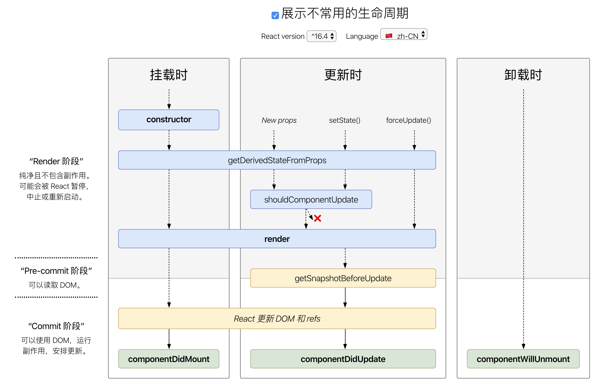

# Some notes

## class 的 this 指向与箭头函数方法

```js
class A {
  constructor() {
    console.log(this)
  }

  r = () => console.log(this)

  t() {
    console.log(this)
  }
}

var a = new A()
a.r()
a.t()
// 全都指向实例 a
```

但 a 实例中 r 作为属性附在 a 上，而不是在 A 的 prototype 上，所以以上写法等同于这样：

```js
class A {
  constructor() {
    this.r = () => console.log(this)
  }

  t() {
    console.log(this)
  }
}
```

class 中的 constructor 就是 ES5 中的构造函数：

```js
function A() {
  this.r = () => console.log(this)
}
```

这种写法有时还是挺常见的

## Virtual DOM

就是 JSX（createElement）得到的那个对象（tree）

## 无状态组件对比 class 组件

在适合的情况下，我们都应该且必须使用无状态组件。无状态组件不像上述两种方法（class、createClass）在调用时会创建新实例，它创建时始终保持了一个实例，避免了不必要的检查和内存分配，做到了内部优化。

## class 渲染加工后的 props

可以直接在 JSX 中计算结果，或者在组件的 render 方法中定义一个局部变量，其实都是在组件的 render 方法中计算加工

而在其他地方计算然后再将结果传给 JSX 是不行的

这是因为 class 组件的 Virtual DOM 由 render 方法返回

## React 中从上到下的数据流到底有什么好处？为什么不直接实现外部状态管理（Redux）

MVC 不是单向数据流，当项目变得很大时，会有多个 View 和多个 Model，数据流就会变的非常混乱

> 一个 Model 对应多个 View，一个 View 对应多个 Model，一个 Model 需要另一个 Model 的数据，另一个 Model 可以改变这个 Model 的数据……

而 React 的单向数据流动使保证了数据流的简单

有些很简单的，属于组件自己内部的状态，放在外部会使全局状态混乱复杂

## 生命周期



constructor 接收 props，初始化 state

如果我们在 componentDidMount 中执行 setState 方法，组件当然会再次更新，不过在初始化过程就渲染了两次组件，这并不是一件好事。但实际情况是，有一些场景不得不需要 setState，比如计算组件的位置或宽高时，就不得不让组件先渲染，更新必要的信息后，再次渲染。

在 componentWillUnmount 方法中，我们常常会执行一些清理方法，如事件回收或是清除定时器。

shouldComponentUpdate 接收需要更新的 props 和 state（nextProps、nextState），让开发者增加必要的条件判断，让其在需要时更新，不需要时不更新，作为性能优化。当返回 false 的时候，组件不再向下执行生命周期方法。更推荐使用 PureComponent 代替（React.PureComponent 中以浅层对比 prop 和 state 的方式来实现了该函数）

> 无状态组件中因为没有生命周期，可用 React.memo，如果函数组件在给定相同 props 的情况下渲染相同的结果，那么你可以通过将其包装在 React.memo 中调用，以此通过记忆组件渲染结果的方式来提高组件的性能表现。这意味着在这种情况下，React 将跳过渲染组件的操作并直接复用最近一次渲染的结果。默认情况下其只会对复杂对象做浅层对比，如果你想要控制对比过程，那么请将自定义的比较函数通过第二个参数传入来实现。
>```jsx
> const MyComponent = React.memo(props => {
>   // some code...
> }, (prevProps, nextProps) => {
>   // 无状态组件，所以只有 props 的比较
>   // some compare logic...
> })
> ```

componentDidUpdate 提供更新前的 props 和 state，不能再该方法中使用 this.setState，会陷入无限的更新

## React 与 DOM

### react-dom

一般情况下，大部分组件都不需要使用这个模块

由于考虑 React-Native、React-Canvas 等的实现，所以不推荐直接使用 react-dom 中的方法（除了挂载）

### refs

在组件内 JSX 不会返回一个组件的实例，它只是一个 ReactElement，只是告诉 React 被挂载的组件应该长什么样:

```jsx
const myApp = <App />
```

refs 就是为了得到改组件的实例

回调函数形式：

React 将在组件挂载时，会调用 ref 回调函数并传入 DOM 元素，当卸载时调用它并传入 null，在 componentDidMount 或 componentDidUpdate 触发前，React 会保证 refs 一定是最新的

```jsx
class App extends React.Component {
  render() {
    <input ref={node => this.inputRef = node} />
  }
}
```

```jsx
const App = () => {
  let inputRef = null

  return <input ref={node => inputRef = node} />
}
```

React.createRef API 形式：

```jsx
class App extends React.Component {
  constructor() {
    super()

    this.inputRef = React.createRef()
  }

  render() {
    return <input ref={this.inputRef} />
  }
}
```

在 React 中，无法使用 refs 获取无状态组件，因为无状态组件挂载时，只是方法调用，没有新建实例

有两种解决方式：

1. 作为属性传给 DOM 或有状态组件

    ```jsx
    const TextInput = props => <input ref={props.aRef} />

    class App extends React.Component {
      render() {
        return <TextInput aRef={node => this.inputRef = node} />
      }
    }
    ```

2. 包裹一层 DOM

    ```jsx
    const TextInput = props => <input />

    class App extends React.Component {
      render() {
        return (
          <div ref={node => this.wrappedRef = node}>
            <TextInput />
          </div>
        )
      }
    }
    ```

使用了 ref 很容易写命令式的代码

```jsx
this.inputRef.current.focus()
this.inputRef.current.blur()
```

为了防止内存泄漏，当卸载一个组件的时候，组件里所有的 refs 就会变为 null

### React 之外的 DOM 操作

React 的声明式渲染机制把复杂的 DOM 操作抽象为简单的 state 和 props 的操作，因此避免了很多直接的 DOM 操作

比如，audio 和 video 标签的 play 和 pause，获取 DOM 的大小和位置信息

> 值得高兴的是，React 正在自己构建一个 DOM 排列模型，来努力避免这些 React 之外的 DOM 操作。我们相信在不久的将来，React 的使用者就可以完全抛弃掉 jQuery 等 DOM 操作库
