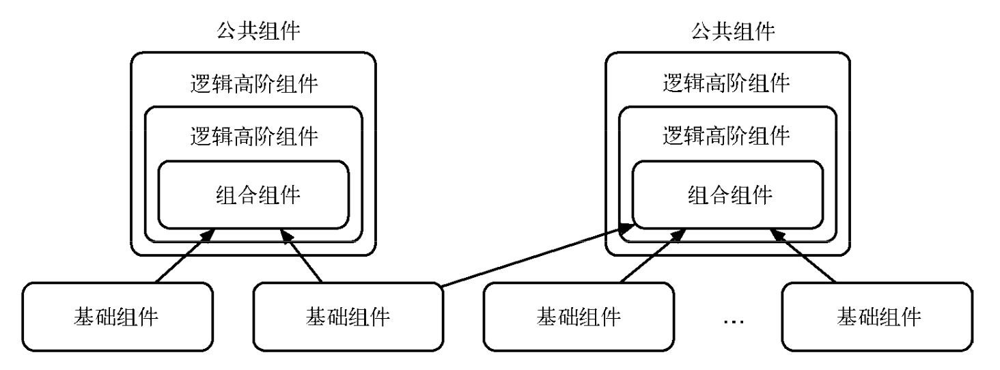
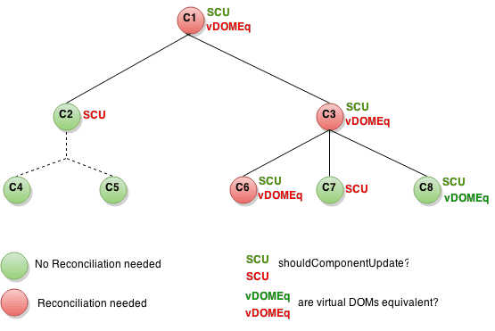

# notes

## 事件系统

React 基于 Virtual DOM 实现了一个 SyntheticEvent (合成事件)层，我们所定义的事件 处理器会接收到一个 SyntheticEvent 对象的实例，它完全符合 W3C 标准，不会存在任何 IE 标 准的兼容性问题。并且与原生的浏览器事件一样拥有同样的接口，同样支持事件的冒泡机制，我们可以使用 stopPropagation() 和 preventDefault() 来中断它

所有事件都自动绑定到最外层上。如果需要访问原生事件对象，可以使用 nativeEvent 属性

### 事件委派

不会把事件处理函数直接绑定到真实的节点上，而是把所有事件绑定到结构的最外层，使用一个统一的事件监听器，这个事件监听器上维持了一个映射来保存所有组件内部的事件监听和处理函数。当组件挂载或卸载时，只是在这个统一的事件监听器上插入或删除一些对象；当事件发生时，首先被这个统一的事件监听器处理，然后在映射里找到真正的事件处理函数并调用。这样做简化了事件处理和回收机制，效率也有很大提升。

### this 绑定

绑定到组件的实例上

```jsx
class App extends React.Component {
  handleClick() {
    console.log('Clicked!')
  }

  render() {
    return <button onClick={this.handleClick.bind(this)}>Click Me</button>
  }
}
```

```jsx
class App extends React.Component {
  constructor() {
    super()

    this.handleClick = this.handleClick.bind(this)
  }

  handleClick() {
    console.log('Clicked!')
  }

  render() {
    return <button onClick={this.handleClick}>Click Me</button>
  }
}
```

在 onClick 上 `this.handleClick.bind(this)` 相比于在 constructor 中 `this.handleClick = this.handleClick.bind(this)`，由于每次调用事件监听器时都会执行绑定操作，而在构造器中只执行一次，所以性能不如第二种好

> 双冒号提案：如果方法只绑定，不传参，可以用 `onClick={::this.handleClick}` 代替，可使用 babel 支持

## 原生事件

通过 ref 使用

在 React 中使用 DOM 原生事件时，一定要在组件卸载时手动移除，否则很可能出现内存泄漏的问题。而使用合成事件系统时则不需要，因为 React 内部已经帮你妥善地处理了

当实现点击一个按钮，出现二维码，而点击二维码之外的地方，二维码消失时，以前原生可以用事件委托实现，现在 React 中如果也用事件委托实现就需要给 document 对象添加原生事件了

```jsx
class Popup extends React.Component {
  state = { show: false }

  componentDidMount() {
    document.body.addEventListener('click', this.hideQrcode)
  }

  componentWillUnmount() {
    document.body.removeEventListener('click', this.hideQrcode)
  }

  showQrcode = () => {
    this.setState({ show: true })
  }

  hideQrcode = () => {
    this.setState({ show: false })
  }

  render() {
    return (
      <div>
        
        <button onClick={this.showQrcode}>show qr-code</button>
      </div>
    )
  }
}
```

现在大体实现了，但点击二维码时也会隐藏二维码

按照以前的写法，我们可以在二维码上点击时阻止冒泡：

```jsx
handleClickQrcode = e => {
  e.stopPropagation()
}

render() {
  return (
    <div>
      
      <button onClick={this.showQrcode}>show qr-code</button>
    </div>
  )
}
```

但是并不行，因为 handleClickQrcode 的事件是 React 的合成事件，只是在最外层的容器进行了绑定，并依赖事件的冒泡机制完成了委派。也就是说，事件没有直接绑定上 img 元素上，所以使用 e.stopPropagation 并没有用

```jsx
componentDidMount() {
  document.body.addEventListener('click', this.hideQrcode)
  document.querySelector('img').addEventListener('click', this.stopPropagation)
}

componentWillUnmount() {
  document.body.removeEventListener('click', this.hideQrcode)
  document.querySelector('img').addEventListener('click', this.stopPropagation)
}

stopPropagation = e => e.stopPropagation()
```

通过原生事件阻止冒泡，当然这样很麻烦，而且事件委托时我们一般用 e.target 判断

```jsx
hideQrcode = () => {
  if (e.target && e.target.matches('img')) return
  this.setState({ show: false })
}
```

> 其他方案：把二维码视为一个弹窗，二维码之外的部分是一个透明的层，整体盖住整个屏幕，点击它透明层整体消失

所以应避免合成事件和原生事件混用，阻止合成事件的冒泡只能只能阻止合成事件，无法阻止原生事件的冒泡，反之，在原生事件中阻止冒泡却可以阻止合成事件的传播

实际上，React 的合成事件系统只是原生 DOM 事件系统的一个子集。它仅仅实现了 DOM Level 3 的事件接口，并且统一了浏览器间的兼容问题。有些事件 React 并没有实现，或者受某些 限制没办法去实现，比如 window 的 resize 事件

由于在开发中使用事件捕获的意义并不大，所以 React 没有实现事件捕获，符合“二八原则”

## 表单

每当表单的状态发生变化时，都会被写入到组件的 state 中，这种组件在 React 中被称为受控组件(controlled component)。在受控组件中，组件渲染出的状态与它的 value 或 checked prop 相对应。React 通过这种方式消除了组件的局部状态，使得应用的整个状态更加可控

表单的数据源于组件的 state，并通过 props 传入，实现了单向数据绑定，然后又通过 onChange 将新的数据传回 state，实现了双向数据绑定

非受控组件是一种反模式，他的值不受组件的 state 和 props 控制，通常需要 ref 进行操控，所以并不推荐

## 样式

通过传递 className props 来修改组件的样式，className 也是组件的一个属性

### CSS 模块化遇到了哪些问题？

CSS 模块化是为了解决 CSS 样式的导入与导出问题，灵活按需导入以便复用代码，导出时要能够隐藏内部作用域，以免造成全局污染

Sass、Less、PostCSS 等解决了 CSS 编程能力弱的问题，但没有解决模块的问题

* 全局污染：CSS 使用全局选择器的机制来设置样式，优点是方便重写样式，缺点是所有的样式都全局生效，很容易污染，所以出现了 !important、inline !important、复杂的选择器权重。Web-Components 的 Shadow DOM 能解决这个问题，但是样式彻底局部化，无法外部修改样式，丧失了灵活性

* 依赖管理不彻底：组件应该是独立的，引入 CSS 时，应该只引入他所需要的 CSS 样式，而 Sass、Less 不能实现对每个组件都编译出单独的 CSS，引入所有 CSS 又会浪费。JavaScript 的模块化已经成熟，所以可以通过 Webpack 的 css-loader 使用 JavaScript 来管理 CSS

* 无法共享变量：复杂组件有时需要 JavaScript 和 CSS 共同处理样式，就会造成 JavaScript 和 CSS 中的变量冗余，而 CSS 的预处理语言和 CSS 变量（--var）不能提供跨 JavaScript 和 CSS 变量的能力

* 代码压缩不彻底

所以出现了完全的 CSS-in-JS，相当于完全抛弃 CSS，在 JS 中用 hash 映射来写 CSS。但这样过于激进，比如 styled-components 只能用于与他适配的，不能直接用于原生，所以出现了 CSS Modules

### CSS Modules

:import :export 两个新增的伪类来解决导入导出问题，但实在太繁琐，我们一般结合 webpack 的 css-loader，就可以在 CSS 中定义样式，在 JavaScript 文件中导入

```css
/* components/Button.css */
.normal { /* some styles */ }
.disabled { /* some styles */ }
```

```js
/* components/Button.js */
import styles from './Button.modules.css';
console.log(styles)
// =>
// Object {
//   normal: 'button--normal-abc5436',
//   disabled: 'button--disabled-def884',
// }
buttonElem.outerHTML = `<button class=${styles.normal}>Submit</button>
```

样式默认局部：

```css
.normal {
  color: green;
}
/* 以上与下面等价 */
:local(.normal) {
  color: green;
}
/* 定义全局样式 */
:global(.btn) {
  color: red;
}
/* 定义多个全局样式 */
:global {
  .link {
    color: green;
  }
  .box {
    color: yellow;
  }
}
```

使用 composes 组合样式

```css
.classNameA {
  color: green;
}

.classNameB {
  background: red;
}

.otherClassNameA {
  composes: classNameA classNameB;
  color: yellow;
}
```
生成的 HTML 如下：

```html
<button class="button--base-abc53 button--normal-abc53"> Processing... </button>
```

```css
.otherClassNameB {
  composes: globalClassName from global;
}

.otherClassNameC {
  composes: className from "./style.css";
}
```

> BEM 命名：
> Block：对应模块名，如 Dialog
> Element：对应模块中的节点名 Confirm Button
> Modifier：对应节点相关的状态，如 disabled 和 highlight

BEM 最终得到的 class 名为 dialog__confirm-button--highlight。使用双符号 __ 和 -- 是为 了与区块内单词间的分隔符区分开来。虽然看起来有些奇特，但 BEM 被非常多的大型项目采用。
CSS Modules 中 CSS 文件名恰好对应 Block 名，只需要再考虑 Element 和 Modifier 即可。BEM 对应到 CSS Modules 的做法是：

```css
/* .dialog.css */
.ConfirmButton--disabled {}
```

CSS Modules 是对现有的 CSS 做减法。为了追求简单可控，作者建议遵循如下原则：

* 不使用选择器，只使用 class 名来定义样式（CSS Modules 只转换 CSS 的类名）;

* 不层叠多个 class，只使用一个 class 把所有样式定义好;

* 所有样式通过 composes 组合来实现复用;

* 不嵌套。

### CSS Modules vs styled-components

CSS Modules 支持原生，更通用，更支持 BEM

styled-components 是 JS，编程性更好，结合 React 超爽

## 组件间通信

> props (& context) down, events up

Context 提供了一个无需为每层组件手动添加 props，就能在组件树间进行数据传递的方法

Context 像一个全局变量一样，把所有状态作为全局变量中会导致混乱，在大部分情况下，并不推荐使用 context。比较好的场景是真正意义上的全局信息且不会更改，例如界面主题、用户信息等。

### 没有嵌套关系的组件

可通过发布订阅模式

这里用 Node.js 中的 events 模块在浏览器上的实现

```js
// event.js
// 实现单例
import { EventEmitter } from 'events'
export default new EventEmitter()
```

```jsx
// Child.jsx
import React from 'react'
import emitter from 'event'

export default class Child extends React.Component {
  state = { count: 0 }

  handleClick = () => this.setState({ count: this.state.count + 1 }, () => {
    emitter.emit('increased', this.state.count)
  })

  render() {
    return <div onClick={this.handleClick}>Child counter: {this.state.count}</div>
  }
}
```

```jsx
// Bro.jsx
import React from 'react'
import emitter from 'event'

export default class Bro extends React.Component {
  state = { count: 0 }

  componentDidMount() {
    emitter.addListener('increased', count => this.setState({ count }))
  }

  componentWillUnmount() {
    emitter.removeListener('increased')
  }

  render() {
    return <div>Bro counter: {this.state.count}</div>
  }
}
```

```jsx
// App.jsx
import React from 'react'
import Bro from './components/Bro.jsx'
import Child from './components/Child.jsx'

export default function App() {
  return (
    <div>
      <Child />
      <Bro />
    </div>
  )
}
```

Pub/Sub 利用全局对象来保存事件，用广播的方式去处理事件。但这种模式带来的问题就是逻辑关系混乱

跨级通信往往是反模式的典型案例。对于应用开发来说，应该尽力 避免仅仅通过例如 Pub/Sub 实现的设计思路，加入强依赖与约定来进一步梳理流程是更好的方法

## 组件间抽象

### mixin

mixin 是将模块混入到另一个模块中，C++ 等 OOP 语言都有一个强大但危险的**多重继承特性**，现代语言为了权衡利弊，都舍弃了多继承，只能多继承，但只用单继承有时会很不方便，所以 Java 引入了 interface，其他语言则引入了 mixin，方法虽然不同，但都是为创造一种类似多重继承的效果，事实上说它是组合更为贴切

mixin 的问题：

* 破坏了原有组件的封装：

    混入方法的时候也会混入状态，使得组件中有一些“不可见”的状态需要我们维护；有时 mixin 会依赖其他 mixin，形成复杂的依赖链，使我们修改一个时也需要修改其他多个

* 命名冲突

* 增加复杂性：

### 高阶组件

hocFactory:: W: React.Component => E: React.Component

#### 属性代理

```jsx
import React from 'react'
import Child from './components/Child'

const hocFactory = (WrappedComponent) => (
  class extends React.Component {
    render() {
      return <WrappedComponent {...this.props} />
    }
  }
)

export default hocFactory(Child)
```

生命周期：

hoc constructing -> constructing
-> didMount -> hoc didMount
-> didUpdate -> hoc didUpdate
-> hoc willUnmount -> willUmnount

嗯，非常合理，will 的都是 hoc 先，did 的都是 wrapped 先

> HOC 为组件添加特性。自身不应该大幅改变约定。HOC 返回的组件与原组件应保持类似的接口。

* **约定：将不相关的 props 传递给被包裹的组件**

    HOC 应该透传与自身无关的 props

    ```jsx
    render() {
      // 过滤掉非此 HOC 额外的 props，且不要进行透传
      const { extraProp, ...passThroughProps } = this.props

      // 将 props 注入到被包装的组件中。
      // 通常为 state 的值或者实例方法。
      const injectedProp = someStateOrInstanceMethod

      // 将 props 传递给被包装组件
      return (
        <WrappedComponent
          injectedProp={injectedProp}
          {...passThroughProps}
        />
      )
    }
    ```

    这种约定保证了 HOC 的灵活性以及可复用性

* **约定：最大化可组合性**

    用于 HOC 的签名都是 Component => Component，所以很容易进行 compose

    ```jsx
    // OK but not good...
    const EnhancedComponent = withRouter(connect(commentSelector)(WrappedComponent))

    // 使用函数式编程中的 compose
    // compose(f, g, h) 等同于 (...args) => f(g(h(...args)))
    // OK and very good...
    const enhance = compose(
      withRouter,
      connect(commentSelector)
    )
    const EnhancedComponent = enhance(WrappedComponent)
    ```

* **约定：包装显示名称以便调试**

    设置 displayName 以便调试

    ```jsx
    function withSubscription(WrappedComponent) {
      return class WithSubscription extends React.Component {
        static displayName = `WithSubscription(${getDisplayName(WrappedComponent)})`
      }
    }

    function getDisplayName(WrappedComponent) {
      // 高阶组件的 displayName
      // || 非高阶组件的 name（class 组件构造函数的 name 和函数组件的 name）
      // || 没有显示指定组件的 name
      return WrappedComponent.displayName || WrappedComponent.name || 'Component'
    }
    ```

* **注意：不要在 render 方法中使用 HOC**

    diff 算法使用组件标识来确定它是应该更新现有子树还是将其丢弃并挂载新子树。如果从 render 返回的组件与前一个渲染中的组件相同（===），则 React 通过将子树与新子树进行区分来递归更新子树。如果它们不相等，则完全卸载前一个子树

    ```jsx
    render() {
      // 每次调用 render 函数都会创建一个新的 EnhancedComponent
      // EnhancedComponent1 !== EnhancedComponent2
      const EnhancedComponent = enhance(MyComponent)
      // 这将导致子树每次渲染都会进行卸载，和重新挂载的操作！
      return <EnhancedComponent />
    }
    ```

    这不仅仅是性能问题 - 重新挂载组件会导致该组件及其所有子组件的状态丢失

    可以在组件的生命周期方法或其构造函数中进行调用

* **注意：务必复制静态方法**

    当你将 HOC 应用于组件时，原始组件将使用容器组件进行包装。这意味着新组件没有原始组件的任何静态方法
    
    为了解决这个问题，你可以在返回之前把这些方法拷贝到容器组件上

    ```jsx
    function enhance(WrappedComponent) {
      return class Enhance extends React.Component {
        // 必须准确知道应该拷贝哪些方法 :(
        // (可以使用 hoist-non-react-statics 自动拷贝所有非 React 静态方法)
        static staticMethod = WrappedComponent.staticMethod
      }
    }
    ```

    除了导出组件，另一个可行的方案是再额外导出这个静态方法

    ```jsx
    // 使用这种方式代替...
    MyComponent.someFunction = someFunction
    export default MyComponent

    // ...单独导出该方法...
    export { someFunction }

    // ...并在要使用的组件中，import 它们
    import MyComponent, { someFunction } from './MyComponent.js'
    ```

* **注意：Refs 不会被传递**
    虽然高阶组件的约定是将所有 props 传递给被包装组件，但这对于 refs 并不适用。那是因为 ref 实际上并不是一个 prop - 就像 key 一样，它是由 React 专门处理的。如果将 ref 添加到 HOC 的返回组件中，则 ref 引用指向容器组件，而不是被包装组件

    这个问题的解决方案是通过使用 React.forwardRef API

#### 反向继承

```jsx
const hocFactory = (WrappedComponent) => class extends WrappedComponent {
  render() {
    return super.render() // <WrappedComponent {...props} />
  }
}
```

相比之前的属性代理方式，这种可以控制 WrappedComponent 的 state，但可能使 state 变得混乱

### 组合式组件开发实践

1. 组件分离

我们期望组件是没有冗余的，组件与组件间视图重叠的部分应当被抽离出来，形成颗粒度更细小的原子组件，使组件组合充满更多的可能，对于颗粒度最小的组件而言，我们希望它是纯粹的、木偶式的组件

2. 逻辑抽象

通过高阶组件实现逻辑与视图的分离

```jsx
const FinalSelector = compose(AsyncSelector, EnhancedSearcher)(Selector)
```



## 组件性能优化

无论是 PureRender 还是 key 值，整个 React 组件的优化逻辑都是针对 Virtual DOM 的更新优化

### pure function

React 组件本身就是纯函数。React 的 createElement 方法保证了组件是纯净的，即传入指定 props 得到一定的 Virtual DOM，整个过程都是可预测的

保持纯净状态，可以让方法或组件更加专注（focused），体积更小（small），更独立（independent），更具有复用性（reusability）和可测试性（testability）

### pure render

PureRender 源代码中只对新旧 props 作了浅比较

```js
const shallowEqual = (obj, newObj) => {
  if (obj === newObj) return true

  const objKeys = Object.keys(obj)
  const newObjKeys = Object.keys(newObj)

  if (objKeys.length !== newObjKeys.length) return false

  return objKeys.every(key => newObj[key] === obj[key])
}
```

PureComponent 就是 shouldComponentUpdate 浅比较的封装

```jsx
shouldComponentUpdate(nextProps, nextState) {
  return (shallowEqual(this.props, nextProps) || shallowEqual(this.state, nextState))
}
```

```jsx
class App extends React.PureComponent {
  state = {
    list: [
      {
        name: 'one',
      },
      {
        name: 'two',
      },
      {
        name: 'three',
      },
    ],
  }

  handleClick = () => {
    // OK but very bad...
    const { list } = this.state

    list.forEach(item => {
      item.name += '#'
    })
    // console.log(list)
    this.setState({ list })
  }

  render() {
    return (
      <div>
        <ul>
          {this.state.list.map(item => <li key={item.name}>{item.name}</li>)}
        </ul>
        <button onClick={this.handleClick}>update</button>
      </div>
    )
  }
}
```

以上在点击 update 之后会发现视图根本不会更新，而看 console.log 会发现 list 中的 name 是改变了的，但因为 list 的值（引用类型，值是址）并没有改变，所以 shallowEqual 返回 false，没有更新视图



#### 优化 pure render

1. 使用引用类型数据的引用不变

    ```jsx
    // Item 是 PureComponent，props 做浅比较，items !== nextItems（引用类型址不同）
    <Item items={this.props.items.filter(e => e.val > 30)} />
    ```

    这样由于每次 Item 的 items props 的引用都改变，尽管 items 还是那几个，视图也不改变，但仍然会更新一遍视图（一次无用的更新）

2. constructor 中 bind 事件

3. 子组件的 JSX

    ```jsx
    render() {
      return (
        <Item>
          <span>hah</span>
        </Item>
      )
    }
    ```

    翻译过来就是

    ```jsx
    render() {
      return (
        <Item children={React.createElement('span', {}, 'hah')} />
      )
    }
    ```

    所以与 1 其实是同一个问题

    给父组件设置为 PureComponent，父组件 shouldComponentUpdate 返回 false，则父组件不会更新，diff 算法终止与父组件，就不会去更新子组件

### Immutable.js

### key

key 用来唯一标示渲染的列表元素