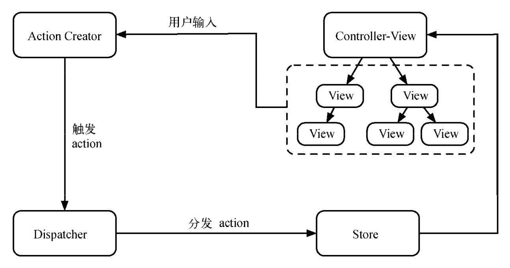
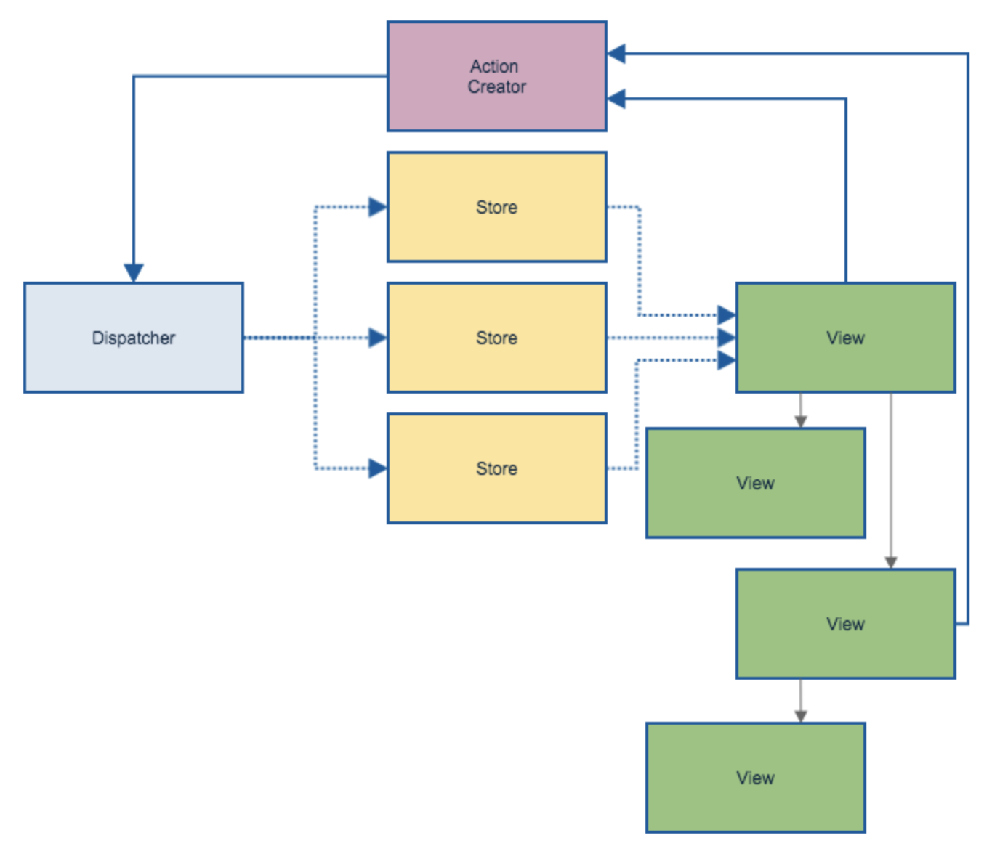

# Flux 架构

## MVC/MVVM

### MVC

MVC 是一种架构设计模式，它通过关注数据界面分离，来鼓励改进应用程序结构。具体地说，MVC 强制将业务数据(Model)与用户界面(View)隔离，用控制器(Controller)管理逻辑和用户输入

* Model

    Model 负责保存应用数据，和后端交互同步应用数据，或校验数据。

    Model 不涉及用户界面，也不涉及表示层，而是代表应用程序可能需要的独特形式的数据。当 Model 改变时，它会通知它的观察者(如视图)作出相应的反应。

    总的来说，Model 主要与业务数据有关，与应用内交互状态无关

* View

    View 是 Model 的可视化表示，表示当前状态的视图。前端 View 负责构建和维护 DOM 元素。 View 对应用程序中的 Model 和 Controller 的了解是有限的，更新 Model 的实际任务都是在 Controller 上。

    用户可以与 View 交互，包括读取和编辑 Model，在 Model 中获取或设置属性值。

    一个 View 通常对应一个 Model，并在 Model 更改时进行通知，使 View 本身能够进行相应的更新。但在实际应用开发中，还会面临多个 View 对应多个 Model 的情况

* Controller

    负责连接 View 和 Model，Model 的任何改变会应用到 View 中，View 的操作会通过 Controller 应用到 Model 中。Controller 管理了应用程序中 Model 和 View 之间的逻辑和协调

### MVVM

### MVC 问题

当项目变得很大时，会有多个 View 和多个 Model，（双向的）数据流就会变的非常混乱

一个 Model 对应多个 View，一个 View 对应多个 Model，一个 Model 需要另一个 Model 的数据，另一个 Model 可以改变这个 Model 的数据……

## Flux

Flow

ADSV（Action、Dispatch、Store、View）

Flux 是如何解决 MVC 存在的问题呢？正如其名，Flux 的核心思想就是**数据和逻辑永远单向流动**

在介绍 React 的时候，我们也提到它推崇的核心也是单向数据流，Flux 中单向数据流则是在整体架构上的延伸

Flux 强调单向数据流，强调谨慎可追溯的数据变动

