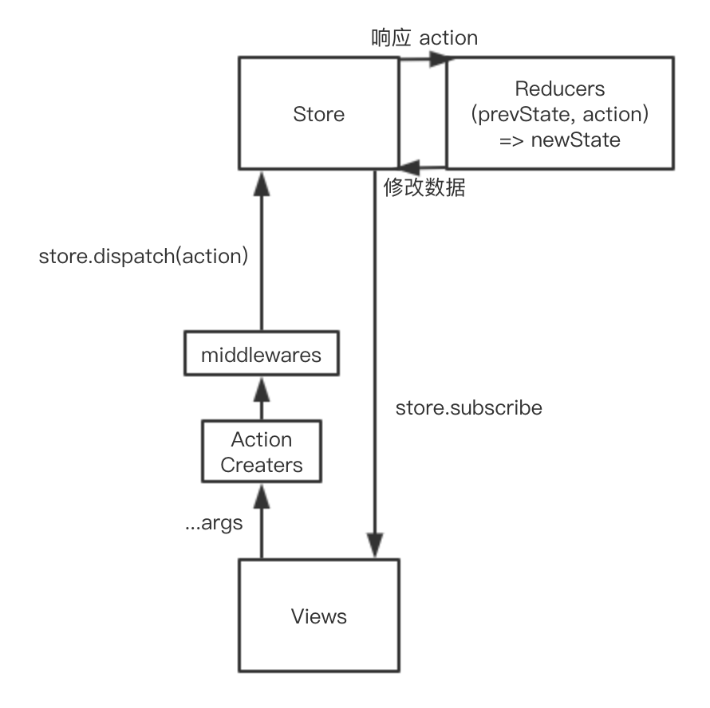

# Redux

## 三大原则：

1. 单一数据源

2. 状态是只读的

3. 状态修改均有纯函数完成



相比 Flux 可以看出，Redux 没有 Dispatcher，Store 是单一的，Store 通过 Reducers 纯函数获取新的 State，使得状态的修改变得简单、纯粹、可测试，并且可以追踪每次变化，实现了时间旅行

## middleware

> It provides a third-party extension point between dispatching an action, and the moment it reaches the reducer.

它提供了一个分类处理 action 的机会。在 middleware 中，你可以检阅每一个流过的 action，挑选出特定类型的 action 进行相应操作，给你一次改变 action 的机会

## 高阶 reducer

`higher-order-reducer:: reducer => reducer`

高阶 reducer 就是指将 reducer 作为参数或者返回值的函数

combineReducers 其实就是一个高阶 reducer，因为 combineReducers 就是将一个 reducer 对象作为参数，最后返回顶层的 reducer

* reducer 的复用：

    我们两个组件，它们的功能是相同的，都是 LOAD_DATA，我们能不能让它们共用一个 reducer？

    不能，因为当一个组件出发 action 时，另一个组件的状态也会改变

    所以在一个应用中，不同模块间的 actionType 必须是全局唯一的

    我们可以用增加前缀的方法解决：

    ```js
    const generateReducer = (prefix, state) => {
      const LOAD_DATA = prefix + 'LOAD_DATA'
      const defaultStaet = {}

      return (state = defaultStaet, action) => {
        switch (action.type) {
          case LOAD_DATA:
            return {
              ...state,
              data: action.payload,
            }
          default:
            return state
        }
      }
    }
    ```

* reducer 增强

    redux-undo：

    ```js
    const undoable = reducer => {
      const defaultState = {
        past: [],
        current: reducer(undefined, {}),
        future: [],
      }

      return (state = defaultState, action) => {
        const { past, current, future } = state

        switch (action.type) {
          case '@@redux-undo/UNDO':
            const previous = past[past.length - 1]
            const newPast = past.slice(0, past.length - 1)

            return {
              past: newPast,
              current: previous,
              future: [current, ...future],
            }
          case '@@redux-undo/REDO':
            const next = future[0]
            const newFuture = future.slice(1)

            return {
              past: [...past, current],
              current: next,
              future: newFuture,
            }
          default:
            const newCurrent = reducer(current, action)

            return {
              past: [...past, current],
              current: newCurrent,
              future: [],
            }
        }
      }
    }
    ```

## 源码分析