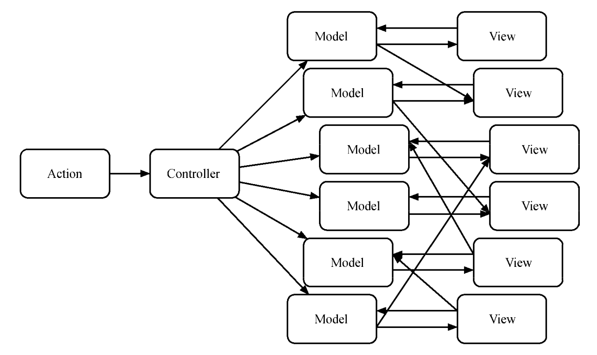

# Redux

随着前端应用逐渐变大，状态也越来越复杂，需要一种状态管理的方案，Redux 就是其中一种

总结起来 React 状态管理方案就分为两类：

* 外部 Model，通过事件修改状态，组件通过监听订阅状态（观察者模式）

  * Redux

  * Mobx

  * EventBus

  * hox

* 通过 React Context 提升状态（包括修改状态的方法），在组件中拿到并使用 Context

  * unstated

  * unstated-next

  * reunx

使用外部 Model 的模式由于不依赖于 React，所以不仅适用于 React，在各个框架甚至原生应用中都可以使用；而第二种依赖于 React Context 仅适用于 React 应用，但是十分轻量

MVC（backbone.js...）由于当应用变得很大时，会有多个 View 和多个 Model，（双向的）数据流就会变的非常混乱



所以出现了 Flux，以单向数据流管理状态，React 推崇的核心也是单向数据流，Flux 中单向数据流可以看作是在其整体架构上的延伸，Redux 是也不是 Flux，它遵循了 Flux 的单向数据流的理念，同时简化了 Flux


Flux/Redux 这种以单向数据流管理状态更像是一种设计模式

## Redux 对比 Mobx

Mobx 和 Redux 的目标都是管理好应用状态，但是最根本的区别在于对数据的处理方式不同。

Redux 认为，数据的一致性很重要，为了保持数据的一致性，要求Store 中的数据尽量范式化，也就是减少一切不必要的冗余，为了限制对数据的修改，要求 Store 中数据是不可改的（Immutable），只能通过 action 触发 reducer 来更新 Store。

Mobx 也认为数据的一致性很重要，但是它认为解决问题的根本方法不是让数据范式化，而是不要给机会让数据变得不一致。所以，Mobx 鼓励数据干脆就“反范式化”，有冗余没问题，只要所有数据之间保持联动，改了一处，对应依赖这处的数据自动更新，那就不会发生数据不一致的问题。

> Redux 和 Mobx 都是一个特定时期的产物，不要因为某个工具或者技术炫酷或者热门而去用它，要根据自己的工作需要去选择工具和技术

## Redux 三大原则

1. 单一数据源

2. 状态是只读的

3. 状态修改均有纯函数完成


相比 Flux 可以看出，Redux 没有 Dispatcher，Store 是单一的，Store 通过 Reducers 纯函数获取新的 State，使得状态的修改变得简单、纯粹、可测试，并且可以追踪每次变化，实现了时间旅行

## middleware

> It provides a third-party extension point between dispatching an action, and the moment it reaches the reducer.

它提供了一个分类处理 action 的机会。在 middleware 中，你可以检阅每一个流过的 action，挑选出特定类型的 action 进行相应操作，给你一次改变 action 的机会

### Redux 为什么需要 middleware

middleware 大部分都是用来处理异步，因为 Redux 的 reducer 必须要是一个纯函数，不能有任何的副作用，所以 Redux 引入了 middleware，在 action 没有到 reducer 的时候就拦截 action 并进行副作用的操作

如果 reducer 不纯（我们当然可以写成不纯的），就可以在 reducer 中处理副作用，但这样不仅代码难看（async reducer() => await ...），而且没有可预测性、组织性……

也正因为 reducer 是纯函数，我们通过 middleware 进行的异步操作和在一些大项目中对 action 的特殊需求的一些处理，才可以很好的进行组织管理

## 高阶 reducer

`higher-order-reducer:: reducer => reducer`

高阶 reducer 就是指将 reducer 作为参数或者返回值的函数

combineReducers 其实就是一个高阶 reducer，因为 combineReducers 就是将一个 reducer 对象作为参数，最后返回顶层的 reducer

* reducer 的复用：

    我们两个组件，它们的功能是相同的，都是 LOAD_DATA，我们能不能让它们共用一个 reducer？

    不能，因为当一个组件出发 action 时，另一个组件的状态也会改变

    所以在一个应用中，不同模块间的 actionType 必须是全局唯一的

    我们可以用增加前缀的方法解决：

    ```js
    const generateReducer = (prefix, state) => {
      const LOAD_DATA = prefix + 'LOAD_DATA'
      const defaultStaet = {}

      return (state = defaultStaet, action) => {
        switch (action.type) {
          case LOAD_DATA:
            return {
              ...state,
              data: action.payload,
            }
          default:
            return state
        }
      }
    }
    ```

* reducer 增强

    redux-undo：

    ```js
    const undoable = reducer => {
      const defaultState = {
        past: [],
        current: reducer(undefined, {}),
        future: [],
      }

      return (state = defaultState, action) => {
        const { past, current, future } = state

        switch (action.type) {
          case '@@redux-undo/UNDO':
            const previous = past[past.length - 1]
            const newPast = past.slice(0, past.length - 1)

            return {
              past: newPast,
              current: previous,
              future: [current, ...future],
            }
          case '@@redux-undo/REDO':
            const next = future[0]
            const newFuture = future.slice(1)

            return {
              past: [...past, current],
              current: next,
              future: newFuture,
            }
          default:
            const newCurrent = reducer(current, action)

            return {
              past: [...past, current],
              current: newCurrent,
              future: [],
            }
        }
      }
    }
    ```

## 源码分析

### createStore

createStore 其实就把 reducer 包了一层，根本没有 store，只是暴露出几个接口，方便操作，并用发布订阅模式实现了 state 改变时执行订阅的函数的功能，然后在一开始实现 enhancer，供 applyMiddleware 使用

reducer、preloadedState/initialState 都得自己写，Redux 为我们干的很少

```js
const createStore = (reducer, preloadedState, enhancer) => {
  if (typeof enhancer !== undefined) {
    return enhancer(createStore)(reducer, preloadedState)
  }

  let currentReducer = reducer
  let state = preloadedState
  let listeners = []

  function getState() {
    return state
  }

  function subscribe(listener) {
    // 利用闭包防止多次 unsubscribe
    let isSubscribed = true
    listeners.push(listener)

    return function unsubscribe() {
      if (!isSubscribe) return

      const index = listeners.indexOf(lintener)
      listeners.splice(index, 1)
      isSubscribe = false
    }
  }

  function dispatch(action) {
    state = currentReducer(state, action)
    // 依次执行订阅
    listenters.forEach(listener => listener())

    return action
  }

  function replaceReducer(nextReducer) {
    currentReducer = nextReducer

    dispatch({ type: Symbol('REPLACE') })
  }

  // dispacth 一个没有的 action，仅用来第一次初始化 state
  dispatch({ type: Symbol('INIT') })

  return {
    dispatch,
    subscribe,
    getState,
    replaceState,
  }
}
```

### combineReducers

combineReducers 使我们更方便的组织 state，它干的就是将所有的 reducers 执行，使相应的 reducer 更新相应的 state，最终得到总共的新的 state

```js
const combineReducers = reducers => (state, action) => (
  Object.entries(reducers).reducer((nextState, [key, reducer]) => {
    const previousStateForKey = state[key]
    const nextStateForKey = reducer(previousStateForKey, action)

    return nextState[key] = nextStateForKey
  }, {})
)
```

### compose

compose 就是典型的函数式编程中的组合函数，用于组合多个 enhancers 成一个 enhancer

```js
const compose = (...fns) => fns.reduce((f, g) => (...args) => f(g(...args)))
```

### applyMiddleware

applyMiddleware 可以对特定类型的 action 进行操作

createStore 中的 dispatch 由于有对 action 是否为 plainObject 的检测，所以只能 dispatch plainObject，而中间件可以穿入其他类型的 action（redux-thunk...）

实现就是通过传入旧的 createStore 返回增强过的 store，从旧的 createStore 中提取出原来 dispatch，然后对原来的 dispatch 进行包裹（增强），检测特定类型的 action 并进行的一些操作，然后仍然创建一个 plainObject 的 action，使用原来的 dispatch 派发掉

```js
// 对应 enhancer(createStore)(reducer, preloadedState)
export default function applyMiddleware(...middlewares) {
  return createStore => (...args) => {
    const store = createStore(...args)
    let dispatch = () => {
      throw new Error(
        'Dispatching while constructing your middleware is not allowed. ' +
          'Other middleware would not be applied to this dispatch.'
      )
    }

    // 这里一开始传入报错的 dispatch，防止在组合 middlewares 时 dispatch
    // 之后 dispacth 改变，根据作用域得到增强后的 dispatch
    const middlewareAPI = {
      getState: store.getState,
      dispatch: (...args) => dispatch(...args)
    }
    const chain = middlewares.map(middleware => middleware(middlewareAPI))
    // 组合所有 middleware（enhancer），把原来的 dispatch 传入，得到包裹（增强）的 dispatch
    // 把这行 compose 分开写就是 dispatch = thunk(logger(timer(store.dispatch)))
    dispatch = compose(...chain)(store.dispatch)

    // 返回新的 store
    return {
      ...store,
      dispatch
    }
  }
}
```

简单的 middleware，在打印日志之前输出当前的时间戳：

```js
// 获取 dispatch 和 getState 方法，方便内部使用，返回接收 dispatch 的函数
// 这里 next 就对应了上一个中间件返回出来的 dispatch
// action 就是之后开发者写的要派发的 action
const timerMiddleware = ({ dispatch, getState }) => next => action => {
  console.log(`timer: ${new Date().getTime()}`)
  next(action)
}
```

对应 redux-thunk 源码：

```js
// 其实 thunk 就是 ({ dispatch, getState }) => next => action => ... 这个函数
// 再包一层是为了获取额外的参数，以供一些需求使用
function createThunkMiddleware(extraArgument) {
  return ({ dispatch, getState }) => next => action => {
    if (typeof action === 'function') {
      return action(dispatch, getState, extraArgument);
    }

    // action 不是 function 就用原来的 dispatch 派发掉
    return next(action);
  };
}

const thunk = createThunkMiddleware();
thunk.withExtraArgument = createThunkMiddleware;

export default thunk;
```

参考：

* 深入 react 技术栈

* [完全理解 redux](https://mp.weixin.qq.com/s?__biz=MzIxNjgwMDIzMA==&mid=2247484209&idx=1&sn=1a33a2c8cb58ae98e4f8080ab59da06f&chksm=9782cdb8a0f544ae4101a1a7453e8f5a320d9f338c92bf4a6ce6ae31c6228fd5887a091d7987&mpshare=1&scene=23&srcid=1024nQu5koC1MkPZfll5npNZ&sharer_sharetime=1571885623450&sharer_shareid=ff850364fdc08ae532955239c841ceda%23rd)
