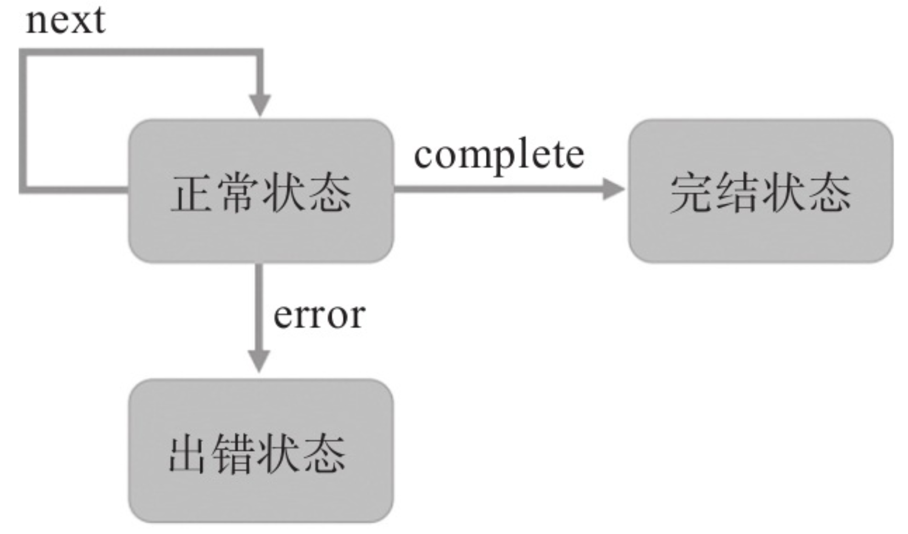

# RxJS 入门

> [RxJS overview](https://rxjs-dev.firebaseapp.com/guide/overview)

可以把一个“数据流”对象理解为一条河流，数据就是这条河流中流淌的水，代表“流”的变量标示符，都是用 `$` 符号结尾

比如一个按钮，我们需要记录用户按下去的时间，显示到页面上，同时发送给服务器，一般我们可以这样写：

```ts
const btn = $('#btn')
let startTime: number = 0
btn!.addEventListener('mousedown', () => {
  startTime = +new Date()
})
btn!.addEventListener('mouseup', () => {
  if (startTime) {
    const holdTime = +new Date() - startTime
    // ajax
    // render
    startTime = 0
  }
})
```

两个函数交叉访问一个变量 startTime，易出错

如果我们用 RxJS 的方式，可以把 mouseDown 和 mouseUp 看成通过 fromEvent 创造的两个流，holdTime$ 由 mouseUp$ mouseDown$ 计算得到，通过两个 subscribe 消费 holdTime$，一个用来 render，一个用来 ajax

RxJS 引用了两个重要的编程思想：

* 函数式

* 响应式

## 函数式编程

* 声明式

* 纯函数

    1. 函数的执行过程完全由输入参数决定，不会受除参数之外的任何数据影响（引用透明）

    2. 函数不会修改任何外部状态，比如修改全局变量或传入的参数对象（无副作用）

* 数据不可变性

```ts
const arrayPush = (arr, newValue) => arr.push(newValue) // 不纯，arr.push 改变原数组
const arrayPush = (arr, newValue) => [...arr, newValue]
```

纯函数易于单元测试，不纯的需要 mock，修改代码同时也要修改测试中的 mock

## FRP

* 数据流抽象了很多现实问题（DOM、WS、AJAX……）

* 擅长处理异步操作（对数据“推送”，产生数据时推送数据，无需关心数据是同步还是异步产生的）

* 把复杂问题分解成简单问题的组合

## Observable / Observer

Observable：可被观察者

Observer：观察者

Observable 实现了**观察者模式**和**迭代器模式**，是这两个模式的组合

### 观察者模式

观察者模式要解决的问题，就是在一个**持续产生事件**的系统中，如何分割功能，让不同模块只需要处理一部分逻辑，这种分而治之的思想是基本的系统设计概念

观察者模式将逻辑分为 Publisher 和 Observer，Publisher 负责发布事件，Observer 负责处理事件

```ts
import { of } from 'rxjs'

const source$ = of(1, 2, 3)
source$.subscribe(console.log) // console.log 作为观察者，只管处理
```

RxJS 中，Observable 对象作为 Publisher，subscribe 的参数作为 Observer

### 迭代器模式

Iterator 指能够遍历一个数据集合的对象（树、数组、链表……）Iterator 的作用就是通过一个通用的接口，是开发者不必关心数据集合的具体实现方式

```ts
function* gen() {
  yield 1
  yield 2
  return 3
}

const iter = gen()

console.log(iter.next()) // { value: 1, done: false }
console.log(iter.next()) // { value: 2, done: false }
console.log(iter.next()) // { value: 3, done: true }
console.log(iter.next()) // { value: undefined, done: true }

const iter2 = gen()
for (const v of iter2) console.log(v) // "downlevelIteration": true
```

“拉”式的迭代器实现，RxJS 中是“推”式的迭代器实现，其迭代器的使用者，并不用从 Observable 上“拉”数据，而是只要 subscribe 上 Observable 对象之后，自然就能接收到消息的推送

> 拉和推是从数据消费者的角度描述，比如：AJAX 是网页（数据消费者）从服务器拉取数据，而通过 WebSocket 服务器可以推送给网页数据

### 创造 Observable

Observable = Publisher + Iterator

```ts
const onSubscribe = (subscriber: Subscriber<number>) => {
  subscriber.next(1)
  subscriber.next(2)
  subscriber.next(3)
}

const source$ = new Observable(onSubscribe)

const theObserver = {
  next: console.log,
}

source$.subscribe(theObserver) // subscribe 事件发生，调用 onSubscribe
```

### 跨越时间的 Observable

Observable 用于发布事件，Observable 来做更合适

```ts
const source$ = new Observable(subscriber => {
  let number = 1;
  const timer = setInterval(() => {
    if (number >= 3) clearInterval(timer)
    else subscriber.next(number++)
  }, 1000)
})
```

### 永无止境的 Observale

如果没有 clearInterval，数据流就不会终止，因为每次只吐出一个数据，然后被 subscriber 消化掉，所以内存不会增加。如果把所有的数据放到一个数组中，数组所占内存大小就会随数据的增加而增加

大部分数据流会终止，上面例子中吐出 1 2 3 后就应该终止，但 Observable 如果只是停止吐出数据，只不过不再点用 next 推送，并不能给予 subscriber 一个终止信号，subscriber 依然准备着接收数据

### Observable 的完结和错误处理

```ts
const source$ = new Observable(subscriber => {
  let number = 1
  const timer = setInterval(() => {
    if (number >= 3) {
      clearInterval(timer)
      subscriber.complete() // 发出完结事件
    }
    else subscriber.next(number++)
  }, 1000)
})

source$.subscribe(
  console.log,
  console.error, // 处理错误事件
  () => console.log('done'), // 处理完结事件
)
```

> next*(error|complete)?



## 退订 Observable

```ts
const sleep = (time: number) => new Promise<never>(resolve => setTimeout(resolve, time))

const observable = new Observable(function subscribe(subscriber) {
  const intervalId = setInterval(() => {
    console.log('interval...')
    subscriber.next('hi')
  }, 1000)
})

const subscription = observable.subscribe(x => console.log(x))

await sleep(3500)
subscription.unsubscribe() // 退订之后仍然打印 interval...
```

```ts
const observable = new Observable(function subscribe(subscriber) {
  const intervalId = setInterval(() => {
    console.log('interval...')
    subscriber.next('hi')
  }, 1000)

  return () => {
    clearInterval(intervalId)
  }
})

const subscription = observable.subscribe(x => console.log(x))

await sleep(3500)
subscription.unsubscribe() // 退订之后不再打印 interval...，return cleanUp 用来清除副作用
```

## Hot Observable 和 Cold Observable

对于多个 Subscriber，比如第一个订阅 n 秒之后第二个在订阅，第二个是否接收错过 n 秒的数据

对于不接收错过的 n 秒数据，叫做 Hot Observable，对于从头开始接收的，叫做 Cold Observable

## operators

* Pipeable operators：传入 Observable 返回新的 Observable

* Creation Operators：可以传入一些预定义行为调用函数来创建新的 Observable，或通过加入其他 Observable

```ts
import { of } from 'rxjs'
import { map } from 'rxjs/operators'

map((x: number) => x * x)(of(1, 2, 3)).subscribe((v) => console.log(`value: ${v}`))
```

## 弹珠图


