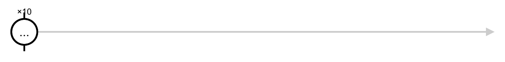
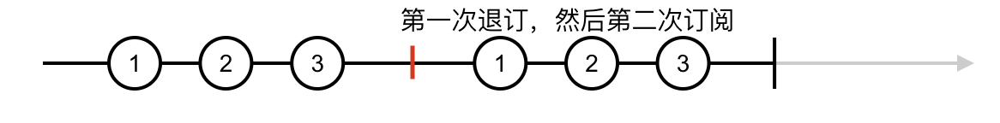
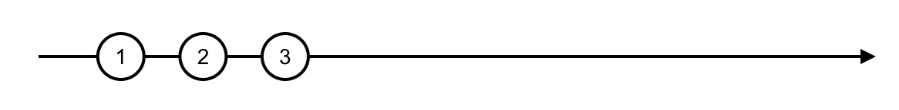
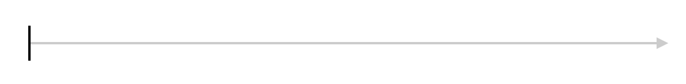
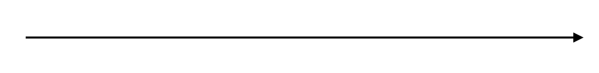
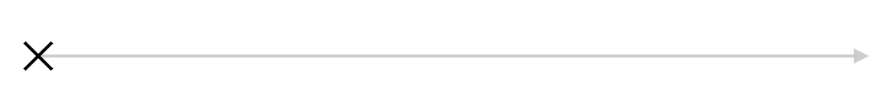

# 创建数据流

RxJS 提供的创建类操作符覆盖了几乎所有的数据流创建模式，没有必要重复发明轮子

## 创建同步操作流

* 产生哪些数据

* 数据之间先后顺序

### create

```ts
export class Observable<T> implements Subscribable<T> {
  // ...
  static create: Function = <T>(subscribe?: (subscriber: Subscriber<T>) => TeardownLogic) => {
    return new Observable<T>(subscribe);
  }
  // ...
}
```

### of 列举数据

of 产生 Cold Observable

```ts
const oba$ = of(1, 2, 3)
```

### range 指定范围

```ts
const numbers = range(1, 10)
```



range 只能每次递增 1，range(1.5, 3) 吐出 1.5、2.5、3.5

### generate 循环创建

```ts
generate(0, x => x < 10, x => x + 1)
```

### repeat 重复数据

```ts
const oba$ = new Observable((ob: Observer<number>) => {
  console.log('on subscribe')
  setTimeout(() => ob.next(1), 1000)
  setTimeout(() => ob.next(2), 2000)
  setTimeout(() => ob.next(3), 3000)
  setTimeout(() => ob.complete(), 4000)

  return () => console.log('on unsubscribe')
})

oba$
  .pipe(repeat(2))
  .subscribe(console.log, null, () => console.log('on complete'))

// on subscribe
// 1
// 2
// 3
// on unsubscribe
// on subscribe
// 1
// 2
// 3
// on complete
// on unsubscribe
```



如果去掉 `setTimeout(() => ob.complete(), 4000)`

```ts
const oba$ = new Observable((ob: Observer<number>) => {
  console.log('on subscribe')
  setTimeout(() => ob.next(1), 1000)
  setTimeout(() => ob.next(2), 2000)
  setTimeout(() => ob.next(3), 3000)

  return () => console.log('on unsubscribe')
})

oba$
  .pipe(repeat(2))
  .subscribe(console.log, null, () => console.log('on complete'))

// on subscribe
// 1
// 2
// 3
```



所以 repeat 依赖于上游完结的时机

### empty、never、throwError

```ts
empty()
```



```ts
never()
```



```ts
throwError()
```



## 创建异步操作流

相比创建同步操作流，还需要关心数据之间的时间间隔问题

### interval、timer 定时产生数据
