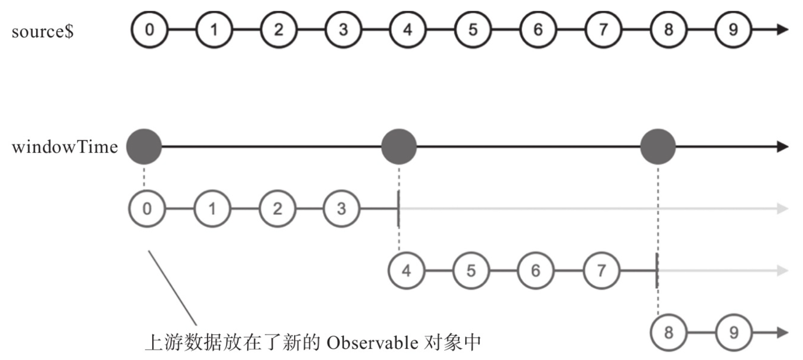
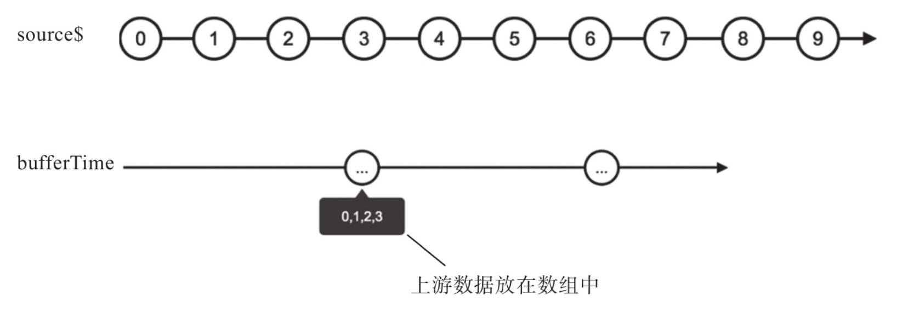
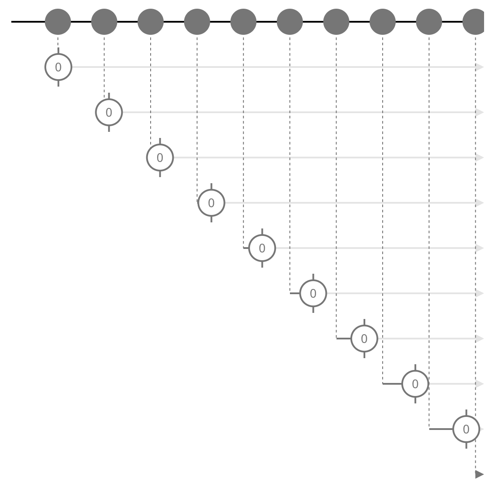

# 转化数据流

## 转化类操作符

* 对每个数据进行转化，映射

* 不转化单个数据，而是把数据重新组合，比如上游传下来 1、2、3 传给下游 [1, 2, 3]，无损回压控制

## 映射

### map

```ts
function map<T, R>(project: (value: T, index: number) => R, thisArg?: any): OperatorFunction<T, R>
```

project 中的 this 指向 thisArg，相当于一个 context 对象，当然也可以用闭包产生一个 context

### mapTo

```ts
oba.pipe(map(x => 1)) // mapTo(1)
```

### pluck

```ts
oba.pipe(map(x => x.target.tagName)) // pluck('target', 'tagName')
```

## 缓存窗口：无损回压控制

支持数组的以 buffer 开头，支持 Observable 对象的以 window 开头

### windowTime、bufferTime





第一个参数表示缓存窗口时间长度，第二个参数表示缓存窗口创建时间间隔，第三个参数表示每个缓存窗口存的数据最大个数

### windowCount、bufferCount

缓存窗口长度根据数据个数

### windowWhen、bufferWhen、windowToggle、bufferToggle

根据 Observable 控制开始结束时机

### window、buffer

> notifer: An Observable that completes the previous window and starts a new window.

```ts
// On every click, emit array of most recent interval events
const clicks = fromEvent(document, 'click')
const intervalEvents = interval(1000)
const buffered = intervalEvents.pipe(buffer(clicks))
```

## 高阶 map

```ts
interval(1000).pipe(map((value) => timer(value * 100)))
```



* concatMap = map + concatAll

* mergeMap = map + mergeAll

* switchMap = map + switch

* exhaustMap = map + exhaust

把 map 产生的高阶 Observable 利用对应的组合操作符合并为一阶的 Observable 对象

### concatMap

拖拽：

```ts
const mouseMove$ = fromEvent<MouseEvent>(document, 'mousemove')
const mouseUp$ = fromEvent<MouseEvent>(document, 'mouseup')

const mouseDownOnBtn$ = fromEvent<MouseEvent>(btn!, 'mousedown')
const drag$ = mouseDownOnBtn$.pipe(
  concatMap((startEvent) => {
    const initialLeft = (btn as HTMLElement).offsetLeft
    const initialTop = (btn as HTMLElement).offsetTop
    const stop$ = mouseUp$
    return mouseMove$.pipe(
      takeUntil(stop$),
      map((moveEvent) => ({
        x: moveEvent.x - startEvent.x + initialLeft,
        y: moveEvent.y - startEvent.y + initialTop,
      }))
    )
  })
)

drag$.subscribe((e) => {
  ;(btn as HTMLElement).style.left = `${e.x}px`
  ;(btn as HTMLElement).style.top = `${e.y}px`
})
```

### mergeMap

其他的 Rx 和之前的版本都叫 flatMap

AJAX：

```ts
fromEvent<MouseEvent>(btn!, 'click').pipe(
  mergeMap(() => ajax(apiUrl))
).subscribe(render)
```

### switchMap

flatMapLatest

可以用来解决 AJAX 竞态问题

### exhaustMap

flatMapFirst

### 高阶 mapTo

* concatMapTo

* mergeMapTo

* switchMapTo

```ts
oba.pipe(concatMap(() => inner$)) // concatMapTo(inner$)
```

### expand

这个操作符类似于 mergeMap，但是，所有 expand 传递给下游的数据，同时也会传递给自己，就像是逐层“展开”所有的数据，expand构成了一个逻辑死循环，除非发生异常，或者 expand 的函数参数 project 代码中限定在某些情况下不再产生数据

2 的 n 次方：

```ts
of(1).pipe(expand(value, index) => of(value * 2).pipe(delay(1000)))
```

## 数据分组

### groupBy

groupBy 作为一个内容分发器，对上游推送的数据检测 key 值，如果 key 第一次出现，就产生一个新的 Observable 对象，否则就给相应 key 的 Observable 对象

根据奇偶性分组：

```ts
interval(1000).pipe(groupBy((x) => x % 2))
```


根据 key 产生的 Observable 对象是一个 GroupedObservable，有 key 属性可以分辨

事件委托：

```ts
const clicks$ = fromEvent(document, 'click')
const groupByClass$ = clicks$.pipe(groupBy(e => e.target.className))
groupByClass$.pipe(
  filter(value => value.key === 'foo'),
  mergeAll(),
).subscribe(fooHandler)
```

### partition

> It's like filter, but returns two Observables: one like the output of filter, and the other with values that did not pass the condition.

```ts
const observableValues = of(1, 2, 3, 4, 5, 6)
const [evens$, odds$] = partition(observableValues, (value, index) => value % 2 === 0)
odds$.subscribe(x => console.log('odds', x))
evens$.subscribe(x => console.log('evens', x))
```

## 累计数据

之前所有操作符，上游的数据之间都不会产生影响，非常符合 FP，但是有时需要依赖之前的数据

### scan

参数类似 reduce 的参数，这俩区别在于 scan 对上游每一个数据都会产生一个规约结果，而 reduce 是对上游所有数据进行规约；reduce 最多只给下游传递一个数据，如果上游数据永不完结，那 reduce 也永远不会产生数据，而 scan 完全可以处理一个永不完结的上游 Observable 对象

scan 常用来维持应用状态

```ts
const clicks = fromEvent(document, 'click')
const ones = clicks.pipe(mapTo(1))
const seed = 0
const count = ones.pipe(scan((acc, one) => acc + one, seed))
count.subscribe(x => console.log(x))
```

### mergeScan

> It's like scan, but the Observables returned by the accumulator are merged into the outer Observable.

```ts
const click$ = fromEvent(document, 'click')
const one$ = click$.pipe(mapTo(1))
const seed = 0
const count$ = one$.pipe(
  mergeScan((acc, one) => of(acc + one), seed),
)
count$.subscribe(x => console.log(x))
```

懒加载：

```ts
const result$ = throttledScrollToEnd$.pipe(
  mergeScan((acc, cur) => getData(acc.length).pipe(
    map(newData => acc.pipe(
      concat(newData),
    ))),
    [],
  ),
)
```
