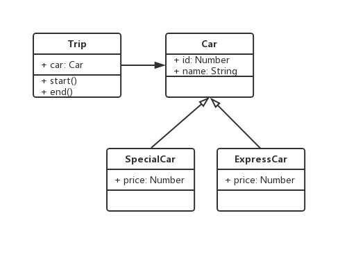
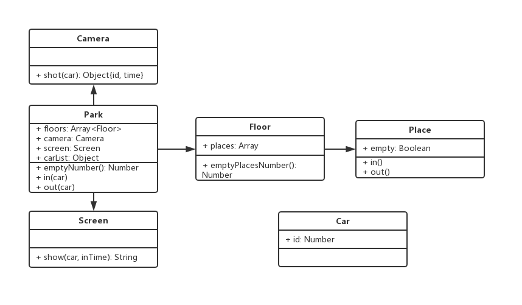

# 设计原则

## 设计准则

`《UNIX/LINUX 设计哲学》`

* 小即是美

* 每一个程序只做好一件事

* 快速建立原型

* 舍弃高效率而取可移植性

* 采用纯文本来存储数据（可读性，不用二进制存）

* 充分利用软件的杠杆效应（软件复用）

* 使用 shell 脚本来提杠杆效应和可移植性

* 避免强制的用户界面

* 让每个程序都称为过滤器

* 允许用户定制环境

* 尽量使操作系统内核小而轻量化

* 使用小写字母并尽量简短

* 沉默是金（fail 时返回 0 或空）

* 各部分之和大于整体

* 寻求 90% 的解决方案

## SOLID 五大设计原则

### S - 单一职责原则

* 一个程序只做好一件事

* 若果功能过于复杂就拆分开，每个部分保持独立

### O - 开放封闭原则

* 对扩展开放，对修改封闭

* 增加需求时，扩展新代码，而非修改已有代码

* 这是软件设计的终极目标

### L - 李氏置换原则

* 子类能覆盖父类

* 父类能出现的地方子类就能出现

### I - 接口独立原则

* 保持接口的单一独立，避免出现“胖接口”

* 类似 S，关注于接口

### D - 依赖导致原则

* 面对接口编程，依赖于抽象而不依赖于具体

* 使用方只关注接口而不关注具体类的实现

## 23 种设计模式

将不变的部分和变化的部分隔开，进行封装

### 创建型

封装创建对象的变化

* 工厂模式（工厂方法模式、抽象工厂模式、建造者模式）

* 单例模式

* 原型模式

### 结构型

封装对象之间的组合关系

* 适配器模式

* 装饰器模式

* 代理模式

* 外观模式

* 桥接模式

* 组合模式

* 享元模式

### 行为型

封装对象的行为变化

* 策略模式

* 模版方法模式

* 观察之模式

* 迭代器模式

* 职责链模式

* 命令模式

* 备忘录模式

* 状态模式

* 访问者模式

* 中介者模式

* 解释器模式

## 面试题

画出 UML 类图，写出代码。

1. 打车时，可以打专车或者快车。任何车都有车牌号和名称。不同车价格不同，快车每公里 1 元，专车每公里 2 元。行程开始时，显示车辆信息，行程结束时，显示打车金额（假定行程就 5 公里）

* UML:



* JS:

```js
class Car {
  constructor(id, name) {
    this.id = id
    this.name = name
  }
}

class SpecialCar extends Car {
  constructor(id, name) {
    super(id, name)
    this.price = 1
  }
}

class ExpressCar extends Car {
  constructor(id, name) {
    super(id, name)
    this.price = 2
  }
}

class Trip {
  constructor(car) {
    this.car = car
  }

  start() {
    console.log(`行程开始，名称：${this.car.name}，车牌号：${this.car.id}`)
  }

  end() {
    console.log(`行程结束，金额${this.car.price * 5}`)
  }
}

// test
const car = new SpecialCar(100, 'lanb')
const trip = new Trip(car)
trip.start()
trip.end()
```

2. 某停车场，分 3 层，每层 100 车位。每个车位都能监控到车辆的驶入和离开。车辆进入前，显示每层的空余车位数量；车辆进入时，摄像头可识别车牌号和时间；车辆出来时，出口显示器显示车牌号和停车时长。

* UML：


