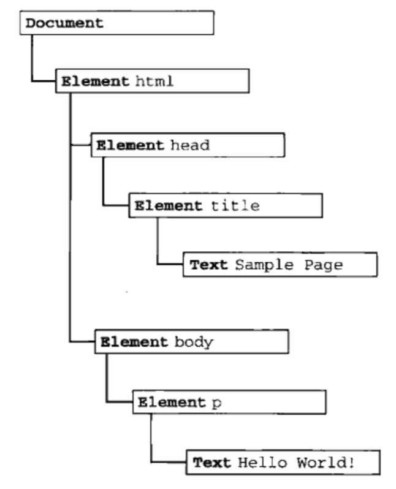

JS 高程第八章 BOM 的笔记

<!-- more -->

# 节点层次

DOM 描绘 HTML 和 XML

DOM 结构类型：树（DOM 树）



## Node 类型

IE 中有兼容性问题

属性：

nodeName 元素的标签名

nodeValue 始终为 null

childNodes 保存着一个 NodeList 对象（类数组对象，Array.prototype.slice.call(NodeList)、[].slice.call(NodeList)、[...NodeList]）

firstChild、lastChild

方法：

appendChild()

```js
var child = node.appendChild(child) // 末尾添加，child 即是参数又是这个方法的返回值
```

insertedNode()

```js
var insertedNode = parentNode.insertBefore(newNode, referenceNode) // 返回 newNode，referenceNode 为 null 时插到末尾
```

> Node.insertBefore() 方法在参考节点之前插入一个拥有指定父节点的子节点。
>
> 如果给定的子节点是对文档中现有节点的引用，insertBefore()会将其从当前位置移动到新位置(在将节点附加到其他节点之前，不需要从其父节点删除该节点)。
>
> 这意味着一个节点不能同时位于文档的两个点中。因此，如果节点已经有父节点，则首先删除该节点，然后将其插入到新位置。在将节点追加到新父节点之前，可以使用Node.clonenode()复制节点。注意，使用cloneNode创建的副本不会自动保持同步。
>
> 如果引用节点为空，则将指定的节点添加到指定父节点的子节点列表的末尾。
>
> 如果给定的子节点是DocumentFragment，那么DocumentFragment的全部内容将被移动到指定父节点的子节点列表中。

replaceChild()

```js
var replacedNode = parentNode.replaceChild(newChild, oldChild) // newChild 用来替换 oldChild 的新节点。如果该节点已经存在于DOM树中，则它会被从原始位置删除。返回 oldChild
```

removeChild()

```js
let oldChild = node.removeChild(child) // 返回 child
```

cloneChild()

```js
var dupNode = node.cloneNode(deep) // deep 传入 true 为 深拷贝，false 为 浅拷贝
```

hasChildNodes()

# Document 类型

浏览器中，document 对象是 HTMLDoucmnet（继承自 Document）的一个实例，也是 window 对象的一个属性

```js
var html = document.documentElement // 对 <html> 的引用
html === document.firstChild // true
var body = document.body // 对 <body> 的引用
```

```js
var title = document.title // 取得页面标题
var url = document.URL // 取得页面完整 URL
var domain = document.domain // 取得页面域名
// 只有 domain 可以设置，但出于安全考虑，只能设置为 url 中包含的域，例：url：p2p.wrox.com，domain 只能设为 wrox.com
```

createElement()

getElementById()

getElementsByClassName(）、getElementsByTagName()、grtElementByName() 返回 HTMLCollection 对象（动态的，随着文档内容的更新而更新）

# Element 类型

element 的特性操作

setAttribute()、getAttribute()、removeAttribute()

