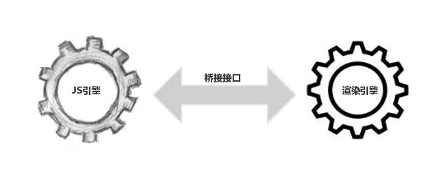

# 渲染

## SSR

**本该浏览器做的事情，分担给服务器去做**

优点：

* SEO

* 首屏渲染

缺点：

* 服务器压力大

在实践中，我一般会建议大家先忘记服务端渲染这个事情——服务器稀少而宝贵，但首屏渲染体验和 SEO 的优化方案却很多——我们最好先把能用的低成本“大招”都用完。除非网页对性能要求太高了，以至于所有的招式都用完了，性能表现还是不尽人意，这时候我们就可以考虑向老板多申请几台服务器，把服务端渲染搞起来了~

## 浏览器运行机制

浏览器内核可以分成两部分：渲染引擎（Layout Engine 或者 Rendering Engine）和 JS 引擎。早期渲染引擎和 JS 引擎并没有十分明确的区分，但随着 JS 引擎越来越独立，内核也成了渲染引擎的代称。渲染引擎又包括了 HTML 解释器、CSS 解释器、布局、网络、存储、图形、音视频、图片解码器等等零部件。

目前市面上常见的浏览器内核可以分为这四种：Trident（IE）、Gecko（火狐）、Blink（Chrome、Opera）、Webkit（Safari）。

### CSS 选择器优化

```css
#myList  li {}
```

CSS 选择符是从右到左进行匹配的。我们这个看似“没毛病”的选择器，实际开销相当高：浏览器必须遍历页面上每个 li 元素，并且每次都要去确认这个 li 元素的父元素 id 是不是 myList

```css
* {}
```

它会匹配所有元素，所以浏览器必须去遍历每一个元素

* 避免使用通配符，只对需要用到的元素进行选择。

* 关注可以通过继承实现的属性，避免重复匹配重复定义。

* 少用标签选择器。如果可以，用类选择器替代

* 减少嵌套。后代选择器的开销是最高的，因此我们应该尽量将选择器的深度降到最低（最高不要超过三层），尽可能使用类来关联每一个标签元素

### CSS 渲染阻塞

默认情况下，CSS 是阻塞的资源。浏览器在构建 CSSOM 的过程中，不会渲染任何已处理的内容。即便 DOM 已经解析完毕了，只要 CSSOM 不 OK，那么渲染这个事情就不 OK（这主要是为了避免没有 CSS 的 HTML 页面丑陋地“裸奔”在用户眼前）。

我们知道，只有当我们开始解析 HTML 后、解析到 link 标签或者 style 标签时，CSS 才登场，CSSOM 的构建才开始。很多时候，DOM 不得不等待 CSSOM。因此我们可以这样总结：

> CSS 是阻塞渲染的资源。需要将它尽早、尽快地下载到客户端，以便缩短首次渲染的时间。

事实上，现在很多团队都已经做到了尽早（将 CSS 放在 head 标签里）和尽快（启用 CDN 实现静态资源加载速度的优化）。

### JS 阻塞

JS 引擎是独立于渲染引擎存在的。我们的 JS 代码在文档的何处插入，就在何处执行。当 HTML 解析器遇到一个 script 标签时，它会暂停渲染过程，将控制权交给 JS 引擎。JS 引擎对内联的 JS 代码会直接执行，对外部 JS 文件还要先获取到脚本、再进行执行。等 JS 引擎运行完毕，浏览器又会把控制权还给渲染引擎，继续 CSSOM 和 DOM 的构建。


## DOM 优化

> 把 DOM 和 JavaScript 各自想象成一个岛屿，它们之间用收费桥梁连接。——《高性能 JavaScript》



当我们修改 DOM 引发了 Render Tree 的改变，就会引发重绘甚至回流

重绘不一定导致回流，回流一定会导致重绘

减少 DOM 操作

* 最“贵”的操作：改变 DOM 元素的几何属性

这个改变几乎可以说是“牵一发动全身”——当一个DOM元素的几何属性发生变化时，所有和它相关的节点（比如父子节点、兄弟节点等）的几何属性都需要进行重新计算，它会带来巨大的计算量。

常见的几何属性有 width、height、padding、margin、left、top、border 等等

* “价格适中”的操作：改变 DOM 树的结构

这里主要指的是节点的增减、移动等操作。浏览器引擎布局的过程，顺序上可以类比于树的前序遍历——它是一个从上到下、从左到右的过程。通常在这个过程中，当前元素不会再影响其前面已经遍历过的元素。

* 最容易被忽略的操作：获取一些特定属性的值

offsetTop、offsetLeft、 offsetWidth、offsetHeight、scrollTop、scrollLeft、scrollWidth、scrollHeight、clientTop、clientLeft、clientWidth、clientHeight —— 这些值有一个共性，就是需要通过即时计算得到。因此浏览器为了获取这些值，也会进行回流。

## Event Loop 与异步更新策略


### 渲染的时机

假如我想要在异步任务里进行DOM更新，我该把它包装成 micro 还是 macro 呢？

```js
setTimeout(task, 0)
```

现在 task 被推入的 macro 队列。但因为 script 脚本本身是一个 macro 任务，所以本次执行完 script 脚本之后，下一个步骤就要去处理 micro 队列了，再往下就去执行了一次 render

```js
Promise.resolve().then(task)
```

那么我们结束了对 script 脚本的执行，紧接着就去处理 micro-task 队列，micro-task 处理完，DOM 修改好了，紧接着就可以走 render 流程了——不需要再消耗多余的一次渲染，不需要再等待一轮事件循环，直接为用户呈现最即时的更新结果。

因此，我们更新 DOM 的时间点，应该尽可能靠近渲染的时机。当我们需要在异步任务中实现 DOM 修改时，**把它包装成 micro 任务是相对明智的选择**

`Vue状态更新手法：nextTick`