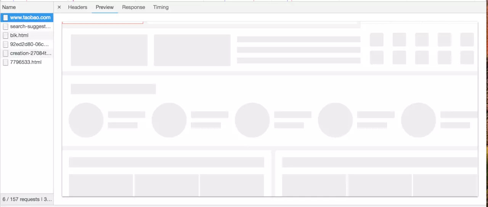

# 应用

## Lazy-Load



```js
// 获取所有的图片标签
const imgs = document.getElementsByTagName('img')
// 获取可视区域的高度
const viewHeight = window.innerHeight || document.documentElement.clientHeight
// num用于统计当前显示到了哪一张图片，避免每次都从第一张图片开始检查是否露出
let num = 0
function lazyload(){
  for(let i=num; i<imgs.length; i++) {
    // 用可视区域高度减去元素顶部距离可视区域顶部的高度
    let distance = viewHeight - imgs[i].getBoundingClientRect().top
    // 如果可视区域高度大于等于元素顶部距离可视区域顶部的高度，说明元素露出
    if(distance >= 0 ){
      // 给元素写入真实的src，展示图片
      imgs[i].src = imgs[i].getAttribute('data-src')
      // 前i张图片已经加载完毕，下次从第i+1张开始检查是否露出
      num = i + 1
    }
  }
}
// 监听Scroll事件
window.addEventListener('scroll', lazyload, false);
```

## 事件的节流（throttle）与防抖（debounce）

scroll 事件，resize 事件、鼠标事件（比如 mousemove、mouseover 等）、键盘事件（keyup、keydown 等）都存在被频繁触发的风险，频繁触发回调导致的大量计算会引发页面的抖动甚至卡顿

### “节流”与“防抖”的本质

这两个东西都以闭包的形式存在。

它们通过对事件对应的回调函数进行包裹、以自由变量的形式缓存时间信息，最后用 setTimeout 来控制事件的触发频率。

节流的中心思想在于：在某段时间内，不管你触发了多少次回调，我都只认第一次，并在计时结束时给予响应（第一次触发的 scroll 事件对应的回调才会执行，而“一段时间内”触发的后续的 scroll 回调都会被节流阀无视掉）

防抖的中心思想在于：我会等你到底。在某段时间内，不管你触发了多少次回调，我都只认最后一次

## 性能检测工具

[Devtool Performance](https://developers.google.com/web/tools/chrome-devtools/evaluate-performance/reference)

[Lighthouse](https://developers.google.com/web/tools/lighthouse/?hl=zh-cn)

[Performance API](https://developer.mozilla.org/zh-CN/docs/Web/API/Performance)
