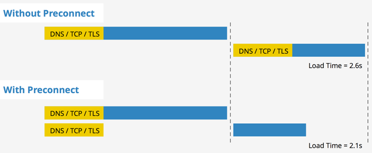

# 开篇

## 从输入 URL 到页面加载完成，发生了什么？

1. DNS 解析

2. TCP 连接

3. HTTP 请求抛出

4. 服务端处理请求，HTTP 响应返回

5. 浏览器拿到响应数据，解析响应内容，把解析的结果展示给用户

## 对应优化

前两个过程的优化往往需要我们和团队的服务端工程师协作完成，前端单方面可以做的努力有限，先介绍 DNS 解析和 TCP 连接

### DNS 解析

浏览器 DNS 缓存和 DNS prefetch

#### DNS

DNS(Domain Name System, 域名系统)，是域名和 IP 地址相互映射的一个分布式数据库。DNS 查询就是将域名转换成 IP 的过程，这个过程短的话 2ms 几乎无感，长则可能达到几秒钟。

当浏览器访问一个域名的时候，需要解析一次 DNS，获得对应域名的 IP 地址。在解析过程中，按照**浏览器缓存、系统缓存（系统 DNS 缓存、本地 hosts（域名解析文件） 文件）、路由器缓存、ISP(运营商)DNS缓存、根域名服务器、顶级域名服务器、主域名服务器**的顺序，逐步读取缓存，直到拿到 IP 地址。

> DNS 度量数据：chrome://histograms/DNS

#### 浏览器 DNS 缓存

浏览器DNS缓存的时间跟DNS服务器返回的TTL值无关。

> TTL(Time-To-Live)，就是一条域名解析记录在DNS服务器中的存留时间。

浏览器在获取网站域名的实际IP地址后会对其IP进行缓存，减少网络请求的损耗。每种浏览器都有一个固定的DNS缓存时间，其中Chrome的过期时间是1分钟，在这个期限内不会重新请求DNS。Chrome浏览器看本身的DNS缓存时间比较方便，在地址栏输入：

> chrome://net-internals/#dns

#### DNS prefetch

提前解析之后可能会用到的域名，使解析结果缓存到**系统缓存**（Chromium）中，缩短DNS解析时间，来提高网站的访问速度。

现代浏览器在 DNS Prefetch 上做了两项工作：

1. html 源码下载完成后，会解析页面的包含链接的标签，提前查询对应的域名。

2. 对于访问过的页面，浏览器会记录一份域名列表，当再次打开时，会在 html 下载的同时去解析 DNS。

DNS预解析分为以下两种：

* 自动解析

浏览器使用超链接的href属性来查找要预解析的主机名。当遇到a标签，浏览器会自动将href中的域名解析为IP地址，这个解析过程是与用户浏览网页并行处理的。但是为了确保安全性，在HTTPS页面中不会自动解析。

* 手动解析

在页面添加如下标记：

```html
<link rel="dns-prefetch" href="//g.alicdn.com" />
```

上面的link标签会让浏览器预取"g.alicdn.com"的解析

希望在HTTPS页面开启自动解析功能时，添加如下标记：

```html
<meta http-equiv="x-dns-prefetch-control" content="on">
```

希望在HTTP页面关闭自动解析功能时，添加如下标记：

```html
<meta http-equiv="x-dns-prefetch-control" content="off">
```

##### 使用

1. 对静态资源域名做手动 dns prefetching。

2. 对 js 里会发起的跳转、请求做手动 dns prefetching。

3. 不用对超链接做手动 dns prefetching，因为 chrome 会自动做 dns prefetching。

4. 对重定向跳转的新域名做手动 dns prefetching，比如：页面上有个 A 域名的链接，但访问 A 会重定向到 B 域名的链接，这么在当前页对 B 域名做手动 dns prefetching 是有意义的。

##### 其他

1. 假设页面 head 里面有个 css 链接, 在当前页的 head 里加上对应的手动 dns prefetching 的 link 标签，实际上并没有好处。

2. 普遍来说合理的 dns prefetching 能对页面性能带来 50ms ~ 300ms 的提升，有人做了这方面的统计。

3. 如 chromium 的官方文档所说，dns prefetching 的网络消耗是极低极低的

4. 如 chromium 的官方文档所说，chrome 使用 8 个线程专门做 dns prefetching 而且 chrome 本身不做 dns 记录的 cache，是直接从操作系统读 dns —— 也就是说，直接修改系统的 dns 记录或者 host 是可以直接影响 chrome 的。

### TCP 链接

长连接、预连接、接入 SPDY 协议（http2）

#### 预连接

preconnect 允许浏览器在一个 HTTP 请求正式发给服务器前预先执行一些操作，这包括 DNS 解析，TLS 协商，TCP 握手，这消除了往返延迟并为用户节省了时间。可以这样使用：

```html
<link href="https://cdn.domain.com" rel="preconnect" crossorigin>
```



## 顺便介绍下其他 pre...

### prefetch

如果我们确定某个资源将来一定会被使用到，我们可以让浏览器预先请求该资源并放入浏览器缓存中。例如，一个图片和脚本或任何可以被浏览器缓存的资源：

```html
<link rel="prefetch" href="/image.png">
```

HTTP Header: `Link: </uploads/images/pic.png>; rel=prefetch`

与 DNS 预解析不同，预获取真正请求并下载了资源，并储存在缓存中。但预获取还依赖于一些条件，某些预获取可能会被浏览器忽略

> 这对 webfonts 性能提升非常明显。目前，字体文件必须等到 DOM 和 CSS 构建完成之后才开始下载，使用预获取就可以轻松绕过该瓶颈。—— Bram Stein 的帖子

> 这项技术有为很多有交互网站提速的潜力，但并不会应用在所有地方。对于某些站点来说，太难猜测用户下一步的动向，对于另一些站点，提前获取资源可能导致数据过期失效。还有很重要的一点，不要过早进行 prefetch，否则会降低你当前浏览的页面的加载速度 —— Google Developers"

PS：要测试资源的预获取有点困难，但在 Chrome 和 Firefox 的网络面板中都有资源预获取的记录。还需要记住，预获取的资源没有同源策略的限制。

### Prerender

这是一个核武器，因为 prerender 可以预先加载文档的所有资源：

```html
<link rel="prerender" href="http://example.com">
```

### Preload

一般来说，最好使用 preload 来加载你最重要的资源，比如图像，CSS，JavaScript 和字体文件。这不要与浏览器预加载混淆，浏览器预加载只预先加载在HTML中声明的资源。preload 指令事实上克服了这个限制并且允许预加载在 CSS 和JavaScript 中定义的资源，并允许决定何时应用每个资源。

Preload 与 prefetch 不同的地方就是它专注于当前的页面，并以高优先级加载资源，Prefetch 专注于下一个页面将要加载的资源并以低优先级加载。同时也要注意 preload 并不会阻塞 window 的 onload 事件。

使用 preload 指令的好处包括：

* 允许浏览器来设定资源加载的优先级因此可以允许前端开发者来优化指定资源的加载。
* 赋予浏览器决定资源类型的能力，因此它能分辨这个资源在以后是否可以重复利用。
* 浏览器可以通过指定 as 属性来决定这个请求是否符合 content security policy。
* 浏览器可以基于资源的类型（比如 image/webp）来发送适当的 accept 头。

举例

这里有一个非常基本的预加载图像的例子：

```html
<link rel="preload" href="image.png">
```

这里有一个预加载字体的例子，记住：如果你的预加载需要 CORS 的跨域请求，那么也要加上 crossorigin 的属性。

```html
<link rel="preload" href="https://example.com/fonts/font.woff" as="font" crossorigin>
```

这里有一个通过 HTML 和 JavaScript 预加载样式表的例子：

```html
<link rel="preload" href="/css/mystyles.css" as="style">
```

```js
var res = document.createElement("link")
res.rel = "preload"
res.as = "style"
res.href = "css/mystyles.css"
document.head.appendChild(res)
```

来自 filament group 的 Scott Jehl 也有了一些相关研究并写了 async loaded styles using markup 说明了 preload 是不阻塞页面渲染的！

## 思维导图


