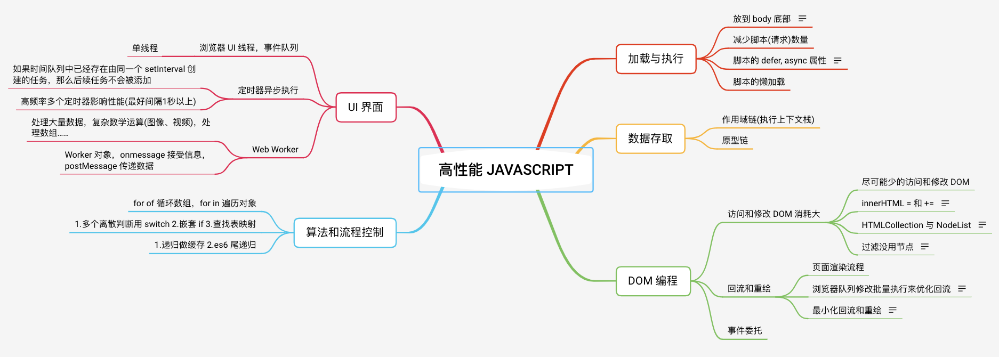

<!-- markdownlint-disable -->

# 高性能 JavaScript

## 加载与执行

### 放到 body 底部

脚本解析和执行会阻塞页面渲染

### 减少脚本(请求)数量

### 脚本的 defer, async 属性

都是并行下载，不阻塞页面，defer 需等页面加载好后执行，async 是自动执行defer 属性的脚本标签可以放到文档任何位置

### 脚本的懒加载

## 数据存取

### 作用域链(执行上下文栈)

### 原型链

## DOM 编程

### 访问和修改 DOM 消耗大

- 尽可能少的访问和修改 DOM
- innerHTML = 和 +=

  每次 += 都会访问修改 DOM，而把要改的内容赋给 html 字符串变量，之后一次性赋给 innerHTML 只会访问修改一次 DOM

- HTMLCollection 与 NodeList

  HTMLCollection 是动态的(实时性)，实时访问 DOM，消耗大，NodeList 是静态的，不需要实时访问DOMgetElementBy 方式返回 HTMLCollection，查找快但之后操作慢，querySelector 方式返回 NodeList，以 CSS 选择器查找，查找慢但之后操作快，且数据是有不变性的

- 过滤没用节点

  childNodes, firstChild, nextSibling 不区分元素节点和其他节点(注释、文本节点)，children 只包含元素节点

### 回流和重绘

- 页面渲染流程
- 浏览器队列修改批量执行来优化回流

  强制刷新对列的方法：offsetTop, offsetLeft, offsetWidth, offsetHeight, scrollTop, scrollLeft, scrollWidth, scrollHeight, clientTop, clientLeft, clientWidth, clientHeight, getComputedStyle()

- 最小化回流和重绘

  cssText += ，修改 class内存中批量修改 DOM(1 createDocumentFragment, createElement  2 隐藏元素修改后重新显示 el.style.display: none  3 cloneNode 修改后替换原有元素)缓存布局信息(offsetLeft……)元素脱离文档流(position)

### 事件委托

## 算法和流程控制

### for of 循环数组，for in 遍历对象

### 1.多个离散判断用 switch 2.嵌套 if 3.查找表映射

### 1.递归做缓存 2.es6 尾递归

## UI 界面

### 浏览器 UI 线程，事件队列

- 单线程

### 定时器异步执行

- 如果时间队列中已经存在由同一个 setInterval 创建的任务，那么后续任务不会被添加
- 高频率多个定时器影响性能(最好间隔1秒以上)

### Web Worker

- 处理大量数据，复杂数学运算(图像、视频)，处理数组……
- Worker 对象，onmessage 接受信息，postMessage 传递数据
