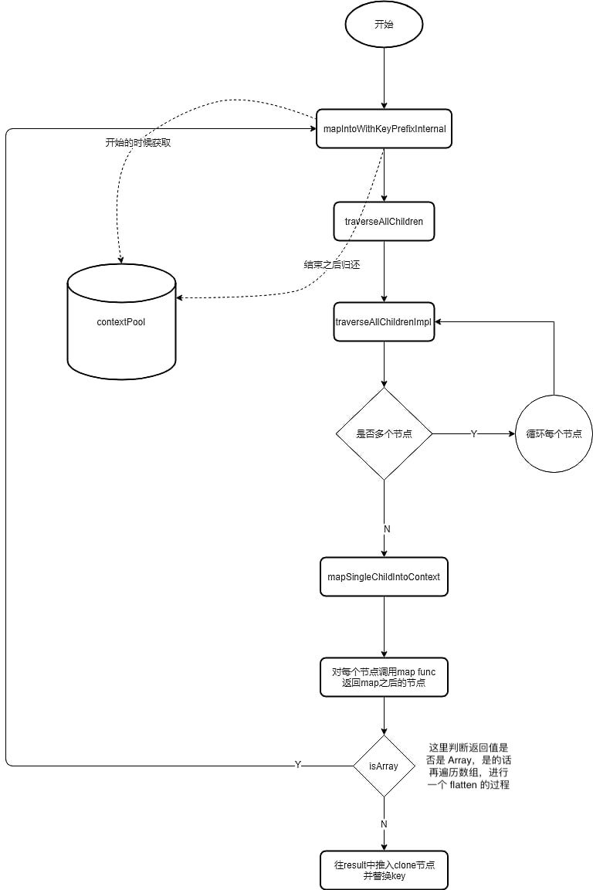

# React API

v16.12.0

```shell
.
├── legacy-events
├── react
├── react-dom
├── scheduler
└── shared
```

React 只包含定义 React 组件所需的功能，它通常与用于 Web 的 react-dom 或用于 Native 环境的 react-native 之类的 React renderer 一起使用

```ts
// `./react/React.js`
const React = {
  Children: {
    map,
    forEach,
    count,
    toArray,
    only,
  },

  createRef,
  Component,
  PureComponent,

  createContext,
  forwardRef,
  lazy,
  memo,

  useCallback,
  useContext,
  useEffect,
  useImperativeHandle,
  useDebugValue,
  useLayoutEffect,
  useMemo,
  useReducer,
  useRef,
  useState,

  Fragment: REACT_FRAGMENT_TYPE,
  Profiler: REACT_PROFILER_TYPE,
  StrictMode: REACT_STRICT_MODE_TYPE,
  Suspense: REACT_SUSPENSE_TYPE,

  createElement: __DEV__ ? createElementWithValidation : createElement,
  cloneElement: __DEV__ ? cloneElementWithValidation : cloneElement,
  isValidElement: isValidElement,

  version: ReactVersion,

  __SECRET_INTERNALS_DO_NOT_USE_OR_YOU_WILL_BE_FIRED: ReactSharedInternals,
}

// 根据 `./shared/ReactFeatureFlags.js` 中的标示判断一些未来的功能是否启用
// 比如之后的 ConcurrentMode
if (exposeConcurrentModeAPIs) {
  React.useTransition = useTransition;
  React.useDeferredValue = useDeferredValue;
  React.SuspenseList = REACT_SUSPENSE_LIST_TYPE;
  React.unstable_withSuspenseConfig = withSuspenseConfig;
}
// 还有几个别的提的不多，这里省略……
```

## JSX

```tsx
<>
  <div id='container'>
    <Div value={1} />
    <Comp onClick={() => console.log('Click Comp!')} />
  </div>
</>
```

转译得：

```tsx
React.createElement(
  React.Fragment, // React 原生自带组件
  null,
  React.createElement(
    "div",
    {
      id: "container"
    },
    // 兄弟节点转译为后面的多个参数
    React.createElement(Div, { // 组件与原生标签通过首字母大小写区分
      value: 1
    }),
    React.createElement(Comp, {
      onClick: function onClick() {
        return console.log("Click Comp!")
      }
    })
  )
)
```

## react-element

JSX 经过转译成为 React.createElement 调用

```ts
// `./react/src/ReactElement.js`
// React.createElement
// 处理参数，调用并返回 ReactElement
export function createElement(type, config, ...children) {
  const props = {}

  // 保留 props
  let key = null
  let ref = null
  let self = null
  let source = null

  // 处理 props
  if (config !== null) {
    // 处理保留 props，与其他 props 分开，单独传入 ReactElement 中
    if (hasValidRef(config)) ref = config.ref
    if (hasValidKey(config)) key = config.key
    self = config.__self === undefined ? null : config.__self
    source = config.__source === undefined ? null : config.__source

    // 除保留 props 都放到 props 中
    for (propName in config) {
      if (
        hasOwnProperty.call(config, propName) &&

        // const RESERVED_PROPS = {
        //   key: true,
        //   ref: true,
        //   __self: true,
        //   __source: true,
        // };

        !RESERVED_PROPS.hasOwnProperty(propName)
      ) {
        props[propName] = config[propName]
      }
    }
  }

  // 处理 children，一个就 props.children 赋值为单个 child，多个就 props.children 赋值为数组
  // 同时在开发环境对 children 进行 Object.freeze，保证开发准确同时提高生产环境性能（此处省略）
  if (children.lenght === 1) props.children = children[0]
  else if (children.length > 1) props.children = children

  // 处理组件的 defaultProps
  if (type && type.defaultProps) {
    const defaultProps = type.defaultProps
    for (propName in defaultProps) {
      // 如果 JSX 中 propName 没有传值，则赋值为 defaultProps[propName]
      if (props[propName] === undefined) {
        props[propName] = defaultProps[propName]
      }
    }
  }

  // 构造并返回 ReactElement
  return ReactElement(
    type,
    key,
    ref,
    self,
    source,
    ReactCurrentOwner.current, // `./react/ReactCurrentOwner 标示是哪个 Fiber 的`
    props,
  )
}
```

```ts
// `./react/src/ReactElement.js`
// ReactElement
// 根据参数返回 ReactElement 对象
function ReactElement(type, key, ref, self, source, owner, props) {
  const element = {
    // This tag allows us to uniquely identify this as a React Element
    $$typeof: REACT_ELEMENT_TYPE,

    // Built-in properties that belong on the element
    type: type,
    key: key,
    ref: ref,
    props: props,

    // Record the component responsible for creating this element.
    _owner: owner,
  }
  // self and source are DEV only properties.
  return element
}
```

`React.cloneElement` 就是把 config 复制一遍，之后类似 createElement 创建

`React.createFactory` 一般写 JSX 用不到，`createFactory(type)` 返回工厂函数之后通过工厂函数创建具体的 ReactElement，类似 curry

```ts
// `./react/ReactElement.js`
// React.createFactory
export function createFactory(type) {
  const factory = createElement.bind(null, type)
  factory.type = type
  return factory
}
```

## react-component

```ts
// `./react/src/ReactBaseClasses.js`
// React.Component
function Component(props, context, updater) {
  this.props = props
  this.context = context
  // If a component has string refs, we will assign a different object later.
  this.refs = emptyObject
  // We initialize the default updater but the real one gets injected by the renderer.
  // updater 根据 renderer 实现，没有 renderer 使用默认的抽象的 updater，最终在 __DEV__ 开发环境下会报错
  this.updater = updater || ReactNoopUpdateQueue
}

Component.prototype.isReactComponent = {}

Component.prototype.setState = function(partialState, callback) {
  invariant(/* 报错条件，报错信息 */) // 编译时会被替换 if (报错条件) throw new Error(报错信息)
  this.updater.enqueueSetState(this, partialState, callback, 'setState')
}

Component.prototype.forceUpdate = function(callback) {
  this.updater.enqueueForceUpdate(this, callback, 'forceUpdate')
}
```

PureComponent 继承（类似寄生组合式继承）自 Component

```ts
// `./react/src/ReactBaseClasses.js`
// React.PureComponent
// ComponentDummy 就是“被寄生者”
function ComponentDummy() {}
ComponentDummy.prototype = Component.prototype;

/**
 * Convenience component with default shallow equality check for sCU.
 */
function PureComponent(props, context, updater) {
  this.props = props
  this.context = context
  // If a component has string refs, we will assign a different object later.
  this.refs = emptyObject
  this.updater = updater || ReactNoopUpdateQueue
}

// const pureComponentPrototype = (PureComponent.prototype = Object.create(Component.prototype))
const pureComponentPrototype = (PureComponent.prototype = new ComponentDummy())
pureComponentPrototype.constructor = PureComponent
// Avoid an extra prototype jump for these methods.
Object.assign(pureComponentPrototype, Component.prototype)
// 标示 isPureReactComponent
pureComponentPrototype.isPureReactComponent = true
```

## React 原生组件

```ts
// `./react/React.js`
const React = {
  // ...
  Fragment: REACT_FRAGMENT_TYPE,
  Profiler: REACT_PROFILER_TYPE,
  StrictMode: REACT_STRICT_MODE_TYPE,
  Suspense: REACT_SUSPENSE_TYPE,
  SuspenseList: REACT_SUSPENSE_LIST_TYPE,
  // ...
}
```

React 原生自带的组件就是几个 `Symbal` 定义在 `./shared/ReactSymbols.js` 中

## react-ref

```ts
// `./react/src/ReactCreateRef.js`
// React.createRef
// an immutable object with a single mutable value
export function createRef(): RefObject {
  const refObject = {
    current: null,
  }
  return refObject
}
```

```ts
// `./react/src/forwardRef.js`
// React.forwardRef
export function forwardRef(render) {
  if (__DEV__) {
    // 报错相关
  }
  return {
    $$typeof: REACT_FORWARD_REF_TYPE,
    render,
  }
}
```

使用场景：

* 转发 refs 到 DOM 组件

* 在高阶组件中转发 refs

```ts
const FancyButton = React.forwardRef((props, ref) => (
  <button ref={ref} className="FancyButton">
    {props.children}
  </button>
))

// You can now get a ref directly to the DOM button:
const ref = React.createRef();
<FancyButton ref={ref}>Click me!</FancyButton>
// 对应 JS
React.createElement(
  // type
  {
    $$typeof: REACT_FORWARD_REF_TYPE,
    render: (props, ref) => (
      <button ref={ref} className="FancyButton">
        {props.children}
      </button>
    ),
  },
  // config
  {
    ref,
  },
  // children
  "Click me!",
)
// 所以最终的 ReactElement 形如：
const element = {
  $$typeof: REACT_ELEMENT_TYPE,
  type: {
    $$typeof: REACT_FORWARD_REF_TYPE,
    render: (props, ref) => (
      <button ref={ref} className="FancyButton">
        {props.children}
      </button>
    ),
  },
  key: key,
  ref: ref,
  props: props,
  _owner: owner,
}
```

## memo

```ts
// `./react/memo.js`
// React.memo
export function memo(type, compare) {
  if (__DEV__) {/* ... */}
  return {
    $$typeof: REACT_MEMO_TYPE,
    type,
    compare: compare === undefined ? null : compare,
  }
}
```

## context

```ts
// `./react/src/ReactContext.js`
// React.createContext
// 只有当组件所处的树中没有匹配到 Provider 时，其 defaultValue 参数才会生效
export function createContext(defaultValue) {
  const context = {
    $$typeof: REACT_CONTEXT_TYPE,
    _calculateChangedBits: calculateChangedBits,
    // 作为支持多个并发渲染器的一种变通方法，我们将一些渲染器归为主渲染器，另一些则归为次渲染器。
    // 我们只期望最多有两个并发渲染器：
    // React Native（主渲染器）和 Fabric（副渲染器）；
    // React DOM（primary）和 React ART（secondary）。
    // 二级渲染器将它们的上下文值存储在不同的字段中。
    _currentValue: defaultValue,
    _currentValue2: defaultValue,
    // Used to track how many concurrent renderers this context currently
    // supports within in a single renderer. Such as parallel server rendering.
    _threadCount: 0,
    // These are circular
    Provider: null,
    Consumer: null,
  };

  context.Provider = {
    $$typeof: REACT_PROVIDER_TYPE,
    _context: context,
  }

  context.Consumer = context

  return context
}
```

## lazy

```ts
// `./react/ReactLazy.js`
// React.Lazy
// ctor: () => Thenable<T, R>
// ctor 是一个函数，其返回值是 Thenable 对象（Promise）
export function Lazy(ctor) {
  const lazyType = {
    $$typeof: REACT_LAZY_TYPE,
    _ctor: ctor,
    // React uses these fields to store the result.
    _status: -1,
    _result: null,
  }

  return lazyType
}
```

至此所有类型 ReactElement 都有了，ReactElement 就是一个对象，其中包含了 React renderer 渲染时所需要的信息

```tsx
const Comp = ({ text }) => <div>{text}</div>
<Comp text='hah' />
// =>
const CompReactElement = {
  $$typeof: REACT_ELEMENT_TYPE,
  type: ({ text }) => <div>{text}</div>,
  key: null,
  ref: null,
  props: {
    text: 'hah',
  },
  _owner: ReactCurrentOwner.current,
}

class Comp extends React.Component {
  render (
    return <div>{props.text}</div>
  )
}
<Comp text='hah' />
// =>
const element = {
  $$typeof: REACT_ELEMENT_TYPE,
  type: class Comp extends React.Component {
    render (
      return <div>{props.text}</div>
    )
  },
  key: null,
  ref: null,
  props: {
    text: 'hah',
  },
  _owner: ReactCurrentOwner.current,
}

// React（Lazy、forwardRef、createContext、memo）函数返回的组件
const LazyComp = React.Lazy(() => import('./Comp.tsx'))
// =>
const element = {
  $$typeof: REACT_ELEMENT_TYPE,
  type: {
    $$typeof: REACT_LAZY_TYPE,
    _ctor: () => import('./Comp.tsx'),
    _status: -1,
    _result: null,
  },
  ...
}

// React 原生组件
<></> // <React.Fragment></React.Fragment>
// =>
const element = {
  $$typeof: REACT_ELEMENT_TYPE,
  type: REACT_FRAGMENT_TYPE,
  ...
}
```

## hooks

```ts
// `./react/ReactHooks.js`
function resolveDispatcher() {
  const dispatcher = ReactCurrentDispatcher.current
  invariant(/* 报错相关 */)
  return dispatcher
}
// React.useReducer
export function useReducer(reducer, initialArg, init) {
  const dispatcher = resolveDispatcher()
  return dispatcher.useReducer(reducer, initialArg, init)
}
// ...
```

## children

React.Children.map 与数组 map 的不同点就是 Children.map 会把 callback 返回的数组展开（map + flatten）

例如：

```tsx
<>
  {React.Children.map(
    [
      <div><b>1</b>2</div>,
      <div><b>3</b>4</div>,
    ],
    e => [e, e],
  )}
</>
// =>
<>
  <div><b>1</b>2</div>
  <div><b>1</b>2</div>
  <div><b>3</b>4</div>
  <div><b>3</b>4</div>
</>
```



因为对 Children 的处理一般在 render 里面，所以会比较频繁，所以设置一个 pool 减少声明和 gc 的开销，进行性能优化

`Children.forEach` 内部走的跟 `map` 一样，但是 `callback` 没有返回值

`Children.count` 调用 `traverseAllChildren`，返回内部调用的 `traverseAllChildrenImpl` 的结果，Impl 通过 `subtreeCount` 计数并返回 `subtreeCount`

`Children.only` 作用是验证传入的参数是不是一个 ReactElement，最终返回传入的参数，其内部通过 `isValidElement` 验证，如果不是就 `invariant` 进行报错

```ts
export function isValidElement(object) {
  return (
    typeof object === 'object' &&
    object !== null &&
    object.$$typeof === REACT_ELEMENT_TYPE
  )
}
```

`Children.toArray` 调用 `mapIntoWithKeyPrefixInternal(children, result, null, child => child)`，其中 children 是一个“可以拿到 iterator 方法”的对象或函数（`const iteratorFn = getIteratorFn(children)`）

`traverseAllChildrenImpl` 中进行递归，会对 children 类型进行判断，`undefined | boolean | null | number | string | 含有 REACT_ELEMENT_TYPE 或 REACT_PORTAL_TYPE 的 object` 就会标记结束本次递归，`isArray` 就递归，否则判断是否可 iterator，再不行则报错

```ts
// traverseAllChildrenImpl
function traverseAllChildrenImpl(
  children,
  nameSoFar,
  callback,
  traverseContext,
) {
  if (
    // 对 children 是否为 undefined | boolean | null | number | string | 含有 REACT_ELEMENT_TYPE 或 REACT_PORTAL_TYPE 的 object 进行判断
  ) {
    invokeCallback = true
  }
  if (invokeCallback) {
    callback( // mapSingleChildIntoContext
      // ...
    )
    return 1
  }
  if (Array.isArray(children)) {
    for (const child of children) {
      subtreeCount += traverseAllChildrenImpl(
        child,
        // ...
      )
    }
  } else {
    const iteratorFn = getIteratorFn(children)
    if (typeof iteratorFn === 'function') {
      const iterator = iteratorFn.call(children)
      while (!(step = iterator.next()).done) {
        child = step.value
        subtreeCount += traverseAllChildrenImpl(
          child,
          // ...
        )
      }
    } else if (
      // 其他的类型
    ) {
      invariant(/* error */)
    }
  }
}
```

`getIteratorFn` 就是通过 `Symbal.iterator` 取出对象的迭代器方法，如果对象是个函数，就把该函数当作迭代方法

```ts
// `./shared/ReactSymbals.js`
const MAYBE_ITERATOR_SYMBOL = typeof Symbol === 'function' && Symbol.iterator
const FAUX_ITERATOR_SYMBOL = '@@iterator'

export function getIteratorFn(maybeIterable) {
  if (maybeIterable === null || typeof maybeIterable !== 'object') {
    return null
  }
  const maybeIterator =
    (MAYBE_ITERATOR_SYMBOL && maybeIterable[MAYBE_ITERATOR_SYMBOL]) ||
    maybeIterable[FAUX_ITERATOR_SYMBOL]
  if (typeof maybeIterator === 'function') {
    return maybeIterator
  }
  return null
}
```

