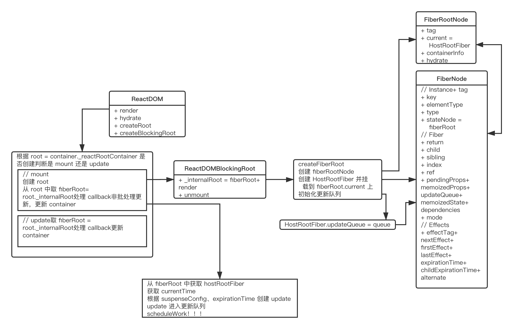
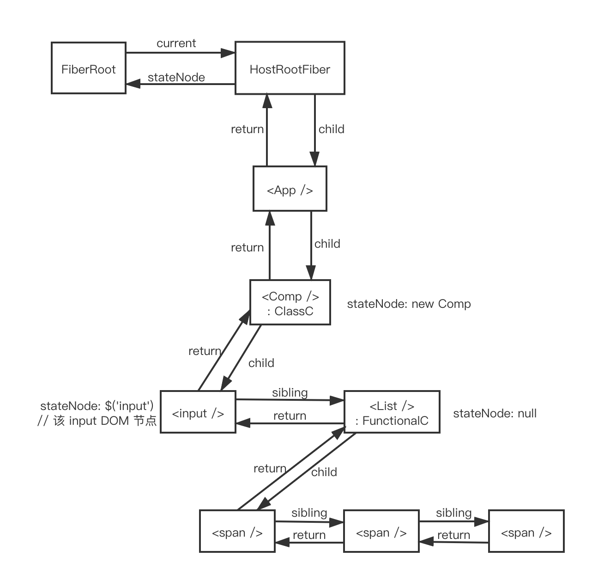

# React 创建更新

创建更新的方式：

* ReactDOM.render || hydrate

* setState

* forceUpdate

## render

1. 创建 reactRoot

2. 创建 FiberRoot 和 HostRootFiber

3. 创建更新



render 和 hydrate 调用 legacyRenderSubtreeIntoContainer，唯一不同就是 forceHydrate 的参数不同，render 和 hydrate 本质的不同就是是否对原来 #root 节点内的 DOM 节点进行复用

legacyRenderSubtreeIntoContainer 根据 #root 中是否有 _reactRootContainer 判断是否为第一次渲染（mount）

mount 阶段调用 legacyCreateRootFromDOMContainer 创建 reactRoot 并挂载到 #root._reactRootContainer 上，legacyCreateRootFromDOMContainer 根据 shouldHydrate = forceHydrate || shouldHydrateDueToLegacyHeuristic(container) 判断是否对 #root 中的子节点进行复用，如果不复用就 remove 所有的子节点，其中 shouldHydrateDueToLegacyHeuristic 判断是否有子节点且子节点上是否有 data-reactroot 的属性，如果有则 shouldHydrate 为 true，进行子节点复用，之后创建的 fiberRoot 也跟是否 hydrate 有关

mount 阶段创建 reactRoot 同时创建了 FiberRoot 和 HostRootFiber，之后对 render 的 callbak 的 this 指向进行 处理，但 mount 时指向 null，然后调用 callback。之后非批处理进行更新 unbatchedUpdates，unbatchedUpdates 传入回调函数 () => updateContainer(children, fiberRoot, parentComponent, callback) ，在 unbatchedUpdates 内部进行更新 updateContainer

updateContainer 中获取 HostRootFiber，获取相应信息后 computeExpirationForFiber(currentTime, current, suspenseConfig) 算出 expirationTime，再 createUpdate(expirationTime, suspenseConfig) 创建 update，createUpdate 将一些信息添加到 update 对象上并返回，之后 enqueueUpdate(current, update) 处理后调用 scheduleWork(current, expirationTime) 进入调度更新

## FiberRoot

1. 整个应用的起点

2. 包含应用挂载的 #root 节点

3. 记录整个应用更新过程中的各种信息

```ts
type BaseFiberRootProperties = {|
  // The type of root (legacy, batched, concurrent, etc.)
  tag: RootTag,

  // Any additional information from the host associated with this root.
  // #root 节点
  containerInfo: any,
  // Used only by persistent updates.
  pendingChildren: any,
  // The currently active root fiber. This is the mutable root of the tree.
  // HostRootFiber
  current: Fiber,

  pingCache:
    | WeakMap<Thenable, Set<ExpirationTime>>
    | Map<Thenable, Set<ExpirationTime>>
    | null,

  finishedExpirationTime: ExpirationTime,
  // A finished work-in-progress HostRoot that's ready to be committed.
  // 已经完成的任务的FiberRoot对象，如果你只有一个Root，那他永远只可能是这个Root对应的Fiber，或者是null
  // 在commit阶段只会处理这个值对应的任务
  finishedWork: Fiber | null,
  // Timeout handle returned by setTimeout. Used to cancel a pending timeout, if
  // it's superseded by a new one.
  // 在任务被挂起的时候通过 setTimeout 设置的返回内容，用来下一次如果有新的任务挂起时清理还没触发的 timeout
  timeoutHandle: TimeoutHandle | NoTimeout,
  // Top context object, used by renderSubtreeIntoContainer
  // 顶层context对象，只有主动调用`renderSubtreeIntoContainer`时才会有用
  context: Object | null,
  pendingContext: Object | null,
  // Determines if we should attempt to hydrate on the initial mount
  +hydrate: boolean,
  // Node returned by Scheduler.scheduleCallback
  callbackNode: *,
  // Expiration of the callback associated with this root
  callbackExpirationTime: ExpirationTime,
  // Priority of the callback associated with this root
  callbackPriority: ReactPriorityLevel,
  // The earliest pending expiration time that exists in the tree
  firstPendingTime: ExpirationTime,
  // The earliest suspended expiration time that exists in the tree
  firstSuspendedTime: ExpirationTime,
  // The latest suspended expiration time that exists in the tree
  lastSuspendedTime: ExpirationTime,
  // The next known expiration time after the suspended range
  nextKnownPendingLevel: ExpirationTime,
  // The latest time at which a suspended component pinged the root to
  // render again
  lastPingedTime: ExpirationTime,
  lastExpiredTime: ExpirationTime,
|}

// The following attributes are only used by interaction tracing builds.
// They enable interactions to be associated with their async work,
// And expose interaction metadata to the React DevTools Profiler plugin.
// Note that these attributes are only defined when the enableSchedulerTracing flag is enabled.
type ProfilingOnlyFiberRootProperties = {|
  interactionThreadID: number,
  memoizedInteractions: Set<Interaction>,
  pendingInteractionMap: PendingInteractionMap,
|}

// The follow fields are only used by enableSuspenseCallback for hydration.
type SuspenseCallbackOnlyFiberRootProperties = {|
  hydrationCallbacks: null | SuspenseHydrationCallbacks,
|}

// Exported FiberRoot type includes all properties,
// To avoid requiring potentially error-prone :any casts throughout the project.
// Profiling properties are only safe to access in profiling builds (when enableSchedulerTracing is true).
// The types are defined separately within this file to ensure they stay in sync.
// (We don't have to use an inline :any cast when enableSchedulerTracing is disabled.)
export type FiberRoot = {
  ...BaseFiberRootProperties,
  ...ProfilingOnlyFiberRootProperties,
  ...SuspenseCallbackOnlyFiberRootProperties,
  ...
}

function FiberRootNode(containerInfo, tag, hydrate) {
  this.tag = tag
  this.current = null
  this.containerInfo = containerInfo
  this.pendingChildren = null
  this.pingCache = null
  this.finishedExpirationTime = NoWork
  this.finishedWork = null
  this.timeoutHandle = noTimeout
  this.context = null
  this.pendingContext = null
  this.hydrate = hydrate
  this.callbackNode = null
  this.callbackPriority = NoPriority
  this.firstPendingTime = NoWork
  this.firstSuspendedTime = NoWork
  this.lastSuspendedTime = NoWork
  this.nextKnownPendingLevel = NoWork
  this.lastPingedTime = NoWork
  this.lastExpiredTime = NoWork

  if (enableSchedulerTracing) {
    this.interactionThreadID = unstable_getThreadID()
    this.memoizedInteractions = new Set()
    this.pendingInteractionMap = new Map()
  }
  if (enableSuspenseCallback) {
    this.hydrationCallbacks = null
  }
}
```

## Fiber

HostRootFiber 也是一个 Fiber

1. 每一个 ReackElement 对应一个 Fiber

2. 记录节点的整体结构

3. 串联整个应用形成树结构



```ts
// A Fiber is work on a Component that needs to be done or was done. There can
// be more than one per component.
export type Fiber = {|
  // These first fields are conceptually members of an Instance. This used to
  // be split into a separate type and intersected with the other Fiber fields,
  // but until Flow fixes its intersection bugs, we've merged them into a
  // single type.

  // An Instance is shared between all versions of a component. We can easily
  // break this out into a separate object to avoid copying so much to the
  // alternate versions of the tree. We put this on a single object for now to
  // minimize the number of objects created during the initial render.

  // Tag identifying the type of fiber.
  // ClassComponent, FunctionalComponent, 原生组件……
  tag: WorkTag,

  // Unique identifier of this child.
  // ReactElement 中的 key
  key: null | string,

  // The value of element.type which is used to preserve the identity during
  // reconciliation of this child.
  // createElement 的 type 参数
  elementType: any,

  // The resolved function/class/ associated with this fiber.
  // 区分 class 和 function 组件
  type: any,

  // The local state associated with this fiber.
  // 对应的实例，classComponent 对应 instance，div、span…… 对应 DOM 节点，functionComponent 没有实例就为 null
  stateNode: any,

  // Conceptual aliases
  // parent : Instance -> return The parent happens to be the same as the
  // return fiber since we've merged the fiber and instance.

  // Remaining fields belong to Fiber

  // The Fiber to return to after finishing processing this one.
  // This is effectively the parent, but there can be multiple parents (two)
  // so this is only the parent of the thing we're currently processing.
  // It is conceptually the same as the return address of a stack frame.
  // 上一个节点
  return: Fiber | null,

  // Singly Linked List Tree Structure.
  // 第一个子节点
  child: Fiber | null,
  // 兄弟节点
  sibling: Fiber | null,
  index: number,

  // The ref last used to attach this node.
  // I'll avoid adding an owner field for prod and model that as functions.
  // ReaclElement 的 ref
  ref:
    | null
    | (((handle: mixed) => void) & {_stringRef: ?string, ...})
    | RefObject,

  // Input is the data coming into process this fiber. Arguments. Props.
  // 新更新的 props
  pendingProps: any, // This type will be more specific once we overload the tag.
  // 更新后旧的 props
  memoizedProps: any, // The props used to create the output.

  // A queue of state updates and callbacks.
  // 该 fiber 对应组件创建的 update 存在 updateQueue 中
  updateQueue: UpdateQueue<any> | null,

  // The state used to create the output
  // 旧的 state
  memoizedState: any,

  // Dependencies (contexts, events) for this fiber, if it has any
  dependencies: Dependencies | null,

  // Bitfield that describes properties about the fiber and its subtree. E.g.
  // the ConcurrentMode flag indicates whether the subtree should be async-by-
  // default. When a fiber is created, it inherits the mode of its
  // parent. Additional flags can be set at creation time, but after that the
  // value should remain unchanged throughout the fiber's lifetime, particularly
  // before its child fibers are created.
  mode: TypeOfMode,

  // Effect
  effectTag: SideEffectTag,

  // Singly linked list fast path to the next fiber with side-effects.
  nextEffect: Fiber | null,

  // The first and last fiber with side-effect within this subtree. This allows
  // us to reuse a slice of the linked list when we reuse the work done within
  // this fiber.
  firstEffect: Fiber | null,
  lastEffect: Fiber | null,

  // Represents a time in the future by which this work should be completed.
  // Does not include work found in its subtree.
  // 不包括它子树所产生的任务
  expirationTime: ExpirationTime,

  // This is used to quickly determine if a subtree has no pending changes.
  childExpirationTime: ExpirationTime,

  // This is a pooled version of a Fiber. Every fiber that gets updated will
  // eventually have a pair. There are cases when we can clean up pairs to save
  // memory if we need to.
  // double buffer 对更新的优化
  // 更新时 current => workInProgress，更新后 workInProgress => current
  alternate: Fiber | null,

  // Time spent rendering this Fiber and its descendants for the current update.
  // This tells us how well the tree makes use of sCU for memoization.
  // It is reset to 0 each time we render and only updated when we don't bailout.
  // This field is only set when the enableProfilerTimer flag is enabled.
  actualDuration?: number,

  // If the Fiber is currently active in the "render" phase,
  // This marks the time at which the work began.
  // This field is only set when the enableProfilerTimer flag is enabled.
  actualStartTime?: number,

  // Duration of the most recent render time for this Fiber.
  // This value is not updated when we bailout for memoization purposes.
  // This field is only set when the enableProfilerTimer flag is enabled.
  selfBaseDuration?: number,

  // Sum of base times for all descendants of this Fiber.
  // This value bubbles up during the "complete" phase.
  // This field is only set when the enableProfilerTimer flag is enabled.
  treeBaseDuration?: number,

  // Conceptual aliases
  // workInProgress : Fiber ->  alternate The alternate used for reuse happens
  // to be the same as work in progress.
  // __DEV__ only
  _debugID?: number,
  _debugSource?: Source | null,
  _debugOwner?: Fiber | null,
  _debugIsCurrentlyTiming?: boolean,
  _debugNeedsRemount?: boolean,

  // Used to verify that the order of hooks does not change between renders.
  _debugHookTypes?: Array<HookType> | null,
|}
```

## update

1. 用于记录组件状态的改变

2. 存放到 updateQueue 中

3. 多个 update 可以同时存在

```ts
export function createUpdate(expirationTime, suspenseConfig) {
  let update = {
    // 更新的过期时间
    expirationTime,
    suspenseConfig,
    // export const UpdateState = 0
    // export const ReplaceState = 1
    // export const ForceUpdate = 2
    // export const CaptureUpdate = 3 // 出错时捕捉的更新，根据它渲染错误信息
    // 指定更新的类型，值为以上几种
    tag: UpdateState,
    // 更新内容，比如`setState`接收的第一个参数
    payload: null,
    // 对应的回调，`setState`，`render`都有
    callback: null,
    // 下一个 update
    next: null,
  }
  // enqueueUpdate 会进行修改调整
  update.next = update
  return update
}
```

```ts
export type UpdateQueue<State> = {|
  baseState: State,
  baseQueue: Update<State> | null,
  shared: SharedQueue<State>,
  effects: Array<Update<State>> | null,
|}
```

## expirationTime

`const expirationTime = computeExpirationForFiber(currentTime, current, suspenseConfig)` 计算 expirationTime 时，现根据 mode 和 `const priorityLevel = getCurrentPriorityLevel()` 得到相应的 expirationTime

## enqueueUpdate

enqueue 其实不准确，因为 update 是一个链表，enqueueUpdate 其实是把 update 的 next 赋值成 pending 的 update，就是把 “updateLinkedList” 进行相连

```ts
export function enqueueUpdate(fiber, update) {
  // 拿 updateQueue
  const updateQueue = fiber.updateQueue
  if (updateQueue === null) {
    // unmounted 后 updateQueue === null
    // Only occurs if the fiber has been unmounted.
    return
  }

  const sharedQueue = updateQueue.shared
  // 拿到 pending 的 update
  const pending = sharedQueue.pending
  if (pending === null) {
    // This is the first update. Create a circular list.
    update.next = update
  } else {
    update.next = pending.next
    pending.next = update
  }
  sharedQueue.pending = update
}
```

## setState & forceUpdate

可以看出 setState 和 forceUpdate 都是通过创建 update 之后 `enqueueUpdate`、`scheduleWork` 进行的更新

```ts
const classComponentUpdater = {
  isMounted,
  enqueueSetState(inst, payload, callback) {
    const fiber = getInstance(inst);
    const currentTime = requestCurrentTimeForUpdate();
    const suspenseConfig = requestCurrentSuspenseConfig();
    const expirationTime = computeExpirationForFiber(
      currentTime,
      fiber,
      suspenseConfig,
    );

    const update = createUpdate(expirationTime, suspenseConfig);
    update.payload = payload;
    if (callback !== undefined && callback !== null) {
      if (__DEV__) {
        warnOnInvalidCallback(callback, 'setState');
      }
      update.callback = callback;
    }

    enqueueUpdate(fiber, update);
    scheduleWork(fiber, expirationTime);
  },
  // ...
  enqueueForceUpdate(inst, callback) {
    const fiber = getInstance(inst);
    const currentTime = requestCurrentTimeForUpdate();
    const suspenseConfig = requestCurrentSuspenseConfig();
    const expirationTime = computeExpirationForFiber(
      currentTime,
      fiber,
      suspenseConfig,
    );

    const update = createUpdate(expirationTime, suspenseConfig);
    update.tag = ForceUpdate;

    if (callback !== undefined && callback !== null) {
      if (__DEV__) {
        warnOnInvalidCallback(callback, 'forceUpdate');
      }
      update.callback = callback;
    }

    enqueueUpdate(fiber, update);
    scheduleWork(fiber, expirationTime);
  },
}
```

## 总结

React 的通过创建 ReactElement 之后每个 ReactElement 创建对应的 Fiber，Fiber 之间通过 return、child、sibing 等进行连接。React 通过 render 进行第一次渲染时（mount），通过创建了 ReactRoot 的同时创建了 FiberRoot 和 HostRootFiber（也就是 `<App />` 对应的 Fiber）。React 进行的更新主要有 render、setState、forceUpdate，这些也是通过创建 Fiber 上的 update，之后 update 进入 updateQueue，在通过 scheduleWork 进行调度更新
