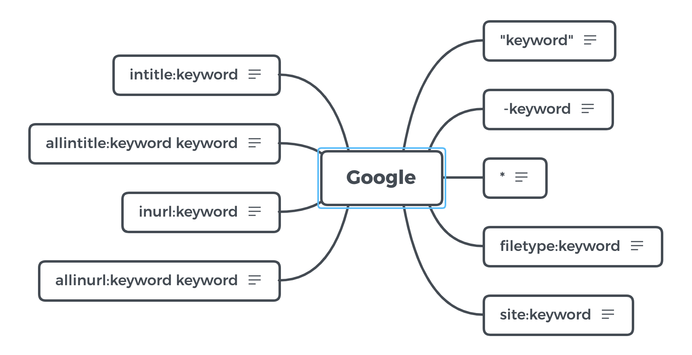

# Google

## "keyword"

完全匹配搜索

##  -keyword

不含减号后面的词

## *

通配符

## filetype:keyword

文件类型搜索

## site:keyword

搜索某个域名下的所有文件

## allinurl:keyword keyword

等于 inurl:SEO inurl:search

## inurl:keyword

关键词出现在 url 中的页面

## allintitle:keyword keyword

多组关键词都出现在 title 中

## intitle:keyword

关键词出现在 title 中
